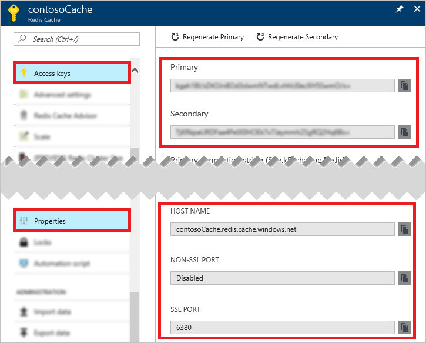

若要连接到某个 Azure Redis 缓存实例，缓存客户端需要该缓存的主机名、端口和密钥。 在某些客户端中，这些项的名称可能略有不同。 可以在 Azure 门户中检索该信息，也可以通过命令行工具（例如 Azure CLI）来检索。

### 使用 Azure 门户检索主机名、端口和访问密钥
若要使用 Azure 门户检索主机名、端口和访问密钥，请[浏览](/documentation/articles/cache-configure/#configure-redis-cache-settings)到 [Azure 门户](https://portal.azure.cn)中的缓存， 然后在“资源”菜单中单击“访问密钥”和“属性”。 

### 使用 Azure CLI 检索主机名、端口和访问密钥
若要使用 Azure CLI 2.0 检索主机名和端口，可调用 [az redis show](https://docs.microsoft.com/zh-cn/cli/azure/redis#show)；若要检索密钥，可调用 [az redis list-keys](https://docs.microsoft.com/zh-cn/cli/azure/redis#list-keys)。 以下脚本调用这两个命令，并将主机名、端口和密钥回显到控制台。

    #/bin/bash

    # Retrieve the hostname, ports, and keys for contosoCache located in contosoGroup

    # Retrieve the hostname and ports for an Azure Redis Cache instance
    redis=($(az redis show --name contosoCache --resource-group contosoGroup --query [hostName,enableNonSslPort,port,sslPort] --output tsv))

    # Retrieve the keys for an Azure Redis Cache instance
    keys=($(az redis list-keys --name contosoCache --resource-group contosoGroup --query [primaryKey,secondaryKey] --output tsv))

    # Display the retrieved hostname, keys, and ports
    echo "Hostname:" ${redis[0]}
    echo "Non SSL Port:" ${redis[2]}
    echo "Non SSL Port Enabled:" ${redis[1]}
    echo "SSL Port:" ${redis[3]}
    echo "Primary Key:" ${keys[0]}
    echo "Secondary Key:" ${keys[1]}

有关此脚本的详细信息，请参阅[获取 Azure Redis 缓存的主机名、端口和密钥](/documentation/articles/cache-keys-ports/)。 有关 Azure CLI 2.0 的详细信息，请参阅 [Install Azure CLI 2.0](https://docs.microsoft.com/zh-cn/cli/azure/install-azure-cli)（安装 Azure CLI 2.0）和 [Get started with Azure CLI 2.0](https://docs.microsoft.com/zh-cn/cli/azure/get-started-with-azure-cli)（Azure CLI 2.0 入门）。