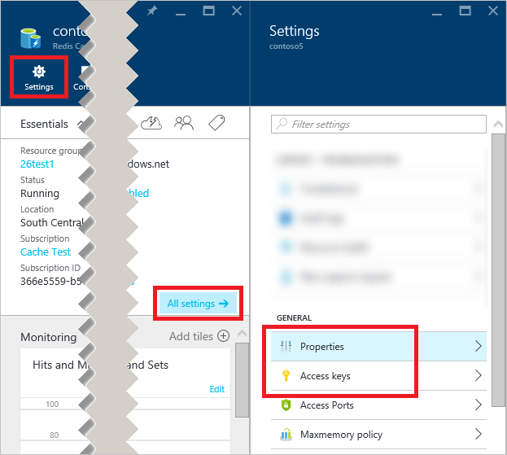

若要连接到某个 Azure Redis 缓存实例，缓存客户端需要该缓存的主机名、端口和密钥。在某些客户端中，这些项的名称可能略有不同。若要检索这些项，请在 [Azure 门户预览](https://portal.azure.cn)中[浏览](/documentation/articles/cache-configure/#configure-redis-cache-settings)到你的缓存，单击“资源”菜单中的所需项。

  

### 主机名和端口
若要访问主机名和端口，请单击“属性”。

  

### 访问密钥
若要检索访问密钥，请单击“访问密钥”。

<!---HONumber=Mooncake_0227_2017-->