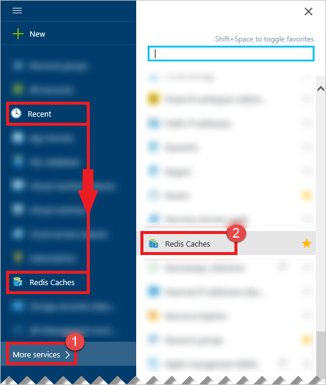
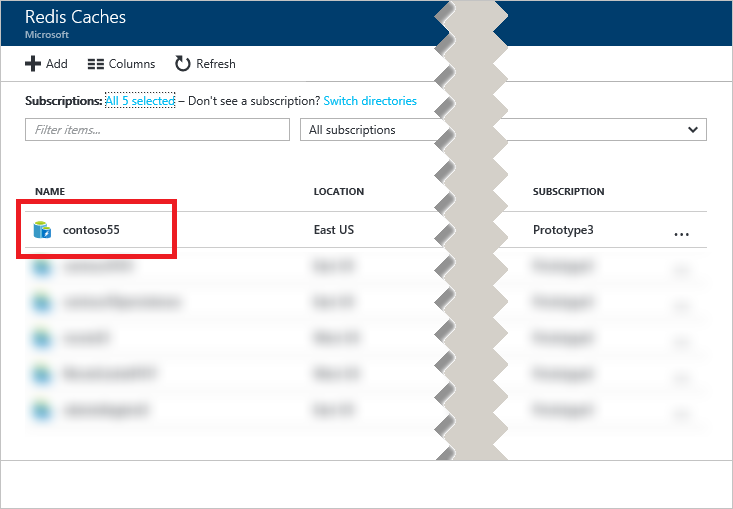
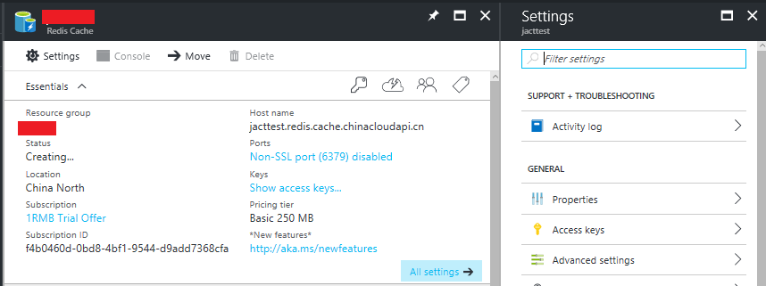

可使用“浏览”边栏选项卡在 [Azure 门户预览](https://portal.azure.cn)访问缓存。

单击“浏览”>“Redis 缓存”查看你的缓存。如果你最近浏览过 Redis 缓存，则可以从列表中直接单击“Redis 缓存”，而无需单击“浏览”。

选择所需缓存以查看其属性。

单击“设置”或“所有设置”以查看和配置缓存。

<!---HONumber=Mooncake_0718_2016-->