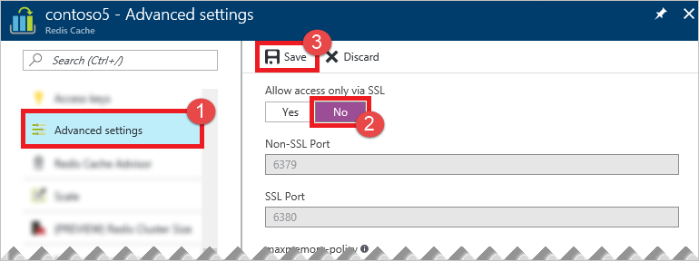

若要启用非 SSL 端口，请在[Azure 门户预览](https://portal.azure.cn)中[浏览](/documentation/articles/cache-configure/#configure-redis-cache-settings)到你的缓存，然后单击“设置”>“访问端口”。单击“否”启用非 SSL 端口，然后单击“保存”。

<!---HONumber=Mooncake_0829_2016-->