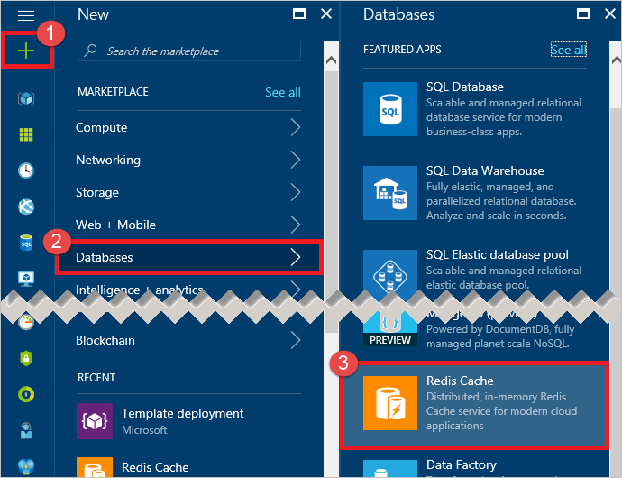
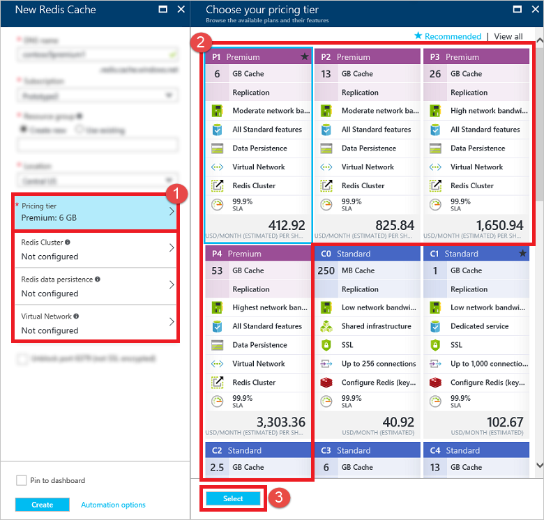

若要创建高级缓存，请登录到 [Azure 门户](https://portal.azure.cn)，然后单击“新建”>“数据 + 存储”>“Redis 缓存”。

>[AZURE.NOTE] 除了在 Azure 门户中创建缓存以外，也可以使用 ARM 模板、PowerShell 或 Azure CLI 来创建。有关详细信息，请参阅[创建缓存](/documentation/articles/cache-dotnet-how-to-use-azure-redis-cache/#create-a-cache)。

若要配置高级功能，请先在“选择你的定价层”边栏选项卡中选择一个高级定价层。

<!---HONumber=Mooncake_0829_2016-->