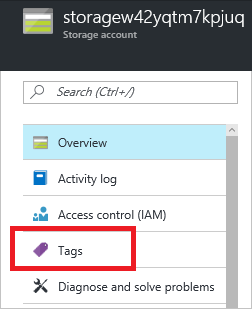
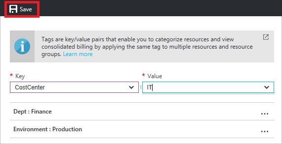
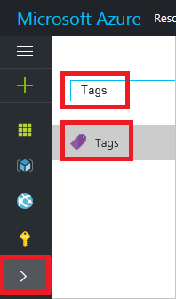
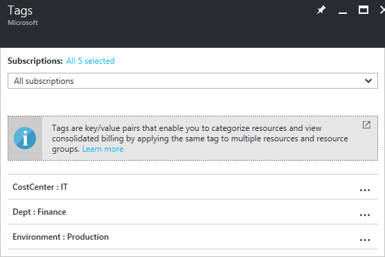
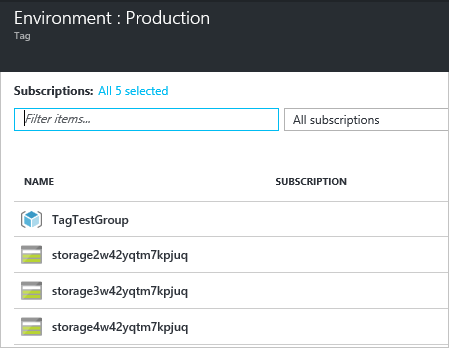
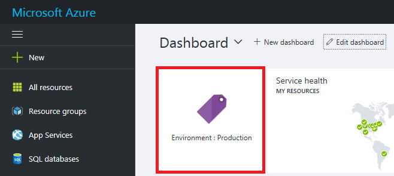

1. 若要将标记添加到现有资源和资源组，请选择标记图标。

     

1. 随后将显示组织已应用到资源的标记列表。如果以前未应用标记，则该列表为空。若要添加标记，只需指定名称和值，然后按 Enter。添加一些标记后，会看到基于现存标记名称和值的自动完成选项。这些自动完成选项确保跨资源实现一致的分类，避免常见错误，如拼写错误。

       

1. 若要在门户中查看标记的分类，请选择“更多服务”和“标记”。

       

1. 随后将显示订阅中标记的摘要。

       

1. 选择任一标记会显示带有该标记的资源和资源组。

       

1. 将最重要的标记固定到仪表板，以便快速进行访问。

     

<!---HONumber=Mooncake_1010_2016-->