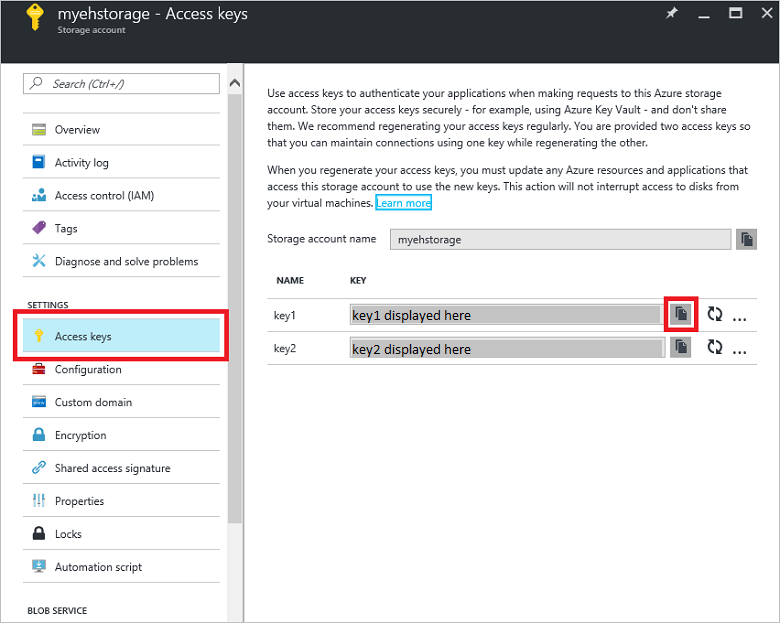

## 使用 EventProcessorHost 接收消息

[EventProcessorHost][] 是一个 .NET 类，它通过从事件中心管理持久检查点和并行接收来简化从那些事件中心接收事件。使用 [EventProcessorHost][]，可跨多个接收方（即使承载于不同节点中）拆分事件。此示例演示如何为单一接收方使用 [EventProcessorHost][]。[经过扩展的事件处理][]示例显示如何将 [EventProcessorHost][] 用于多个接收方。

若要使用 [EventProcessorHost][]，必须拥有 [Azure 存储帐户][]：

1. 登录到 [Azure 门户预览][]，然后单击屏幕左上角的“新建”。

2. 单击“存储”，然后单击“存储帐户”。

      

3. 在“创建存储帐户”边栏选项卡中，键入存储帐户名称。选择 Azure 订阅、资源组和要在其中创建该资源的位置。然后单击“创建”。

      

4. 在存储帐户列表中，单击新建的存储帐户。

5. 在“存储帐户”边栏选项卡中，单击“访问密钥”。复制 **key1** 的值，供本教程后面使用。

	  

4. 在 Visual Studio 中，使用**控制台应用程序**项目模板创建一个新的 Visual C# 桌面应用项目。将该项目命名为 **Receiver**。

      

5. 在“解决方案资源管理器”中，右键单击该解决方案，然后单击“为解决方案管理 NuGet 包”。

6. 单击“浏览”选项卡，然后搜索 `Microsoft Azure Service Bus Event Hub - EventProcessorHost`。确保在“版本”框中指定项目名称（“Receiver”）。单击“安装”并接受使用条款。

      

	Visual Studio 便会下载、安装 [Azure 服务总线事件中心 - EventProcessorHost NuGet 程序包](https://www.nuget.org/packages/Microsoft.Azure.ServiceBus.EventProcessorHost)并添加对该程序包的引用，包括其所有依赖项。

7. 右键单击 **Receiver** 项目，单击“添加”，然后单击“类”。将新类命名为 **SimpleEventProcessor**，然后单击“添加”以创建该类。

	  

8. 在 SimpleEventProcessor.cs 文件的顶部添加以下语句：

    	using Microsoft.ServiceBus.Messaging;
    	using System.Diagnostics;

	然后，用以下代码替换该类的正文：

        class SimpleEventProcessor : IEventProcessor
    	{
    	    Stopwatch checkpointStopWatch;
    
    	    async Task IEventProcessor.CloseAsync(PartitionContext context, CloseReason reason)
    	    {
    	        Console.WriteLine("Processor Shutting Down. Partition '{0}', Reason: '{1}'.", context.Lease.PartitionId, reason);
    	        if (reason == CloseReason.Shutdown)
    	        {
    	            await context.CheckpointAsync();
    	        }
    	    }
    
    	    Task IEventProcessor.OpenAsync(PartitionContext context)
    	    {
    	        Console.WriteLine("SimpleEventProcessor initialized.  Partition: '{0}', Offset: '{1}'", context.Lease.PartitionId, context.Lease.Offset);
    	        this.checkpointStopWatch = new Stopwatch();
    	        this.checkpointStopWatch.Start();
    	        return Task.FromResult<object>(null);
    	    }
    
    	    async Task IEventProcessor.ProcessEventsAsync(PartitionContext context, IEnumerable<EventData> messages)
    	    {
    	        foreach (EventData eventData in messages)
    	        {
    	            string data = Encoding.UTF8.GetString(eventData.GetBytes());
    
    	            Console.WriteLine(string.Format("Message received.  Partition: '{0}', Data: '{1}'",
    	                context.Lease.PartitionId, data));
    	        }
    
    	        //Call checkpoint every 5 minutes, so that worker can resume processing from 5 minutes back if it restarts.
    	        if (this.checkpointStopWatch.Elapsed > TimeSpan.FromMinutes(5))
                {
                    await context.CheckpointAsync();
                    this.checkpointStopWatch.Restart();
                }
    	    }
    	}

	此类将由 **EventProcessorHost** 调用，以处理从事件中心接收的事件。请注意，`SimpleEventProcessor` 类使用秒表以定期对 **EventProcessorHost** 上下文调用检查点方法。这将确保接收方重新启动时将会丢失的处理工作不会超过五分钟。

9. 在 **Program** 类中，在文件顶部添加以下 `using` 语句：

	    using Microsoft.ServiceBus.Messaging;

	然后，将 `Program` 类中的 `Main` 方法替换为以下代码，从而替换为以前保存的事件中心名称和命名空间级别连接字符串，以及在前面部分复制的存储帐户和密钥。

    	static void Main(string[] args)
        {
          string eventHubConnectionString = "{Event Hub connection string}";
          string eventHubName = "{Event Hub name}";
          string storageAccountName = "{storage account name}";
          string storageAccountKey = "{storage account key}";
          string storageConnectionString = string.Format("DefaultEndpointsProtocol=https;AccountName={0};AccountKey={1}", storageAccountName, storageAccountKey);
    
          string eventProcessorHostName = Guid.NewGuid().ToString();
          EventProcessorHost eventProcessorHost = new EventProcessorHost(eventProcessorHostName, eventHubName, EventHubConsumerGroup.DefaultGroupName, eventHubConnectionString, storageConnectionString);
          Console.WriteLine("Registering EventProcessor...");
          var options = new EventProcessorOptions();
          options.ExceptionReceived += (sender, e) => { Console.WriteLine(e.Exception); };
          eventProcessorHost.RegisterEventProcessorAsync<SimpleEventProcessor>(options).Wait();
    
          Console.WriteLine("Receiving. Press enter key to stop worker.");
          Console.ReadLine();
          eventProcessorHost.UnregisterEventProcessorAsync().Wait();
        }

> [AZURE.NOTE] 本教程使用单个 [EventProcessorHost][] 实例。若要增加吞吐量，建议运行多个 [EventProcessorHost][] 实例，如[扩大事件处理][]示例中所示。在这些情况下，为了对接收到的事件进行负载均衡，各个不同实例会自动相互协调。如果希望多个接收方都各自处理*全部*事件，则必须使用 **ConsumerGroup** 概念。在从不同计算机中接收事件时，根据部署 [EventProcessorHost][] 实例的计算机（或角色）来指定该实例的名称可能会很有用。有关这些主题的详细信息，请参阅[事件中心概述][]和[事件中心编程指南][]主题。

<!-- Links -->

[事件中心概述]: /documentation/articles/event-hubs-overview/
[事件中心编程指南]: /documentation/articles/event-hubs-programming-guide/
[扩大事件处理]: https://code.msdn.microsoft.com/windowsazure/Service-Bus-Event-Hub-45f43fc3
[经过扩展的事件处理]: https://code.msdn.microsoft.com/windowsazure/Service-Bus-Event-Hub-45f43fc3
[Azure 存储帐户]: /documentation/articles/storage-create-storage-account/
[EventProcessorHost]: http://msdn.microsoft.com/zh-cn/library/azure/microsoft.servicebus.messaging.eventprocessorhost(v=azure.95).aspx
[Azure 经典管理门户]: http://manage.windowsazure.cn
[Azure 门户预览]: http://portal.azure.cn/

<!---HONumber=Mooncake_1121_2016-->