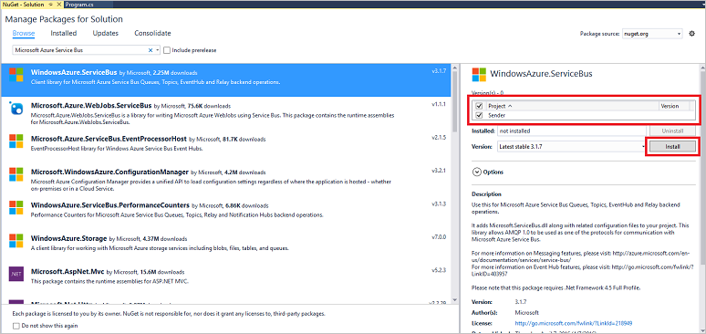

## 将消息发送到事件中心

在此部分中，你将编写用于将事件发送到事件中心的 Windows 控制台应用。

1. 在 Visual Studio 中，使用**控制台应用程序**项目模板创建一个新的 Visual C# 桌面应用项目。将该项目命名为 **Sender**。

	

2. 在“解决方案资源管理器”中，右键单击该解决方案，然后单击“为解决方案管理 NuGet 包”。

3. 单击“浏览”选项卡，然后搜索 `Microsoft Azure Service Bus`。确保在“版本”框中指定项目名称（“Sender”）。单击“安装”并接受使用条款。

	  

	Visual Studio 便会下载、安装 [Azure 服务总线库 NuGet 包](https://www.nuget.org/packages/WindowsAzure.ServiceBus)并添加对它的引用。

4. 在 **Program.cs** 文件顶部添加以下 `using` 语句：

    	using System.Threading;
    	using Microsoft.ServiceBus.Messaging;

5. 将以下字段添加到 **Program** 类，并将占位符值分别替换为你在上一节中创建的事件中心的名称和前面保存的命名空间级别连接字符串。

    	static string eventHubName = "{Event Hub name}";
    	static string connectionString = "{send connection string}";

6. 将以下方法添加到 **Program** 类：

    	static void SendingRandomMessages()
    	{
    	    var eventHubClient = EventHubClient.CreateFromConnectionString(connectionString, eventHubName);
    	    while (true)
    	    {
    	        try
    	        {
    	            var message = Guid.NewGuid().ToString();
    	            Console.WriteLine("{0} > Sending message: {1}", DateTime.Now, message);
    	            eventHubClient.Send(new EventData(Encoding.UTF8.GetBytes(message)));
    	        }
    	        catch (Exception exception)
    	        {
    	            Console.ForegroundColor = ConsoleColor.Red;
    	            Console.WriteLine("{0} > Exception: {1}", DateTime.Now, exception.Message);
    	            Console.ResetColor();
    	        }
    
    	        Thread.Sleep(200);
    	    }
    	}

	此方法会不断地将事件发送到事件中心，迟延为 200 毫秒。

7. 最后，在 **Main** 方法中添加以下行：

    	Console.WriteLine("Press Ctrl-C to stop the sender process");
    	Console.WriteLine("Press Enter to start now");
    	Console.ReadLine();
    	SendingRandomMessages();

<!---HONumber=Mooncake_1121_2016-->