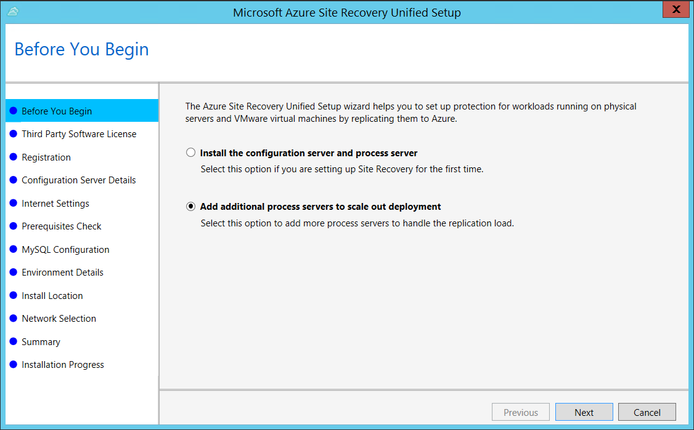
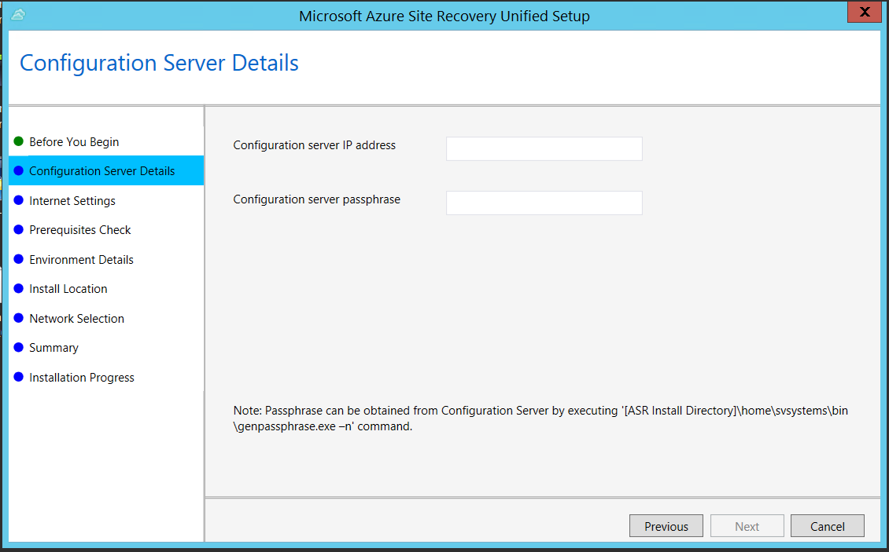
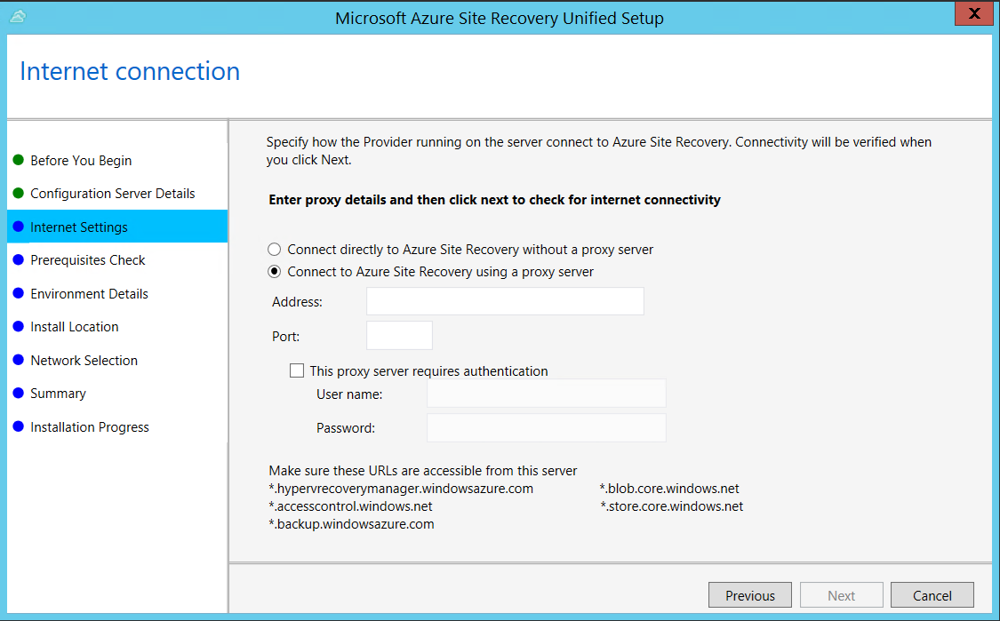
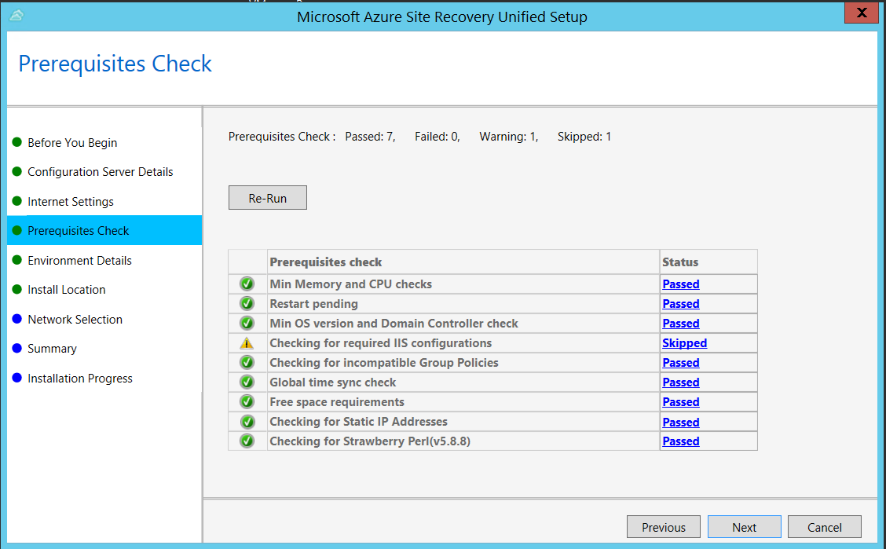
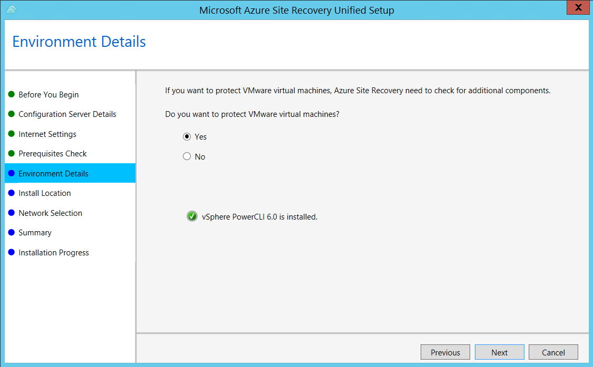
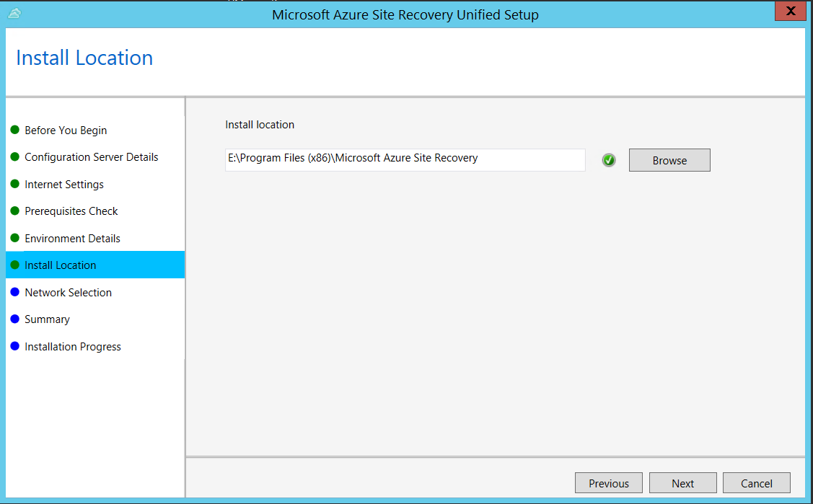
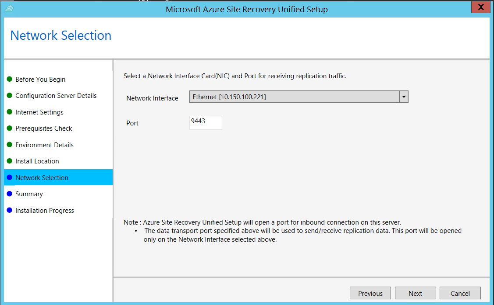
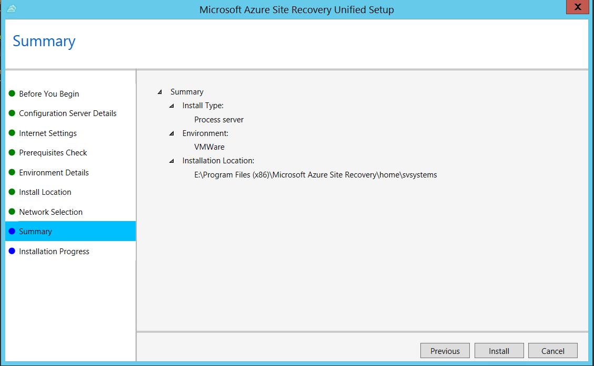

1. 启动 Azure Site Recovery UnifiedSetup.exe
2. 在“开始之前”中选择“添加额外的进程服务器以扩大部署”。

    

3. 在“配置服务器详细信息”中，指定配置服务器的 IP 地址和密码。

    

4. 在“Internet 设置”中，指定配置服务器上运行的提供程序如何通过 Internet 连接到 Azure Site Recovery。

    

   * 如果希望使用当前已在计算机上设置的代理进行连接，请选择“使用现有代理设置进行连接”。
   * 如果希望提供程序直接进行连接，请选择“不使用代理直接连接”。
   * 如果现有代理要求身份验证，或者用户希望使用自定义代理进行提供程序连接，请选择“使用自定义代理设置进行连接”。

     * 若使用自定义代理，需指定地址、端口和凭据。
     * 若要使用代理，应事先允许访问服务 URL。

5. 在“先决条件检查”设置中运行检查，确保安装可运行。如果看到有关**全局时间同步检查**的警告，请检查系统时钟的时间（“日期和时间”设置）是否与时区相同。

       

6. 在“环境详细信息”中，选择是否要复制 VMware VM。如果要复制，则安装程序会检查 PowerCLI 6.0 是否已安装。

       

7. 在“安装位置”中，选择要安装二进制文件和存储缓存的位置。选择的驱动器必须至少有 5 GB 可用存储空间，但建议选择至少有 600 GB 可用空间的缓存驱动器。

8. 在“网络选择”中，指定侦听器（网络适配器和 SSL 端口），以便配置服务器在其上发送和接收复制数据。端口 9443 是用于发送和接收复制流量的默认端口，但可以根据环境的要求修改此端口号。除了端口 9443 以外，还要打开端口 443，Web 服务器将使用该端口协调复制操作。请不要使用端口 443 来发送或接收复制流量。

       

9. 在“摘要”中复查信息，然后单击“安装”。安装完成后，将生成通行短语。启用复制时需要用到它，因此请复制并将它保存在安全的位置。

       

<!---HONumber=Mooncake_0327_2017-->