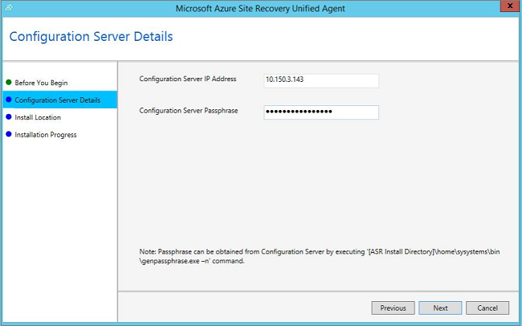

1. 将相关的安装程序复制到服务器并启动安装程序。
2. 在“开始之前”中选择“移动服务”。

      

3. 在“配置服务器详细信息”中，指定配置服务器的 IP 地址和通行短语。

      

4. 保留“安装位置”中的默认设置，然后单击“下一步”开始安装。
5. 在“安装进度”中监视安装过程，然后根据提示重新启动计算机。安装该服务后，可能需要大约 15 分钟，状态才会在门户中更新。

<!---HONumber=Mooncake_0327_2017-->