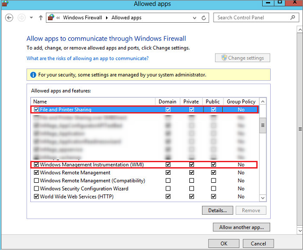

### 准备在 Windows 计算机上执行推送安装

1. 确保 Windows 计算机与进程服务器之间已建立网络连接。
2. 创建可供进程服务器用来访问计算机的帐户。该帐户应具有管理员权限（本地或域），并且仅用于推送安装和代理更新。

   > [AZURE.NOTE]
   如果使用的不是域帐户，则需在本地计算机上禁用远程用户访问控制。可以通过在 HKEY\_LOCAL\_MACHINE\\SOFTWARE\\Microsoft\\Windows\\CurrentVersion\\Policies\\System 注册表项下面添加新的 DWORD **LocalAccountTokenFilterPolicy** 并将其值设置为 1，来禁用远程用户访问控制。在命令提示符下执行以下命令也可以实现相同的目的：**`REG ADD HKEY_LOCAL_MACHINE\SOFTWARE\Microsoft\Windows\CurrentVersion\Policies\System /v LocalAccountTokenFilterPolicy /t REG_DWORD /d 1`**。
   >
   >
2. 在要保护的计算机的 Windows 防火墙中，选择“允许应用或功能通过防火墙”。启用“文件和打印机共享”和“Windows Management Instrumentation”。对于属于某个域的计算机，可以使用 GPO 配置防火墙设置。

     

3. 添加在 CSPSConfigtool 中创建的帐户。
    - 登录到配置服务器。
    - 打开 **cspsconfigtool.exe**。（桌面上有该工具的快捷方式，也可以在 %ProgramData%\\home\\svsystems\\bin 文件夹中找到它）
    - 在“管理帐户”选项卡中，单击“添加帐户”。
    - 添加已创建的帐户。添加帐户后，在为计算机启用复制时，需要提供这些凭据。

<!---HONumber=Mooncake_0327_2017-->