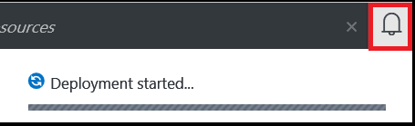

<!--
includes/sql-database-create-new-database-portal.md

Latest Freshness check:  2016-04-11 , carlrab.

As of circa 2016-04-11, the following topics might include this include:
articles/sql-database/sql-database-get-started-tutorial.md

-->
## 创建新的 Azure SQL 数据库

在 Azure 门户预览中使用以下步骤，在新的现有的 Azure SQL 数据库逻辑服务器上创建新的 Azure SQL 数据库。

1. 如果当前未连接，请连接到 [Azure 门户预览](http://portal.azure.cn)。
2. 单击“新建”，键入“SQL 数据库”，然后单击“SQL 数据库(新建数据库)”。

       

3. 单击“SQL 数据库(新建数据库)”。

       

   
4. 单击“创建”，以在 SQL 数据库服务中创建新的数据库。

     

5. 提供以下服务器属性的值：

 - 数据库名称
 - 订阅：仅在具有多个订阅时适用。
 - 资源组：如果你是新手，请使用逻辑服务器的资源组。
 - 选择源：可以选择空白数据库、示例数据或 Azure 数据库备份。若要使用 BCP 命令行工具来迁移本地 SQL Server 数据库或加载数据，请查看本文末尾处的链接。
 - 服务器：新的或现有的逻辑服务器。
 - 服务器管理员登录名
 - 密码
 - 定价层：如果你是新手，请使用默认值 S0。
 - 排序规则：仅在选择空数据库时适用。

        

6.  单击“创建”。可以在通知区域中看到部署已开始。

       

7. 等待部署完成，然后继续下一步。

     

<!---HONumber=Mooncake_1010_2016-->