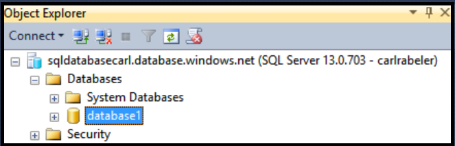

## 使用 SSMS 创建新数据库用户

通过以下步骤使用 SSMS 在现有数据库中创建新的数据库用户。

以下步骤假设你已使用 SSMS 连接到对象资源管理器中的 SQL 数据库，并以服务器级主体管理员身份或使用有权创建新用户的用户帐户连接到 SQL 数据库逻辑服务器。

1. 在对象资源管理器中，展开“数据库”节点并选择你要在其中创建新用户帐户的数据库。

     

2. 右键单击选定的数据库，然后单击“查询”。

     

3. 在查询窗口中，编辑并使用以下 Transact-SQL 语句在用户数据库中创建包含的用户。

		CREATE USER user1 WITH PASSWORD ='p@ssw0rd1';

     

<!---HONumber=Mooncake_0530_2016-->
