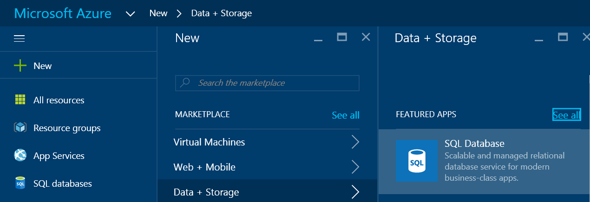
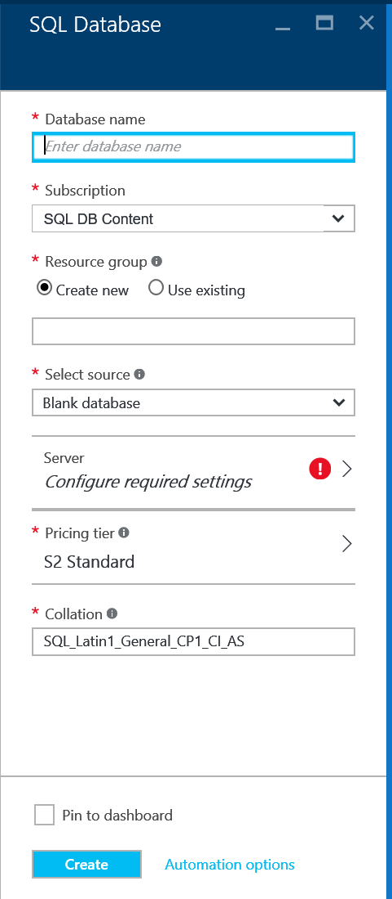
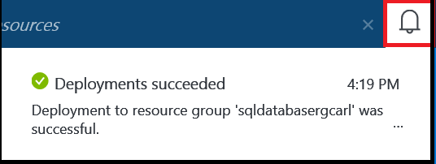

<!--
includes/sql-database-create-new-server-portal.md

Latest Freshness check:  2016-04-11 , carlrab.

As of circa 2016-04-11, the following topics might include this include:
articles/sql-database/sql-database-get-started-tutorial.md

-->
## 创建 Aure SQL 数据库逻辑服务器

在 Azure 门户中使用以下步骤创建 Azure SQL 数据库逻辑服务器。

1. 如果当前未连接，请连接到 [Azure 门户](http://portal.azure.cn)。
2. 单击“新建”，键入“SQL 数据库”，然后单击“SQL 数据库(新建逻辑服务器)”。

      

3. 单击“SQL 数据库(新建逻辑服务器)”。

      
   
4. 单击“创建”打开一个模板，以创建可托管单一数据库和弹性数据库池的空逻辑服务器。

      

5. 提供以下服务器属性的值：

 - 服务器名称
 - 服务器管理员登录名
 - 密码
 - 订阅（仅当你有多个订阅时）
 - 资源组（新的或现有的）
 - 位置

        

6.  单击“创建”，你可以在通知区域中看到部署已开始。

       

7. 等待部署完成，然后继续下一步。

       

<!---HONumber=Mooncake_0530_2016-->
