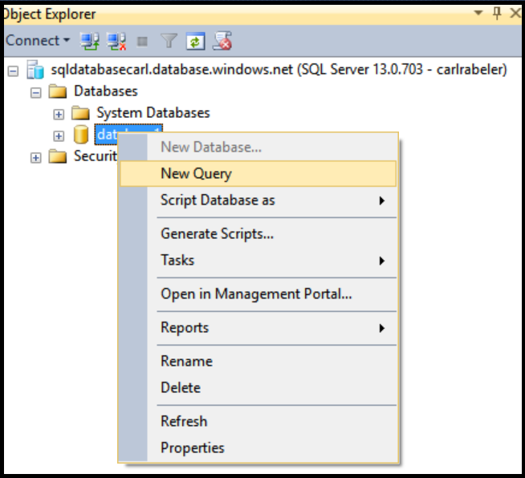

## 授予新的数据库用户 db\_owner 权限

使用以下步骤授予现有数据库用户 db\_owner 权限

以下步骤假设你已使用 SSMS 连接到对象资源管理器中的 SQL 数据库，并以服务器级主体管理员身份或使用有权授予用户权限的用户帐户连接到 SQL 数据库逻辑服务器。

1. 在对象资源管理器中，展开“数据库”节点并选择包含你要为其授予 dbo 权限的用户的数据库。

     

2. 右键单击选定的数据库，然后单击“查询”。

     

3. 在查询窗口中，编辑并使用以下 Transact-SQL 语句向指定的用户授予 dbo 权限。

    '''ALTER ROLE db\_owner ADD MEMBER user1;

     

<!---HONumber=Mooncake_0530_2016-->
