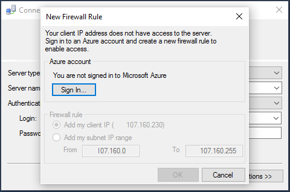

## 使用 SQL Server 身份验证连接到 Azure SQL 数据库

以下步骤演示了如何使用 SSMS 连接到 Azure SQL Server 和数据库。如果没有服务器和数据库，请参阅[在几分钟内创建一个 SQL 数据库](/documentation/articles/sql-database-get-started/)创建一个。

1. 在 Windows 搜索框中键入“Microsoft SQL Server Management Studio”，然后单击桌面应用以启动 SSMS。

2. 在“连接到服务器”窗口中，输入以下信息（如果正在运行 SSMS，请单击“连接”>“数据库引擎”以打开“连接到服务器”窗口）：

 - **服务器类型**：默认为数据库引擎；请不要更改此值。
 - **服务器名称**：输入 Azure SQL 数据库服务器的完全限定名称，格式为 *&lt;服务器名称>*.**database.chinacloudapi.cn**
 - **身份验证类型**：本文介绍如何使用 **SQL Server 身份验证**进行连接。有关使用 Azure Active Directory 进行连接的详细信息，请参阅[使用 Active Directory 集成身份验证进行连接](/documentation/articles/sql-database-aad-authentication/#connect-using-active-directory-integrated-authentication)、[使用 Active Directory 密码身份验证进行连接](/documentation/articles/sql-database-aad-authentication/#connect-using-active-directory-password-authentication)。
 - **用户名**：输入有权访问服务器上的数据库的用户名称（例如，创建服务器时设置的“服务器管理员”）。
 - **密码**：输入指定用户的密码（例如，创建服务器时设置的“密码”）。
     

3. 单击“连接”。
 
4. 默认情况下，新的服务器未定义[防火墙规则](/documentation/articles/sql-database-firewall-configure/)，因此最初阻止客户端进行连接。如果服务器尚不具有允许特定的 IP 地址进行连接的防火墙规则，那么 SSMS 会提示你创建服务器级防火墙规则。

	单击“登录”并创建服务器级防火墙规则。必须是 Azure 管理员才能创建服务器级的防火墙规则。

	  

 

5. 成功连接到 Azure SQL 数据库之后，打开**对象资源管理器**，现在可以访问数据库以[执行管理任务或查询数据](/documentation/articles/sql-database-manage-azure-ssms/)。
 
       

 
     
## 对连接失败进行故障排除

连接失败的最常见原因是服务器名称错误和网络连接问题。请记住，<*servername*> 是服务器的名称，而不是数据库的名称，并且需要提供完全限定的服务器名称：`<servername>.database.chinacloudapi.cn`

另外，请确认用户名和密码不包含任何错字或多余的空格（用户名称不区分大小写，但密码区分）。

你还可以显式设置带服务器名称的协议和端口号，例如：`tcp:servername.database.chinacloudapi.cn,1433`

网络连接问题也可能导致连接错误和超时。只需重新尝试连接（如果知道服务器名称、凭据和防火墙规则正确）就可能成功。

有关连接问题的详细信息，请参阅[排查、诊断和防止 SQL 数据库中的 SQL 连接错误和暂时性错误](/documentation/articles/sql-database-connectivity-issues/)。

<!---HONumber=Mooncake_1024_2016-->