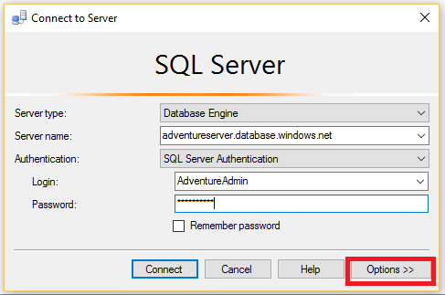
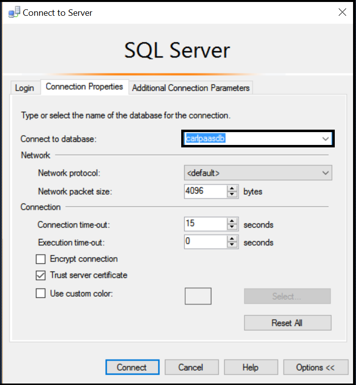

## 以用户身份连接到 Azure SQL 数据库

执行以下步骤，使用 SSMS 以用户身份连接到 Azure SQL 数据库。

1. 在 Windows 搜索框中键入“Microsoft SQL Server Management Studio”，然后单击桌面应用以启动 SSMS。

2. 在“连接到服务器”窗口中，输入以下信息：

- **服务器类型**：默认为数据库引擎；请不要更改此值。
 - **服务器名称**：输入托管你的 SQL 数据库的服务器名称，格式为 &lt;服务器名称>.**database.chinacloudapi.cn**
 - **身份验证类型**：如果你是新手，请选择“SQL 身份验证”。如果你已为 SQL 数据库逻辑服务器启用 Active Directory，可以选择“Active Directory 密码身份验证”或“Active Directory 集成身份验证”。
 - **用户名**：如果选择了“SQL 身份验证”或“Active Directory 密码身份验证”，请输入有权访问服务器上数据库的用户名。
 - **密码**：如果选择了“SQL 身份验证”或“Active Directory 密码身份验证”，请输入指定用户的密码。
   
       

3. 单击“选项”以指定你要连接到的数据库。

      
 
4. 在“连接到数据库”中，选择你要连接到的数据库。

     

5. 单击“连接”。
 
6. 如果客户端 IP 地址没有 SQL 数据库逻辑服务器的访问权限，系统将提示你登录到 Azure 帐户并创建服务器级别的防火墙规则。如果你是 Azure 订阅管理员，请单击“登录”以创建服务器级别的防火墙规则。否则，请让某位管理员在你尝试连接到的数据库中创建服务器级防火墙规则或数据库级防火墙规则。
 
      
 
7. 如果凭据授予你访问指定数据库的权限，对象资源管理器将会打开，现在你可以根据用户权限执行管理任务或查询数据。
  
      
      
 
 ## 排查连接失败

连接失败的最常见原因是服务器名称（记住，<*servername*> 是逻辑服务器（而非数据库）的名称）、用户名或密码错误，以及出于安全原因，服务器不允许进行连接。

<!---HONumber=Mooncake_0503_2016-->
