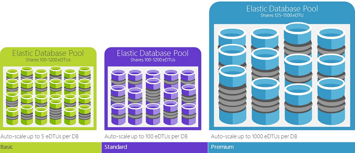

数据库事务单位 (DTU) 是 SQL 数据库中的度量单位，表示数据库基于实际度量（数据库事务）的相对性能。我们执行了针对联机事务处理 (OLTP) 请求通常需要执行的一组操作，然后度量了在全部加载的条件下每秒可以完成多少个事务（这是简短版本，你可以在[基准概述](/documentation/articles/sql-database-benchmark-overview/)中阅读底层详细信息）。

例如，具有 1750 个 DTU 的高级 P11 数据库提供的 DTU 计算能力是具有 5 个 DTU 的基本数据库的 350 倍。

>[AZURE.NOTE] 如果你要迁移现有的 SQL Server 数据库，则可使用第三方工具 [Azure SQL 数据库 DTU 计算器](http://dtucalculator.azurewebsites.net)对你的数据库在 Azure SQL 数据库中可能需要的性能级别和服务层进行估算。

### DTU 与 eDTU

单个数据库的 DTU 可直接转换为弹性数据库的 eDTU。例如，基本弹性数据库池中的一个数据库最多提供 5 个 eDTU。这与单个基本数据库的性能相同。不同之处在于弹性数据库不会使用池中的任何 eDTU，直到必须这样做。

一个简单的示例可帮助你理解。创建一个具有 1000 个 DTU 的基本弹性数据库池并在其中放置了 800 个数据库。只要在任一时间点只使用 800 个数据库中的 200 个数据库（5 DTU X 200 = 1000），就不会达到池的容量，因此数据库性能不会降低。为清楚起见，此示例进行了简化。涉及的真实数学有些复杂。门户会为你执行数学计算，并会根据历史数据库使用情况提出建议。若要了解建议的工作方式，或者要自己执行数学计算，请参阅[弹性数据库池的价格和性能注意事项](/documentation/articles/sql-database-elastic-pool-guidance/)。

<!---HONumber=Mooncake_0530_2016-->
