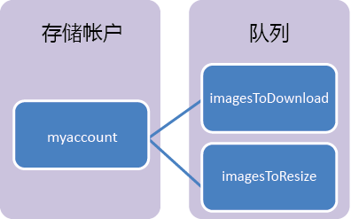

## 什么是队列存储？

Azure 队列存储是一项可存储大量消息的服务，用户可以通过经验证的调用，使用 HTTP 或 HTTPS 从世界任何地方访问这些消息。一条队列消息的大小最多可为 64 KB，一个队列中可以包含数百万条消息，直至达到存储帐户的总容量限值。

队列存储的常见用途包括：

-   创建待做工作以进行异步处理
-   将消息从 Azure Web 角色传递到 Azure worker角色

## 队列服务概念

队列服务包含以下组件：

- URL 格式：可使用以下 URL 格式对队列进行寻址：http://`<storage account>`.queue.core.chinacloudapi.cn/`<queue>` 
      
	可使用以下 URL 访问示意图中的某个队列：
		
	http://myaccount.queue.core.chinacloudapi.cn/imagesToDownload

- **存储帐户：**对 Azure 存储空间的所有访问都要通过存储帐户来完成。有关存储帐户容量的详细信息，请参阅 [Azure 存储空间可伸缩性和性能目标](/documentation/articles/storage-scalability-targets/)。

- **队列：**一个队列包含一组消息。所有消息必须位于相应的队列中。请注意，队列名称必须全部小写。有关命名队列的详细信息，请参阅[命名队列和元数据](https://msdn.microsoft.com/zh-cn/library/azure/dd179349.aspx)。

- **消息：**一条消息（不管采用何种格式）的最大大小为 64 KB。消息可以保留在队列中的最长时间为 7 天。

<!---HONumber=Mooncake_0516_2016-->