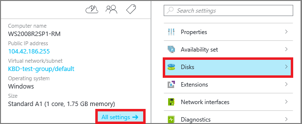
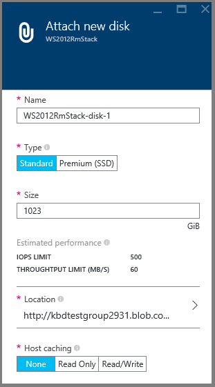
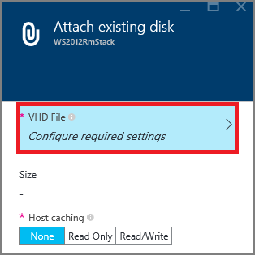
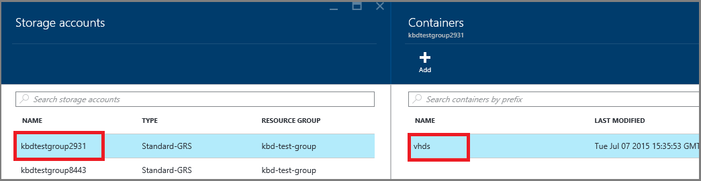

<!-- Ibiza Portal: tested -->

## 查找虚拟机

1. 登录到 Azure 门户预览。

2. 在“中心”菜单中，单击“虚拟机”。

3.	从列表中选择虚拟机。

4. 在右侧，在“Essentials”的下方，单击“所有设置”，然后单击“磁盘”。

	

按照附加新磁盘或现有磁盘的说明继续操作。

## 选项 1：附加新磁盘

1.	在“磁盘”边栏选项卡上，单击“附加新磁盘”。

2.	检查默认设置，根据需要更新，然后单击“确定”。

 	

3.	在 Azure 创建磁盘并将磁盘附加到虚拟机之后，新磁盘将出现在“数据磁盘”下的虚拟机磁盘设置中。

## 选项 2：附加现有磁盘

1.	在“磁盘”边栏选项卡上，单击“附加现有磁盘”。

2.	在“附加现有磁盘”下，单击“VHD 文件”。

	

3.	在“存储帐户”下，选择帐户和容纳 .vhd 文件的容器。

	

4.	选择 .vhd 文件

5.	在“附加现有磁盘”下，刚才选择的文件将出现在“VHD 文件”中。单击“确定”。

6.	在 Azure 将磁盘附加到虚拟机之后，磁盘将出现在“数据磁盘”下的虚拟机磁盘设置中。

