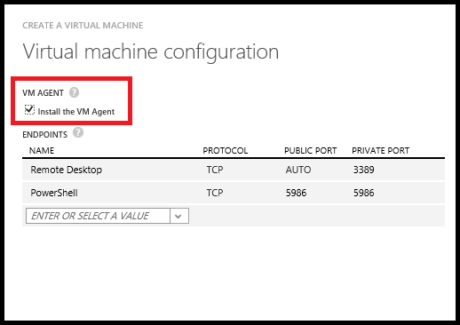

VM 扩展可帮助你：

-   修改安全性和识别功能，例如重置帐户值和使用反恶意软件
-   启动、停止或配置监视和诊断
-   重置或安装连接功能，如 RDP 和 SSH
-   诊断、监视和管理 VM

还有许多其他功能；将定期发布新的 VM 扩展功能。本文介绍适用于 Windows 和 Linux 的 Azure VM 代理，以及这些代理如何支持 VM 扩展功能。有关按功能类别列出的 VM 扩展的列表，请参阅 Azure VM 扩展和功能：[Windows](/documentation/articles/virtual-machines-windows-extensions-features/) 或者 [Linux](/documentation/articles/virtual-machines-linux-extensions-features/)。

##适用于 Windows 和 Linux 的 Azure VM 代理

Azure 虚拟机代理（VM 代理）是一个安全的轻型进程，用于在映像库中的 Azure 虚拟机实例和自定义 VM 实例（如果它们已安装 VM 代理）上安装、配置和删除 VM 扩展。VM 代理充当 Azure VM 的安全本地控制服务。该代理加载的扩展提供特定功能，以在使用实例时提高工作效率。

有两种 Azure VM 代理，一种用于 Windows VM，另一种用于 Linux VM。默认情况下，在从映像库创建 VM 时，自动安装 VM 代理，但也可以在创建实例后安装 VM 代理，或者在随后自行上载的自定义 VM 映像中安装它。

>[AZURE.IMPORTANT] 这些 VM 代理是非常轻量级的，可启用虚拟机实例的安全管理的服务。可能也存在你不想要 VM 代理的情况。如果是这样，请务必创建未安装 VM 代理的 VM。尽管可以物理删除 VM 代理，但实例上的任何 VM 扩展的行为是不确定的。因此，目前不支持在安装 VM 代理后将其删除。

在下列情况下启用 VM 代理：

-   通过使用经典管理门户中的**“快速创建”**方法或**“自定义创建”**方法创建虚拟机实例时，并确保选中**“安装 VM 代理”**复选框（如下图中所示）。有关详细信息，请参阅如何创建自定义 [Window](/documentation/articles/virtual-machines-windows-classic-createportal/) 或者 [Linux](/documentation/articles/virtual-machines-linux-classic-createportal/) 虚拟机。

    

-   通过使用 [New-AzureVM](https://msdn.microsoft.com/zh-cn/library/azure/dn495254.aspx) 或 [New-AzureQuickVM](https://msdn.microsoft.com/zh-cn/library/azure/dn495183.aspx) cmdlet 创建虚拟机实例时。可以通过在 [Add-AzureProvisioningConfig](https://msdn.microsoft.com/zh-cn/library/azure/dn495299.aspx) cmdlet 中添加 **-DisableGuestAgent** 参数来创建未安装 VM 代理的 VM。

-   在现有 VM 实例上手动下载并安装 VM 代理（Windows 或 Linux 版本），然后使用 Powershell 或 REST 调用将 **ProvisionGuestAgent** 值设为 **true**。（如果在手动安装 VM 代理后未设置此值，则将无法正常检测到添加的 VM 代理。） 以下代码示例演示如何使用 PowerShell 执行此操作，其中 `$svc` 和 `$name` 参数已确定。

        $vm = Get-AzureVM -serviceName $svc -Name $name
        $vm.VM.ProvisionGuestAgent = $TRUE
        Update-AzureVM -Name $name -VM $vm.VM -ServiceName $svc

-   创建安装了 VM 代理的 VM 映像，然后将它上载到 Azure。对于 Windows VM，下载 [Windows VM 代理 .msi 文件](http://download.microsoft.com/download/3/4/3/3437907D-745F-46EF-8116-7FC025BBEBDB/WindowsAzureVmAgent.2.6.1198.718.rd_art_stable.150415-1739.fre.msi)并安装 VM 代理。对于 Linux VM，将从位于 <https://github.com/Azure/WALinuxAgent> 的 Github 存储库安装它。有关如何在 Linux 上安装 VM 代理的详细信息，请参阅 [Azure Linux VM 代理用户指南](/documentation/articles/virtual-machines-linux-agent-user-guide/)。

>[AZURE.NOTE]在 PaaS 中，VM 代理名为 **WindowsAzureGuestAgent**，并且始终可在 Web 角色和辅助角色 VM 上找到。（有关详细信息，请参阅 [Azure 角色体系结构](http://blogs.msdn.com/b/kwill/archive/2011/05/05/windows-azure-role-architecture.aspx)。） 角色 VM 的 VM 代理现在可以按向永久性虚拟机添加扩展的相同方式向云服务 VM 添加扩展。在角色 VM 上的 VM 扩展与永久性 VM 上的 VM 扩展的最大区别是，对于角色 VM，扩展将先添加到云服务，然后再添加到该云服务中的部署。

>使用 [Get-AzureServiceAvailableExtension](https://msdn.microsoft.com/zh-cn/library/azure/dn722498.aspx) cmdlet 可列出所有可用的角色 VM 扩展。

##查找、添加、更新和删除 VM 扩展  

有关这些任务的详细信息，请参阅添加、查找、更新和删除 Azure VM 扩展：[Windows](/documentation/articles/virtual-machines-windows-classic-manage-extensions/) 或者 [Linux](/documentation/articles/virtual-machines-linux-classic-manage-extensions/)。
