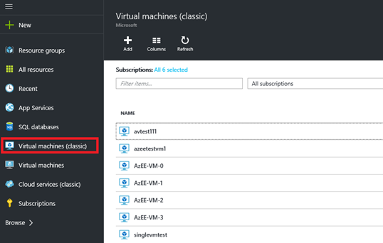

<!-- Ibiza portal: tested -->

可用性集可帮助虚拟机在停机期间（例如维护期间）保持可用。在可用性集中放置两个或更多个类似配置的虚拟机，将可针对虚拟机运行的应用程序或服务创建保持其可用性所需的冗余。有关工作原理的详细信息，请参阅“管理 [Windows](/documentation/articles/virtual-machines-windows-manage-availability/) 或 [Linux](/documentation/articles/virtual-machines-linux-manage-availability/) 虚拟机的可用性”。

同时使用可用性集和负载平衡终结点是帮助确保应用程序一直可用并有效运行的最佳实践。有关负载平衡终结点的详细信息，请参阅“Azure 基础结构服务的负载平衡”（[Windows](/documentation/articles/virtual-machines-windows-load-balance/) 或 [Linux](/documentation/articles/virtual-machines-linux-load-balance/)）。

可以使用以下两个选项中的一个，将经典虚拟机添加到可用性集中：

- [选项 1：同时创建虚拟机和可用性集][]。然后，在创建新的虚拟机时将虚拟机添加到该集。
- [选项 2：将现有虚拟机添加到可用性集][]。

>[AZURE.NOTE] 在经典模型中，要放入同一可用性集的虚拟机必须属于同一云服务。

## 选项 1：同时创建虚拟机和可用性集##

可以使用 Azure 门户预览或 Azure PowerShell 命令来执行此操作。

若要使用 Azure 门户预览：

1. 如果你尚未登录 Azure 门户预览，请先登录。

2. 在中心菜单中，单击“+ 新建”，然后单击“虚拟机”。
    
    

3. 选择要使用的应用商店虚拟机映像。可以选择创建 Linux 或 Windows 虚拟机。

4. 对于所选的虚拟机，确认部署模型已设置为“经典”，然后单击“创建”
    
    

5. 输入虚拟机名称、用户名和密码（适用于 Windows 虚拟机）或 SSH 公钥（适用于 Linux 虚拟机）。

6. 选择 VM 大小，然后单击“选择”以继续。

7. 选择“可选配置 > 可用性集”，并选择要将虚拟机添加到的可用性集。
    
    

8. 查看配置设置。完成后，单击“创建”。

9. 当 Azure 创建虚拟机时，你可以在中心菜单中的“虚拟机”下跟踪进度。

若要使用 Azure PowerShell 命令创建 Azure 虚拟机并将它添加到新的或现有的可用性集，请参阅[使用 Azure PowerShell 创建和预配置基于 Windows 的虚拟机](/documentation/articles/virtual-machines-windows-classic-create-powershell/)

## 选项 2：将现有虚拟机添加到可用性集##

在 Azure 门户预览中，可以将现有经典虚拟机添加到现有可用性集，或为现有经典虚拟机创建新的可用性集。（请记住，同一可用性集中的虚拟机必须属于同一云服务。） 步骤几乎完全相同。使用 Azure PowerShell 时，可以将虚拟机添加到现有可用性集。

1. 如果你尚未登录 Azure 门户预览，请先登录。

2. 在“中心”菜单中，单击“虚拟机(经典)”。
    
    

3. 从虚拟机列表中，选择想要添加到集中的虚拟机的名称。

4. 从虚拟机**设置**中选择“可用性集”。
    
    

5. 选择要将虚拟机添加到的可用性集。虚拟机必须与可用性集属于同一云服务。
    
    

6. 单击“保存”。

若要使用 Azure PowerShell 命令，请打开系统管理员级的 Azure PowerShell 会话并运行以下命令。对于占位符（例如 &lt;VmCloudServiceName&gt;），请将引号内的所有内容（包括 < and > 字符）替换为相应的名称。

	Get-AzureVM -ServiceName "<VmCloudServiceName>" -Name "<VmName>" | Set-AzureAvailabilitySet -AvailabilitySetName "<AvSetName>" | Update-AzureVM

>[AZURE.NOTE] 虚拟机可能必须重新启动，以完成将其添加到可用性集的操作。

<!-- LINKS -->
[选项 1：同时创建虚拟机和可用性集]: #createset
[选项 2：将现有虚拟机添加到可用性集]: #addmachine

[Load balancing for Azure infrastructure services]: /documentation/articles/virtual-machines-linux-load-balance/
[Manage the availability of virtual machines]: /documentation/articles/virtual-machines-linux-manage-availability/

[Create a virtual machine running Windows]: /documentation/articles/virtual-machines-windows-hero-tutorial/
[Virtual Network overview]: /documentation/articles/virtual-networks-overview/
[有关经典虚拟机的文章]: /documentation/articles/?tag=azure-service-management&service=virtual-machines/

<!---HONumber=Mooncake_0627_2016-->