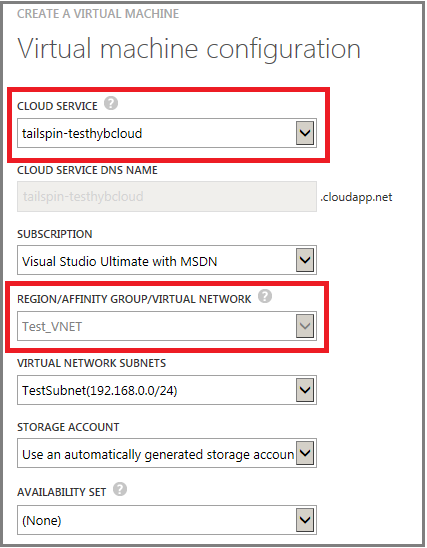

如果将虚拟机放在虚拟网络中，你可以决定要将多少云服务用于负载平衡和可用性集。此外，可以采用与本地网络相同的方式，在子网上组织虚拟机，并将虚拟网络连接到本地网络。下面是一个示例：

若要在 Azure 中连接虚拟机，建议使用虚拟网络。最佳做法是在单独的云服务中配置应用程序的每一层。不过，你可能需要将不同应用程序层的部分虚拟机整合到相同的云服务中，以维持在每个订阅最多 200 个云服务的限制内。若要查看本限制和其他限制，请参阅 [Azure 订阅和服务限制、配额与约束](/documentation/articles/azure-subscription-service-limits/)。

## 连接虚拟网络中的 VM

若要连接虚拟网络中的虚拟机，请执行以下步骤：

1.	在 [Azure 经典管理门户](/documentation/articles/virtual-networks-create-vnet-classic-portal/)中创建虚拟网络。
2.	为部署创建一组云服务，以反映可用性集和负载平衡的设计。在 Azure 经典管理门户中，针对每一个云服务，单击“新建”>“计算”>“云服务”>“自定义创建”。
3.	若要逐一创建新的虚拟机，请单击“新建”>“计算”>“虚拟机”>“从库中”。为 VM 选择正确的云服务和虚拟网络。如果云服务已加入虚拟网络，系统会为你选定服务名称。

## 连接独立云服务中的 VM

若要连接独立云服务中的虚拟机，请执行以下步骤：

1.	在 [Azure 经典管理门户](http://manage.windowsazure.cn)中创建云服务。单击“新建”>“计算”>“云服务”>“自定义创建”。或者，当你创建第一个虚拟机时，可以为你的部署创建云服务。

2.	创建虚拟机时，请选择上一个步骤中创建的云服务名称。

	
