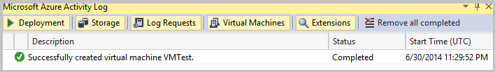

可以在 Visual Studio 中使用“服务器资源管理器”创建 Azure 中的虚拟机。

## 在服务器资源管理器中创建 Azure 虚拟机

可在 [Azure 经典管理门户](https://manage.windowsazure.cn/)中创建虚拟机，同时，也可在“服务器资源管理器”中使用命令创建 Azure 中的虚拟机。例如，可以使用虚拟机在常见的负载均衡式公共终结点后面提供一个前端。

### 创建新虚拟机

1. 在“服务器资源管理器”中打开“Azure”节点，然后单击“虚拟机”。

1. 在上下文菜单中，单击“创建虚拟机”。

    将出现“创建新虚拟机”向导。

      

1. 在“选择订阅”页上，选择创建虚拟机时要使用的订阅，然后单击“下一步”。

    如果尚未登录 Azure，请单击“登录”以登录。然后，在下拉列表框中选择你的 Azure 订阅（如果尚未选择）。

1. 在“选择虚拟机映像”页上的“映像类型”下拉列表框中选择一个映像类型，然后在“映像名称”列表框中选择虚拟机映像。完成后，单击“下一步”。

      

    可选择以下映像类型。

    - “公共映像”将列出操作系统和服务器软件（例如 Windows Server 和 SQL Server）的虚拟机映像。

    - “MSDN 映像”将列出 MSDN 订户可用软件（例如 Visual Studio 和 Microsoft Dynamics）的虚拟机映像。

    - “专用映像”将列出用户创建的专用化和通用化虚拟机映像。

    若要了解专用化和通用化虚拟机，请参阅 [VM Image](https://azure.microsoft.com/blog/2014/04/14/vm-image-blog-post/)（VM 映像）。有关如何将虚拟机转换成模板以便快速创建预配置的新虚拟机的信息，请参阅[如何捕获一台用作模板的 Windows 虚拟机](/documentation/articles/virtual-machines-windows-classic-capture-image/)。

    你可以单击虚拟机映像名称，在页面右侧查看映像的相关信息。

    >[AZURE.NOTE] 无法将虚拟机映像添加到“公共映像”或“MSDN 映像”列表，因为它们是只读的。创建的所有虚拟机都将添加到“专用映像”列表。

1. 在“虚拟机基本设置”页上，输入计算机名称，然后添加虚拟机的规格（包含大小）以及用户名和密码。完成后，单击“下一步”。

    将通过远程桌面使用新名称和密码来登录计算机，因此最好能记下新名称和密码，以免忘记。在 Visual Studio 中创建 Azure 虚拟机之后，可以在 [Azure 经典管理门户](https://manage.windowsazure.cn/)中更改其大小和其他设置。

    >[AZURE.NOTE] 如果选择更大的虚拟机规模，可能需要支付额外费用。有关详细信息，请参阅[虚拟机定价详细信息](/pricing/details/virtual-machines/)。

1. 在 Visual Studio 中创建的虚拟机需要云服务。在“云服务设置”页上，选择虚拟机的云服务，如果还没有云服务或想要使用新的云服务，请单击下拉列表中的“<新建...>”。还需要一个存储帐户，因此请在“存储帐户”下拉列表框中选择存储帐户（或创建新的存储帐户）。有关详细信息，请参阅 [Microsoft Azure 存储空间简介](/documentation/articles/storage-introduction/)。

1. 如果你想要指定虚拟网络（可选操作），请在“虚拟网络”和“子网”下拉列表框中进行选择。

    属于可用性集成员的虚拟机将部署到不同的容错域中。有关详细信息，请参阅 [Azure 虚拟网络](/home/features/networking/)。

1. 如果想让虚拟机属于可用性集（也是可选操作），请选中“指定可用性集”复选框，然后在下拉列表框中选择可用性集。完成后，选择“下一步”按钮。

    将虚拟机添加到可用性集可帮助确保在出现网络故障、本地磁盘硬件故障以及任何计划内停机时，应用程序仍然可用。需要使用 [Azure 经典管理门户](https://manage.windowsazure.cn/)来创建虚拟网络、子网和可用性集。有关详细信息，请参阅管理 [Windows](/documentation/articles/virtual-machines-windows-manage-availability/) 或 [Linux](/documentation/articles/virtual-machines-linux-manage-availability/) 虚拟机的可用性。

1. 在“终结点”页上，指定要提供给虚拟机用户使用的公共终结点。例如，除了默认启用的远程桌面和 PowerShell 终结点以外，可以选择启用 HTTP（端口 80）。若要添加终结点，请在“端口名称”下拉列表框中选择一个终结点，然后选择“添加”按钮。若要删除终结点，请选择终结点列表中名称旁边的红色 **X**。

      

    可用的终结点取决于为虚拟机选择的云服务。有关详细信息，请参阅 [Windows](/documentation/articles/virtual-machines-windows-classic-setup-endpoints/) 或 [Linux](/documentation/articles/virtual-machines-linux-classic-setup-endpoints/) VM 的 Azure 服务终结点。

    >[AZURE.NOTE] 启用公共终结点后，便可以通过 Internet 使用你虚拟机上的服务。请务必在虚拟机上安装并正确配置终结点和服务，例如，为终结点设置访问控制列表 (ACL)。有关详细信息，请参阅如何为 [Windows](/documentation/articles/virtual-machines-windows-classic-setup-endpoints/) 或 [Linux](/documentation/articles/virtual-machines-linux-classic-setup-endpoints/) 虚拟机设置终结点。

1. 配置完虚拟机设置后，请选择“创建”按钮以创建虚拟机。

    Azure 创建虚拟机时，“Azure 活动日志”将显示虚拟机创建操作的进度。

      

    若要只查看虚拟机信息，请在“Azure 活动日志”中选择“虚拟机”选项卡。

      

    如果操作成功完成，新的虚拟机将显示在“服务器资源管理器”中的“虚拟机”节点下面。可通过单击“使用远程桌面进行连接”快捷方式登录到该虚拟机。

      

## 管理虚拟机

在虚拟机配置页上，除了关闭、连接、刷新虚拟机以及向选定虚拟机添加检查点之外，你还可以查看或更改虚拟机的设置。你可以：

- 选择虚拟机大小。

- 选择用于虚拟机的可用性集。

- 添加、删除或更改公共终结点的设置。

- 添加、删除或配置虚拟机扩展。

- 查看与虚拟机关联的磁盘的信息。

### 查看或更改虚拟机设置

1. 在“服务器资源管理器”的“Azure 虚拟机”节点中选择虚拟机。

1. 在快捷菜单上，选择“配置”以查看虚拟机配置页面。

      

1. 查看或更改虚拟机信息。

### 保存或还原虚拟机状态

当你配置虚拟机以及在虚拟机上安装软件时，通过创建虚拟机检查点来定期保存进度是一种可取的做法。检查点是虚拟机的当前状态的快照或映像。如果虚拟机出现任何问题，或者你希望重新配置虚拟机，你可将其还原到以前的检查点状态，而不是从头开始创建虚拟机，从而节省时间。

### 创建虚拟机检查点

1. 在“服务器资源管理器”的“Azure 虚拟机”节点中选择虚拟机。

1. 在快捷菜单上，选择“配置”以查看虚拟机配置页面。

1. 在配置页上，选择“捕获映像”按钮。

      

    将出现“捕获虚拟机”对话框。

      

1. 提供映像标签和说明。系统提供了默认的标签和说明，但如果需要，你可以使用自己的标签和说明来覆盖它们。

1. 如果已在此虚拟机上运行 Sysprep，请选中“我已在虚拟机上运行 Sysprep”框。

    Sysprep 是一种工具，它的一种功能是将系统特定的数据从虚拟机的 Windows 版本中删除，从而使其成为其他用户能够使用的模板。有关详细信息，请参阅[如何捕获一台用作模板的 Windows 虚拟机](/documentation/articles/virtual-machines-windows-classic-capture-image/)。在运行 Sysprep 之前备份 VM。

1. 配置好捕获设置之后，选择“捕获”按钮以创建检查点。

    Azure 创建检查点时，“Azure 活动日志”将显示操作的进度。

      

    检查点操作完成时，可在“Azure 活动日志”中看到该检查点。

      

## 管理虚拟机检查点

### 将虚拟机还原到以前保存的状态

- 遵循 [Step-by-Step: Perform Cloud Restores of Azure Virtual Machines using PowerShell - Part 2](http://blogs.technet.com/b/keithmayer/archive/2014/02/04/step-by-step-perform-cloud-restores-of-windows-azure-virtual-machines-using-powershell-part-2.aspx)（分步说明：使用 PowerShell 执行 Microsoft Azure 虚拟机的云还原 - 第 2 部分）中概述的步骤。

### 删除检查点

1. 转到 [Azure 经典管理门户](https://manage.windowsazure.cn/)。

1. 在虚拟机配置页上，选择页面顶部的“映像”选项卡。

1. 选择要删除的检查点，然后选择页面底部的“删除”按钮。

## 关闭虚拟机

1. 在“服务器资源管理器”中的“Azure 虚拟机”节点下，选择要关闭的虚拟机。

1. 在快捷菜单中，选择“关闭”命令，或选择“配置”以查看虚拟机配置页，然后选择“关闭”按钮。

## 后续步骤

若要了解有关创建虚拟机的详细信息，请参阅[创建运行 Linux 的虚拟机](/documentation/articles/virtual-machines-linux-quick-create-cli/)和 [在 Azure 门户预览中创建运行 Windows 的虚拟机](/documentation/articles/virtual-machines-windows-hero-tutorial/)。

<!---HONumber=Mooncake_1114_2016-->