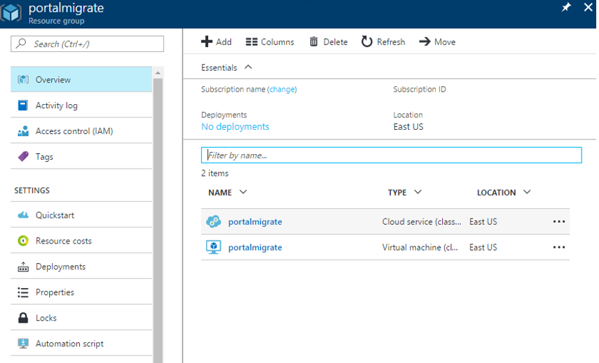
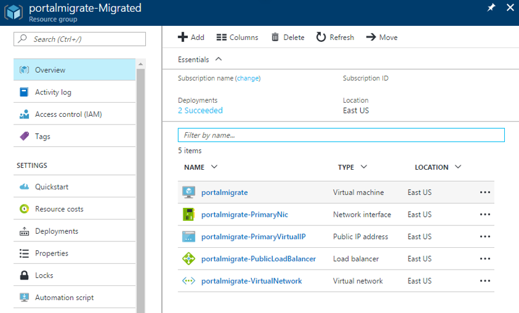
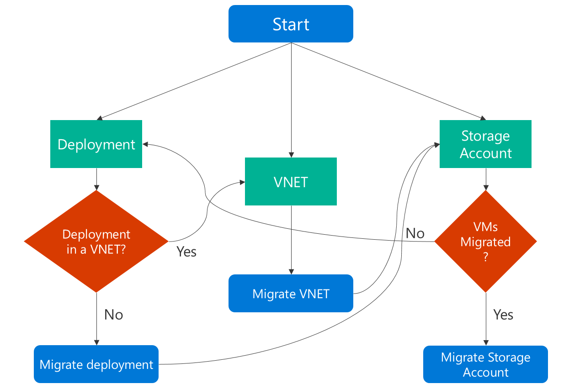

## 将 IaaS 资源从经典模型迁移到 Resource Manager 的意义
在详细了解详细信息之前，先看看 IaaS 资源的数据平面和管理平面操作之间的差异。

* *管理/控制平面*描述进入管理/控制平面或 API 修改资源的调用。 例如，创建 VM、重启 VM 以及将虚拟网络更新成新子网等操作均可管理正在运行的资源。 它们并不直接影响与实例之间的连接。
* *数据平面*（应用程序）描述应用程序本身的运行时，并涉及与不通过 Azure API 的实例的交互。 访问网站或从运行中的 SQL Server 实例或 MongoDB 服务器拉取数据，全都被视为数据平面或应用程序交互。 从存储帐户复制 Blob，以及访问公共 IP 地址以通过 RDP 或 SSH 连接到虚拟机也属于数据平面。 这些操作可让应用程序继续跨计算、网络和存储运行。

> [AZURE.NOTE]
> 在某些迁移方案中，Azure 平台会停止、释放和重新启动虚拟机。 这会造成短暂的数据平面停机。
>
>

## 迁移体验
在开始迁移体验之前，建议执行以下操作：

* 确保你要迁移的资源未使用任何不受支持的功能或配置。 通常平台会检测到这些问题并生成错误。
* 如果你有不在虚拟网络中的 VM，平台将在准备操作期间停止这些 VM 并解除其分配。 因此，如果不想丢失公共 IP 地址，请先保留 IP 地址再触发准备操作。 但是，如果 VM 位于虚拟网络中，则不会将其停止和解除分配。
* 规划在非工作时间迁移，以便应对迁移期间可能发生的任何意外失败。
* 使用 PowerShell、命令行接口 (CLI) 命令或 REST API 下载当前的 VM 配置，以便能够在完成准备步骤之后轻松进行验证。
* 先更新用于处理 Resource Manager 部署模型的自动化/操作化脚本，再开始迁移。 也可以选择在资源处于准备就绪状态时执行 GET 操作。
* 在迁移完成之后，评估经典 IaaS 资源上配置的 RBAC 策略并准备好计划。

迁移工作流如下所示

> [AZURE.NOTE]
> 下列各节描述的所有操作都是幂等的。 如果遇到功能不受支持或配置错误以外的问题，建议重试准备、中止或提交操作。 Azure 平台会尝试再次操作。
>
>

### 验证
验证操作是迁移过程中的第一个步骤。 此步骤的目的是在后台对进行迁移的资源执行数据分析，并在资源能够进行迁移时返回成功/失败。

可选择需要进行迁移验证的虚拟网络或托管服务（如果不是虚拟网络）。

* 如果资源无法迁移，Azure 平台会列出不支持迁移该资源的所有原因。

验证存储服务时，将在与存储帐户同名且追加了“-Migrated”的资源组中找到已迁移的帐户。  例如，如果存储帐户名为“mystorage”，则将在名为“mystorage-Migrated”的资源组中找到支持 Azure Resource Manager 的资源，并且它将包含名为“mystorage”的存储帐户。

### 准备
准备操作是迁移过程中的第二个步骤。 此步骤的目标是要模拟将 IaaS 资源从经典资源转换为 Resource Manager 资源的过程，并以并排方式让此转换过程直观可见。

可选择要进行迁移准备的虚拟网络或托管服务（如果不是虚拟网络）。

* 如果资源无法迁移，Azure 平台会停止迁移过程，并列出准备操作失败的原因。
* 如果资源可迁移，Azure 平台会先锁定进行迁移的资源的管理平面操作。 例如，无法将数据磁盘添加到进行迁移的 VM。

然后，Azure 平台就会开始将迁移中资源的元数据从经典模型迁移到 Resource Manager 模型。

准备操作完成之后，可以选择在经典模型和 Resource Manager 模型中将资源可视化。 对于经典部署模型中的每项云服务，Azure 平台都会创建模式为 `cloud-service-name>-Migrated` 的资源组名称。

> [AZURE.NOTE]
> 不可选择为已迁移资源创建的资源组名称（即“-Migrated”），但迁移完成后，可使用 Azure Resource Manager 移动功能将资源移动到所需的任何资源组。 若要了解详细信息，请参阅[将资源移动到新的资源组或订阅](/documentation/articles/resource-group-move-resources/)

下面两个屏幕显示了“准备”操作成功后的结果。 第一个屏幕显示包含原始云服务的资源组。 第二个屏幕显示包含 Azure Resource Manager 等效资源的新“-Migrated”资源组。

> [AZURE.NOTE]
> 不属于经典虚拟网络的虚拟机将在此迁移阶段中停止（解除分配）。
>
>

### 检查（手动或通过脚本）
在检查步骤中，你可以选择使用前面下载的配置来验证迁移是否正常。 或者，你也可以登录到门户并抽查属性和资源，来验证元数据的迁移是否正常。

如果迁移的是虚拟网络，大多数虚拟机配置不会重新启动。 对于这些 VM 上的应用程序，你可以验证应用程序是否仍已启动并在运行。

可以测试监视/自动化和操作脚本，以查看 VM 是否按预期运行，以及更新后的脚本是否正常运行。 仅当资源处于准备就绪状态时，才支持 GET 操作。

你可以慢慢考虑是否要提交迁移，因为系统对此并没有时间限制。 可以在此状态下停留任何时间。 但是，这些资源的管理平面会遭到锁定，直到中止或提交为止。

如果你发现任何问题，始终可以中止迁移，并返回到经典部署模型。 在用户返回后，Azure 平台会打开资源的管理平面操作，使用户可以继续在经典部署模型中对这些 VM 执行正常操作。

### 中止
中止是可选步骤，可让你将更改还原为经典部署模型，并停止迁移。

> [AZURE.NOTE]
> 触发提交操作后，就无法执行此操作。     
>
>

### 提交
完成验证之后，就可以提交迁移。 资源不会再出现在经典部署模型中，而只有在 Resource Manager 部署模型中才能使用这些资源。 只能在新门户中管理迁移的资源。

> [AZURE.NOTE]
> 这是幂等操作。 如果该操作失败，建议重试该操作。 如果一直失败，请创建支持票证，或在 [VM 论坛](https://social.msdn.microsoft.com/Forums/zh-cn/home?forum=WAVirtualMachinesforWindows)上创建标记为 ClassicIaaSMigration 的论坛帖子。
>
>
 
以下是迁移过程中的步骤流程图

## 从经典资源转换为 Azure Resource Manager 资源
可以在下表中找到资源的经典与 Resource Manager 表示形式。 目前不支持其他功能和资源。

| 经典表示形式 | Resource Manager 表示形式 | 详细说明 |
| --- | --- | --- |
| 云服务名称 |DNS 名称 |在迁移期间，将会以命名模式 `<cloudservicename>-migrated`为每个云服务创建新的资源组。 此资源组包含用户的所有资源。 云服务名称会成为与公共 IP 地址关联的 DNS 名称。 |
| 虚拟机 |虚拟机 |VM 特定属性将原封不动地进行迁移。 某些 osProfile 信息（例如计算机名称）不会存储在经典部署模型中，因此迁移后将保留空白。 |
| 附加到 VM 的磁盘资源 |附加到 VM 的隐式磁盘 |在 Resource Manager 部署模型中，磁盘不会建模为顶级资源。 这些磁盘将作为 VM 下的隐式磁盘进行迁移。 目前只支持附加到 VM 的磁盘。 Resource Manager VM 现在可以使用经典存储帐户轻松地迁移磁盘，不需任何更新。 |
| VM 扩展 |VM 扩展 |除 XML 扩展以外的所有资源扩展都会从经典部署模型中迁移。 |
| 虚拟机证书 |Azure 密钥保管库中的证书 |如果云服务包含服务证书，则会为每个云服务创建新的 Azure 密钥保管库，并将证书移到该密钥保管库。 VM 将更新为引用该密钥保管库中的证书。    **注意：** 请不要删除密钥保管库，否则可能导致 VM 进入故障状态。 我们正致力于改进后端中的功能，将来有望能够安全删除密钥保管库，或将其连同 VM 一起移到新订阅中。 |
| WinRM 配置 |osProfile 下的 WinRM 配置 |Windows 远程管理配置在迁移过程中会原封不动地进行转移。 |
| 可用性集属性 |可用性集资源 | 可用性集规范是经典部署模型中 VM 上的属性。 在迁移过程中，可用性集将成为顶级资源。 以下配置不受支持：每个云服务包含多个可用性集，或者在一个云服务中有一个或多个可用性集以及不在任何可用性集中的 VM。 |
| VM 上的网络配置 |主网络接口 |在迁移后，VM 上的网络配置会表示为主网络接口资源。 对于不在虚拟网络中的 VM，内部 IP 地址在迁移期间将会更改。 |
| VM 上的多个网络接口 |网络接口 |如果 VM 有多个关联的网络接口，则在迁移到 Resource Manager 部署模型的过程中，每个网络接口以及所有属性将成为顶级资源。 |
| 负载均衡的终结点集 |负载均衡器 |在经典部署模型中，平台已经为每个云服务分配一个隐式负载均衡器。 在迁移期间，将创建新的负载均衡器资源，负载均衡终结点集将成为负载均衡器规则。 |
| 入站 NAT 规则 |入站 NAT 规则 |在迁移期间，VM 上定义的输入终结点将转换成负载均衡器下的入站网络地址转换规则。 |
| VIP 地址 |具有 DNS 名称的公共 IP 地址 |虚拟 IP 地址会变成公共 IP 地址并与负载均衡器关联。 |
| 虚拟网络 |虚拟网络 |虚拟网络将连同其所有属性一起迁移到 Resource Manager 部署模型。 将创建名为 `-migrated` 的新资源组。 |
| 保留 IP |具有静态分配方法的公共 IP 地址 |与负载均衡器关联的保留 IP 将在迁移云服务或虚拟机的过程中一起迁移。 目前不支持进行未关联的保留 IP 迁移。 |
| 每个 VM 的公共 IP 地址 |具有动态分配方法的公共 IP 地址 |与 VM 关联的公共 IP 地址将转换为公共 IP 地址资源，分配方法将设置为静态。 |
| NSG |NSG |在迁移到 Resource Manager 部署模型的过程中，将克隆与子网关联的网络安全组。 在迁移期间不会删除经典部署模型中的 NSG。 但是，当迁移正在进行时，会阻止 NSG 的管理平面操作。 |
| UDR |UDR |在迁移到 Resource Manager 部署模型的过程中，将克隆与子网关联的用户定义路由。 在迁移期间不会删除经典部署模型中的 UDR。 当迁移正在进行时，会阻止 UDR 的管理平面操作。 |
| VM 网络配置中的 IP 转发属性 |NIC 中的 IP 转发属性 |VM 上的 IP 转发属性在迁移期间将转换为网络接口上的属性。 |
| 具有多个 IP 的负载均衡器 |具有多个公共 IP 资源的负载均衡器 |与负载均衡器关联的每个公共 IP 都将转换为公共 IP 资源，并在迁移后与负载均衡器关联。 |
| VM 上的内部 DNS 名称 |NIC 上的内部 DNS 名称 |在迁移期间，VM 的内部 DNS 后缀将迁移到 NIC 上名为“InternalDomainNameSuffix”的只读属性。 在迁移后，该后缀将保持不变，并且 VM 解决方案应继续像以前一样正常工作。 |
| 虚拟网络网关 |虚拟网络网关 |虚拟网络网关属性将按原样迁移。 与网关关联的 VIP 也不会更改。 |
| 本地网络站点 |本地网络网关 |本地网络站点属性将按原样迁移到名为“本地网络网关”的新资源。 这表示本地地址前缀和远程网关 IP 。 |
| 连接引用 |连接 |迁移后，网络配置中的网关与本地网络站点之间的连接引用由 Resource Manager 中一个新建的、名为“连接”的资源表示。 网络配置文件中的所有连接引用属性将按原样复制到新建的连接资源。 经典模型中的 VNet 到 VNet 连接是通过与代表 VNet 的本地网络站点建立两条 IPsec 隧道来实现的。 无需本地网络网关，即可将这转换为 Resource Manager 模型中的 Vnet2Vnet 连接类型。 |

## 自动化与工具在迁移之后的变化
在将资源从经典部署模型迁移到 Resource Manager 部署模型的过程中，必须更新现有的自动化或工具，确保其在迁移之后仍可继续运行。