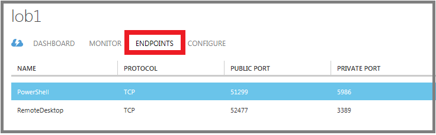
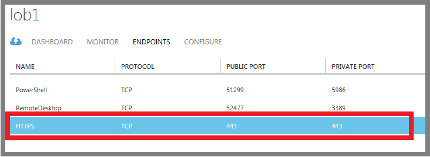
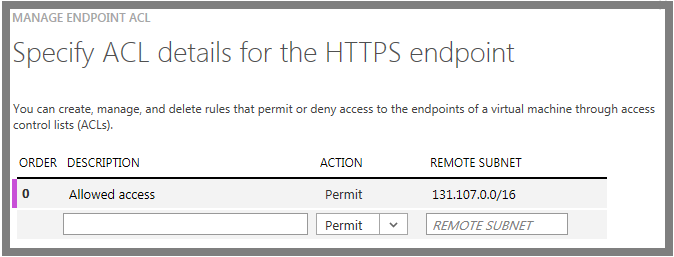

每个终结点都有一个*公用端口*和一个*专用端口*：

- Azure 负载平衡器使用公用端口侦听从 Internet 传入的虚拟机流量。
- 虚拟机使用专用端口侦听通常发送到虚拟机上运行的应用程序或服务的传入流量。

使用 Azure 经典管理门户创建终结点时，将为 IP 协议和众所周知的网络协议的 TCP 或 UDP 端口提供默认值。对于自定义终结点，必须指定正确的 IP 协议（TCP 或 UDP）以及公用和专用端口。若要将传入流量随机分布到多个虚拟机上，必须创建包含多个终结点的负载平衡集。

创建终结点后，可以使用访问控制列表 (ACL) 定义规则以根据传入流量的源 IP 地址允许或拒绝终结点的公用端口的传入流量。但是，如果虚拟机在 Azure 虚拟网络中，则应改为使用网络安全组。有关详细信息，请参阅[关于网络安全组](/documentation/articles/virtual-networks-nsg/)。

> [AZURE.NOTE]将对与 Azure 自动设置的远程连接终结点关联的端口自动完成 Azure 虚拟机的防火墙配置。对于为所有其他终结点指定的端口，将不会为虚拟机的防火墙自动进行任何配置。为虚拟机创建终结点时，需要确保虚拟机的防火墙也允许与终结点配置对应的协议和专用端口的流量。若要配置防火墙，请参阅有关在虚拟机上运行的操作系统的文档或联机帮助。

## 创建终结点

1.	如果你尚未执行，请先登录 Azure 经典管理门户。
2.	单击“虚拟机”，然后单击要配置的虚拟机的名称。
3.	单击“终结点”。“终结点”页将列出该虚拟机的所有当前终结点。（此示例中的是 Windows VM。如果是 Linux VM，则默认显示一个 SSH 终结点。）

	

4.	在任务栏中，单击“添加”。
5.	在“将终结点添加到虚拟机”页上，选择终结点的类型。

	- 如果你要创建的新终结点不属于负载平衡集也不是新负载平衡集中的第一个终结点，请选择“添加独立终结点”，然后单击左箭头。
	- 否则，请选择“将终结点添加到现有负载平衡集”，选择负载平衡集的名称，然后单击左箭头。在“指定终结点详细信息”页上，键入终结点的名称，然后单击复选标记以创建该终结点。

6.	在“指定终结点详细信息”页上的“名称”中，键入终结点的名称。此外，还可以从列表中选择网络协议名称，这将填充“协议”、“公用端口”和“专用端口”的初始值。
7.	对于自定义终结点，请在“协议”中，选择 **TCP** 或 **UDP**。
8.	对于自定义端口，请在“公用端口”中，键入从 Internet 传入流量的端口号。在“专用端口”中，键入虚拟机正在侦听的端口号。这些端口号可以是不同的。请确保已将虚拟机上的防火墙配置为允许与协议（在步骤 7 中）和专用端口对应的流量。
9.	如果此终结点是负载平衡集中的第一个终结点，请单击“创建负载平衡集”，然后单击右箭头。在“配置负载平衡集”页上，指定负载平衡集名称、探测协议和端口，以及探测间隔和发送的探测数。Azure 负载平衡器会将探测发送到负载平衡集中的虚拟机以监视其可用性。Azure 负载平衡器不会将流量转发到未响应探测的虚拟机。单击右箭头。
10.	单击复选标记以创建终结点。

新的终结点将在“终结点”页上列出。

 
##管理终结点上的 ACL

若要定义一组可以发送流量的计算机，终结点上的 ACL 可以基于源 IP 地址限制流量。按照下列步骤在终结点上添加、修改或删除 ACL。

> [AZURE.NOTE] 如果终结点是负载平衡集的一部分，则你对一个终结点上的 ACL 做出的任何更改都将应用于该集中的所有终结点。

如果虚拟机在 Azure 虚拟网络中，则建议使用网络安全组（而不是 ACL）。有关详细信息，请参阅[关于网络安全组](/documentation/articles/virtual-networks-nsg/)。

1.	如果你尚未执行，请先登录 Azure 经典管理门户。
2.	单击“虚拟机”，然后单击要配置的虚拟机的名称。
3.	单击“终结点”。从列表中选择适当的终结点。

    

5.	在任务栏中，单击“管理 ACL”以打开“指定 ACL 详细信息”对话框。

    

6.	使用列表中的行为 ACL 添加、删除或编辑规则，并更改其顺序。**远程子网**值是从 Internet 传入流量的 IP 地址范围，Azure 负载平衡器将使用该值根据流量的源 IP 地址允许或拒绝传入流量。请务必以 CIDR 格式（也称为地址前缀格式）指定 IP 地址范围。例如 131.107.0.0/16。

你可以使用规则只允许来自与 Internet 上你的计算机对应的特定计算机的流量或拒绝来自特定的已知地址范围的流量。

将按以第一条规则开始、以最后一条规则结束的顺序来计算规则。这意味着规则应按最少限制到最多限制排序。有关示例和更多信息，请参阅[什么是网络访问控制列表？](/documentation/articles/virtual-networks-acl/)。

<!---HONumber=Mooncake_0530_2016-->