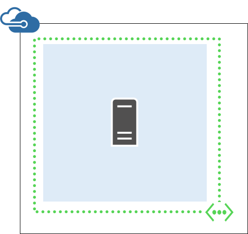
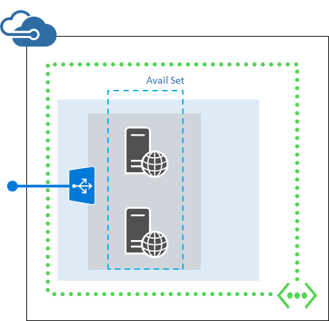

- [在 Azure 中快速创建虚拟机](#quick-create-a-vm-in-azure)
- [在 Azure 中从模板部署虚拟机](#deploy-a-vm-in-azure-from-a-template)
- [从自定义映像创建虚拟机](#create-a-custom-vm-image)
- [部署使用虚拟网络和负载平衡器的虚拟机](#deploy-a-multi-vm-application-that-uses-a-virtual-network-and-an-external-load-balancer)
- [删除资源组](#remove-a-resource-group)
- [显示资源组部署日志](#show-the-log-for-a-resource-group-deployment)
- [显示有关虚拟机的信息](#display-information-about-a-virtual-machine)
- [连接到基于 Linux 的虚拟机](#log-on-to-a-linux-based-virtual-machine)
- [停止虚拟机](#stop-a-virtual-machine)
- [启动虚拟机](#start-a-virtual-machine)
- [附加数据磁盘](#attach-a-data-disk)

## 做好准备

必须拥有正确的 Azure CLI 版本和 Azure 帐户，才能将 Azure CLI 与 Azure 资源组配合使用。如果没有 Azure CLI，[请安装](/documentation/articles/xplat-cli-install/)。

### 将 Azure CLI 版本更新到 0.9.0 或更高

键入 `azure --version` 即可查看安装的是否为版本 0.9.0 或更高版本。

	azure --version
    0.9.0 (node: 0.10.25)

如果你的版本不是 0.9.0 或更高版本，则需要使用某个本机安装程序或者通过在 **npm** 中键入 `npm update -g azure-cli` 进行更新。

你也可以使用以下 [Docker 映像](https://registry.hub.docker.com/u/microsoft/azure-cli/)运行 Docker 容器形式的 Azure CLI。在 Docker 主机上运行以下命令：

	docker run -it microsoft/azure-cli

### 设置你的 Azure 帐户和订阅

如果你还没有 Azure 订阅，你可以注册[试用版](/pricing/1rmb-trial/)。

现在，键入 `azure login -e AzureChinaCloud` 并遵循提示来进行 Azure 帐户的交互式登录体验，[以交互方式登录你的 Azure 帐户](/documentation/articles/xplat-cli-connect/#use-the-log-in-method)。

> [AZURE.NOTE] 如果有工作或学校 ID，而且知道尚未启用双因素身份验证，那么，**也**可以使用 `azure login -e AzureChinaCloud -u` 以及工作或学校 ID，在“没有” 交互式会话的情况下进行登录。如果没有工作或学校 ID，则可以[从 Microsoft 个人帐户创建工作或学校 ID](/documentation/articles/virtual-machines-windows-create-aad-work-id/)，以相同方式进行登录。

你的帐户可能有多个订阅。可以通过键入 `azure account list` 列出订阅，如下所示：

    azure account list
    info:    Executing command account list
    data:    Name                              Id                                    Tenant Id                            Current
    data:    --------------------------------  ------------------------------------  ------------------------------------  -------
    data:    Contoso Admin                     xxxxxxxx-xxxx-xxxx-xxxx-xxxxxxxxxxxx  xxxxxxxx-xxxx-xxxx-xxxx-xxxxxxxxxxxx  true
    data:    Fabrikam dev                      xxxxxxxx-xxxx-xxxx-xxxx-xxxxxxxxxxxx  xxxxxxxx-xxxx-xxxx-xxxx-xxxxxxxxxxxx  false  
    data:    Fabrikam test                     xxxxxxxx-xxxx-xxxx-xxxx-xxxxxxxxxxxx  xxxxxxxx-xxxx-xxxx-xxxx-xxxxxxxxxxxx  false  
    data:    Contoso production                xxxxxxxx-xxxx-xxxx-xxxx-xxxxxxxxxxxx  xxxxxxxx-xxxx-xxxx-xxxx-xxxxxxxxxxxx  false  

若要设置当前 Azure 订阅，请键入以下内容。使用订阅名称或 ID（包含你要管理的资源）。

	azure account set <subscription name or ID> true

### 切换到 Azure CLI 资源组模式

默认情况下，Azure CLI 在服务管理模式下启动（**asm** 模式）。键入以下内容，切换到资源组模式。

	azure config mode arm

## 了解 Azure 资源模板和资源组

大多数应用程序是通过不同资源类型的组合（例如，一个或多个 VM 和存储帐户、一个 SQL 数据库、一个虚拟网络或内容交付网络）构建的。默认 Azure 服务管理 API 和 Azure 经典管理门户使用基于服务的方法代表这些项。这种方法需要你单独部署和管理各个服务（或查找其他具备相同功能的工具），而不是当作单个逻辑部署单元。

不过，你可以利用 “Azure 资源管理器模板” 将这些不同的资源声明为一个逻辑部署单元，然后进行部署和管理。请不要以命令方式告知 Azure 逐一部署命令，而应该在 JSON 文件中描述整个部署 - 所有资源及关联的设置以及部署参数 - 然后告诉 Azure 将这些资源视为一个组进行部署。

然后，使用 Azure CLI 然后，使用 Azure CLI 资源管理命令执行以下操作，即可管理组的资源整体生命周期：

- 一次性停止、启动或删除组内的所有资源。
- 应用基于角色的访问控制 (RBAC) 规则，以锁定对这些资源的安全权限。
- 审核操作。
- 使用其他元数据标记资源以方便跟踪。

可在 [Azure 资源管理器概述](/documentation/articles/resource-group-overview/)中了解有关 Azure 资源组及其功能的详细信息。如果你想要了解如何创作模板，请参阅[创作 Azure 资源管理器模板](/documentation/articles/resource-group-authoring-templates/)。

## 任务：在 Azure 中快速创建 VM

有时候你知道需要何种映像，而且你现在需要该映像的 VM，并且不太在意基础结构 - 也许你必须在全新的 VM 上进行某些测试。此时，你可以使用 `azure vm quick-create` 命令并传递必要的参数来创建 VM 及其基础结构。

首先，创建资源组。

    azure group create coreos-quick chinanorth
    info:    Executing command group create
    + Getting resource group coreos-quick
    + Creating resource group coreos-quick
    info:    Created resource group coreos-quick
    data:    Id:                  /subscriptions/xxxxxxxx-xxxx-xxxx-xxxx-xxxxxxxxxxxx/resourceGroups/coreos-quick
    data:    Name:                coreos-quick
    data:    Location:            chinanorth
    data:    Provisioning State:  Succeeded
    data:    Tags:
    data:
    info:    group create command OK

其次，你需要一个映像。若要使用 Azure CLI 查找映像，请参阅[使用 PowerShell 和 Azure CLI 来浏览和选择 Azure 虚拟机映像](/documentation/articles/virtual-machines-linux-cli-ps-findimage/)。不过，本文只列出了以下常用映像的简短列表。我们将使用 CoreOS 的 Stable 映像来完成这个快速创建过程。

> [AZURE.NOTE] 对于 ComputeImageVersion，你也可以简单地在模板语言和 Azure CLI 中提供“latest”作为参数。这样，你无需修改脚本或模板，就始终都能使用映像的最新修补版本。如下所示。

| PublisherName | 产品 | SKU | 版本 |
|:---------------------------------|:-------------------------------------------|:---------------------------------|:--------------------|
| OpenLogic | CentOS | 7 | 7\.0.201503 |
| OpenLogic | CentOS | 7\.1 | 7\.1.201504 |
| Canonical | UbuntuServer | 12\.04.5-LTS | 12\.04.201504230 |
| Canonical | UbuntuServer | 14\.04.2-LTS | 14\.04.201503090 |
| MicrosoftWindowsServer | WindowsServer | 2012-Datacenter | 3\.0.201503 |
| MicrosoftWindowsServer | WindowsServer | 2012-R2-Datacenter | 4\.0.201503 |
| MicrosoftWindowsServer | WindowsServer | Windows-Server-Technical-Preview | 5\.0.201504 |
| MicrosoftWindowsServerHPCPack | WindowsServerHPCPack | 2012R2 | 4\.3.4665 |

只要输入 `azure vm quick-create` 命令，然后根据系统提示操作，就可以创建 VM。你应该会看到类似下面的屏幕：

    azure vm quick-create
    info:    Executing command vm quick-create
    Resource group name: coreos-quick
    Virtual machine name: coreos
    Location name: chinanorth
    Operating system Type [Windows, Linux]: linux
    ImageURN (format: "publisherName:offer:skus:version"): OpenLogic:coreos:7.1:latest
    User name: ops
    Password: *********
    Confirm password: *********
    + Looking up the VM "coreos"
    info:    Using the VM Size "Standard_A1"
    info:    The [OS, Data] Disk or image configuration requires storage account
    + Retrieving storage accounts
    info:    Could not find any storage accounts in the region "chinanorth", trying to create new one
    + Creating storage account "cli9fd3fce49e9a9b3d14302" in "chinanorth"
    + Looking up the storage account cli9fd3fce49e9a9b3d14302
    + Looking up the NIC "coreo-china-1430261891570-nic"
    info:    An nic with given name "coreo-china-1430261891570-nic" not found, creating a new one
    + Looking up the virtual network "coreo-china-1430261891570-vnet"
    info:    Preparing to create new virtual network and subnet
    / Creating a new virtual network "coreo-china-1430261891570-vnet" [address prefix: "10.0.0.0/16"] with subnet "coreo-china-1430261891570-sne+" [address prefix: "10.0.1.0/24"]
    + Looking up the virtual network "coreo-china-1430261891570-vnet"
    + Looking up the subnet "coreo-china-1430261891570-snet" under the virtual network "coreo-china-1430261891570-vnet"
    info:    Found public ip parameters, trying to setup PublicIP profile
    + Looking up the public ip "coreo-china-1430261891570-pip"
    info:    PublicIP with given name "coreo-china-1430261891570-pip" not found, creating a new one
    + Creating public ip "coreo-china-1430261891570-pip"
    + Looking up the public ip "coreo-china-1430261891570-pip"
    + Creating NIC "coreo-china-1430261891570-nic"
    + Looking up the NIC "coreo-china-1430261891570-nic"
    + Creating VM "coreos"
    + Looking up the VM "coreos"
    + Looking up the NIC "coreo-china-1430261891570-nic"
    + Looking up the public ip "coreo-china-1430261891570-pip"
    data:    Id                              :/subscriptions/xxxxxxxx-xxxx-xxxx-xxxx-xxxxxxxxxxxx/resourceGroups/coreos-quick/providers/Microsoft.Compute/virtualMachines/coreos
    data:    ProvisioningState               :Succeeded
    data:    Name                            :coreos
    data:    Location                        :chinanorth
    data:    FQDN                            :coreo-china-1430261891570-pip.chinanorth.chinacloudapp.cn
    data:    Type                            :Microsoft.Compute/virtualMachines
    data:
    data:    Hardware Profile:
    data:      Size                          :Standard_A1
    data:
    data:    Storage Profile:
    data:      Image reference:
    data:        Publisher                   :OpenLogic
    data:        Offer                       :coreos
    data:        Sku                         :7.1
    data:        Version                     :7.1.20160329
    data:
    data:      OS Disk:
    data:        OSType                      :Linux
    data:        Name                        :cli9fd3fce49e9a9b3d-os-1430261892283
    data:        Caching                     :ReadWrite
    data:        CreateOption                :FromImage
    data:        Vhd:
    data:          Uri                       :https://cli9fd3fce49e9a9b3d14302.blob.core.chinacloudapi.cn/vhds/cli9fd3fce49e9a9b3d-os-1430261892283.vhd
    data:
    data:    OS Profile:
    data:      Computer Name                 :coreos
    data:      User Name                     :ops
    data:      Linux Configuration:
    data:        Disable Password Auth       :false
    data:
    data:    Network Profile:
    data:      Network Interfaces:
    data:        Network Interface #1:
    data:          Id                        :/subscriptions/xxxxxxxx-xxxx-xxxx-xxxx-xxxxxxxxxxxx/resourceGroups/coreos-quick/providers/Microsoft.Network/networkInterfaces/coreo-china-1430261891570-nic
    data:          Primary                   :true
    data:          MAC Address               :00-0D-3A-30-72-E3
    data:          Provisioning State        :Succeeded
    data:          Name                      :coreo-china-1430261891570-nic
    data:          Location                  :chinanorth
    data:            Private IP alloc-method :Dynamic
    data:            Private IP address      :10.0.1.4
    data:            Public IP address       :104.40.24.124
    data:            FQDN                    :coreo-china-1430261891570-pip.chinanorth.chinacloudapp.cn
    info:    vm quick-create command OK

无论身在何处，新的 VM 就在你的身边。

## 任务：在 Azure 中从模板部署 VM

请参考以下各部分中所述的说明，使用 Azure CLI 从模板部署新的 Azure VM。此模板会在只有单个子网的新虚拟网络中创建单个虚拟机，而不同于 `azure vm quick-create`，它可以让你确切描述想要的内容，而且重复使用时也不会发生任何错误。以下是此模板创建的内容：

### 步骤 1：检查 JSON 文件中的模板参数

以下是模板的 JSON 文件内容。（[GitHub](https://raw.githubusercontent.com/Azure/azure-quickstart-templates/master/101-vm-simple-linux/azuredeploy.json) 中也提供了该模板。）

>[AZURE.NOTE] 你从 GitHub 仓库 "azure-quickstart-templates" 中下载的模板，需要做一些修改才能适用于 Azure 中国云环境。例如，替换一些终结点 -- "blob.core.windows.net" 替换成 "blob.core.chinacloudapi.cn"，"cloudapp.azure.com" 替换成 "chinacloudapp.cn"；改掉一些不支持的 VM 映像，还有，改掉一些不支持的 VM 大小。

模板是弹性的，因此，设计人员可能已经选择提供很多的参数给你，或者选择创建一个更固定的模板，而只提供几个参数给你。为了收集信息，请将这个模板以参数的形式传递，然后打开模板文件（本主题内嵌了以下模板），然后检查 **parameters** 值。

在此情况下，以下模板将要求提供：

- 唯一的存储帐户名称。
- 一个 VM 管理员用户名。
- 一个密码。
- 让外界使用的域名。
- Ubuntu Server 版本号 - 但将只接受一个列表。

确定这些值之后，就可以开始创建组，然后将此模板部署到 Azure 订阅。

    {
    "$schema": "https://schema.management.azure.com/schemas/2015-01-01/deploymentTemplate.json#",
    "contentVersion": "1.0.0.0",
    "parameters": {
        "newStorageAccountName": {
        "type": "string",
        "metadata": {
            "description": "Unique DNS name for the storage account where the virtual machine's disks will be placed."
        }
        },
        "adminUsername": {
        "type": "string",
        "metadata": {
            "description": "User name for the virtual machine."
        }
        },
        "adminPassword": {
        "type": "securestring",
        "metadata": {
            "description": "Password for the virtual machine."
        }
        },
        "dnsNameForPublicIP": {
        "type": "string",
        "metadata": {
            "description": "Unique DNS name for the public IP used to access the virtual machine."
        }
        },
        "ubuntuOSVersion": {
        "type": "string",
        "defaultValue": "14.04.2-LTS",
        "allowedValues": [
            "12.04.5-LTS",
            "14.04.2-LTS",
            "15.04"
        ],
        "metadata": {
            "description": "The Ubuntu version for the VM. This will pick a fully patched image of this given Ubuntu version. Allowed values: 12.04.5-LTS, 14.04.2-LTS, 15.04."
        }
        }
    },
    "variables": {
        "location": "China North",
        "imagePublisher": "Canonical",
        "imageOffer": "UbuntuServer",
        "OSDiskName": "osdiskforlinuxsimple",
        "nicName": "myVMNic",
        "addressPrefix": "10.0.0.0/16",
        "subnetName": "Subnet",
        "subnetPrefix": "10.0.0.0/24",
        "storageAccountType": "Standard_LRS",
        "publicIPAddressName": "myPublicIP",
        "publicIPAddressType": "Dynamic",
        "vmStorageAccountContainerName": "vhds",
        "vmName": "MyUbuntuVM",
        "vmSize": "Standard_D1",
        "virtualNetworkName": "MyVNET",
        "vnetID": "[resourceId('Microsoft.Network/virtualNetworks',variables('virtualNetworkName'))]",
        "subnetRef": "[concat(variables('vnetID'),'/subnets/',variables('subnetName'))]"
    },
    "resources": [
        {
        "type": "Microsoft.Storage/storageAccounts",
        "name": "[parameters('newStorageAccountName')]",
        "apiVersion": "2015-05-01-preview",
        "location": "[variables('location')]",
        "properties": {
            "accountType": "[variables('storageAccountType')]"
        }
        },
        {
        "apiVersion": "2015-05-01-preview",
        "type": "Microsoft.Network/publicIPAddresses",
        "name": "[variables('publicIPAddressName')]",
        "location": "[variables('location')]",
        "properties": {
            "publicIPAllocationMethod": "[variables('publicIPAddressType')]",
            "dnsSettings": {
            "domainNameLabel": "[parameters('dnsNameForPublicIP')]"
            }
        }
        },
        {
        "apiVersion": "2015-05-01-preview",
        "type": "Microsoft.Network/virtualNetworks",
        "name": "[variables('virtualNetworkName')]",
        "location": "[variables('location')]",
        "properties": {
            "addressSpace": {
            "addressPrefixes": [
                "[variables('addressPrefix')]"
            ]
            },
            "subnets": [
            {
                "name": "[variables('subnetName')]",
                "properties": {
                "addressPrefix": "[variables('subnetPrefix')]"
                }
            }
            ]
        }
        },
        {
        "apiVersion": "2015-05-01-preview",
        "type": "Microsoft.Network/networkInterfaces",
        "name": "[variables('nicName')]",
        "location": "[variables('location')]",
        "dependsOn": [
            "[concat('Microsoft.Network/publicIPAddresses/', variables('publicIPAddressName'))]",
            "[concat('Microsoft.Network/virtualNetworks/', variables('virtualNetworkName'))]"
        ],
        "properties": {
            "ipConfigurations": [
            {
                "name": "ipconfig1",
                "properties": {
                "privateIPAllocationMethod": "Dynamic",
                "publicIPAddress": {
                    "id": "[resourceId('Microsoft.Network/publicIPAddresses',variables('publicIPAddressName'))]"
                },
                "subnet": {
                    "id": "[variables('subnetRef')]"
                }
                }
            }
            ]
        }
        },
        {
        "apiVersion": "2015-05-01-preview",
        "type": "Microsoft.Compute/virtualMachines",
        "name": "[variables('vmName')]",
        "location": "[variables('location')]",
        "dependsOn": [
            "[concat('Microsoft.Storage/storageAccounts/', parameters('newStorageAccountName'))]",
            "[concat('Microsoft.Network/networkInterfaces/', variables('nicName'))]"
        ],
        "properties": {
            "hardwareProfile": {
            "vmSize": "[variables('vmSize')]"
            },
            "osProfile": {
            "computername": "[variables('vmName')]",
            "adminUsername": "[parameters('adminUsername')]",
            "adminPassword": "[parameters('adminPassword')]"
            },
            "storageProfile": {
            "imageReference": {
                "publisher": "[variables('imagePublisher')]",
                "offer": "[variables('imageOffer')]",
                "sku": "[parameters('ubuntuOSVersion')]",
                "version": "latest"
            },
            "osDisk": {
                "name": "osdisk",
                "vhd": {
                "uri": "[concat('http://',parameters('newStorageAccountName'),'.blob.core.chinacloudapi.cn/',variables('vmStorageAccountContainerName'),'/',variables('OSDiskName'),'.vhd')]"
                },
                "caching": "ReadWrite",
                "createOption": "FromImage"
            }
            },
            "networkProfile": {
            "networkInterfaces": [
                {
                "id": "[resourceId('Microsoft.Network/networkInterfaces',variables('nicName'))]"
                }
            ]
            }
        }
        }
    ]
    }

### 步骤 2：使用模板创建虚拟机

准备好参数值之后，你必须创建一个部署模板时用到的资源组，然后部署模板。

若要创建资源组，请键入 `azure group create <group name> <location>` 和要使用的组的名称，以及要部署到的数据中心位置。此过程很快就能完成：

    azure group create myResourceGroup chinanorth
    info:    Executing command group create
    + Getting resource group myResourceGroup
    + Creating resource group myResourceGroup
    info:    Created resource group myResourceGroup
    data:    Id:                  /subscriptions/xxxxxxxx-xxxx-xxxx-xxxx-xxxxxxxxxxxx/resourceGroups/myResourceGroup
    data:    Name:                myResourceGroup
    data:    Location:            chinanorth
    data:    Provisioning State:  Succeeded
    data:    Tags:
    data:
    info:    group create command OK

现在要创建部署，请调用 `azure group deployment create` 并传递：

- 模板文件（如果要将上述 JSON 模板存储到本地文件）。
- 模板 URI（如果要指向 Github 中的文件或其他网址）。
- 要部署到的资源组。
- 可选的部署名称。

系统会提示你提供 JSON 文件的 "parameters" 节中的参数值。指定所有参数值后，即会开始部署。

下面是一个示例：

你可以在 [GitHub](https://raw.githubusercontent.com/Azure/azure-quickstart-templates/master/101-vm-simple-linux/azuredeploy.json) 下载模板，然后运行下面的命令。

>[AZURE.NOTE] 你从 GitHub 仓库 "azure-quickstart-templates" 中下载的模板，需要做一些修改才能适用于 Azure 中国云环境。例如，替换一些终结点 -- "blob.core.windows.net" 替换成 "blob.core.chinacloudapi.cn"，"cloudapp.azure.com" 替换成 "chinacloudapp.cn"；改掉一些不支持的 VM 映像，还有，改掉一些不支持的 VM 大小。

    azure group deployment create --template-file /path/to/azuredeploy.json myResourceGroup firstDeployment
    info:    Executing command group deployment create
    info:    Supply values for the following parameters
    adminUsername: ops
    adminPassword: password
    dnsLabelPrefix: newdomainname

你将收到以下类型的信息：

    + Initializing template configurations and parameters
    + Creating a deployment
    info:    Created template deployment "firstDeployment"
    + Waiting for deployment to complete
    data:    DeploymentName     : firstDeployment
    data:    ResourceGroupName  : myResourceGroup
    data:    ProvisioningState  : Succeeded
    data:    Timestamp          : 2015-04-28T07:53:55.1828878Z
    data:    Mode               : Incremental
	data:    CorrelationId      : xxxxxxxx-xxxx-xxxx-xxxx-xxxxxxxxxxxx
	data:    DeploymentParameters :
	data:    Name             Type          Value
	data:    ---------------  ------------  -----------
	data:    adminUsername    String        ops
	data:    adminPassword    SecureString  undefined
	data:    dnsLabelPrefix   String        newdomainname
	data:    ubuntuOSVersion  String        14.04.2-LTS
	data:    Outputs            :
	data:    Name        Type    Value
	data:    ----------  ------  -----------------------------------------------
	data:    hostname    String  newdomainname.chinanorth.chinacloudapp.cn
	data:    sshCommand  String  ssh ops@newdomainname.chinanorth.chinacloudapp.cn
	info:    group deployment create command OK

## 任务：创建自定义 VM 映像

你已基本了解上述模板的用法，那么现在我们可以使用类似的说明，通过 Azure CLI 使用模板从 Azure 的特定 .vhd 文件创建自定义 VM 映像。其中的差别就是此模板会从指定的虚拟硬盘 (VHD) 创建单个虚拟机。（这个模板也可以在 [GitHub](https://raw.githubusercontent.com/Azure/azure-quickstart-templates/master/101-vm-from-user-image/azuredeploy.json) 上找到。）

### 步骤 1：检查 JSON 文件中的模板

以下是本部分举例说明时，模板的 JSON 文件内容。

>[AZURE.NOTE] 你从 GitHub 仓库 "azure-quickstart-templates" 中下载的模板，需要做一些修改才能适用于 Azure 中国云环境。例如，替换一些终结点 -- "blob.core.windows.net" 替换成 "blob.core.chinacloudapi.cn"，"cloudapp.azure.com" 替换成 "chinacloudapp.cn"；改掉一些不支持的 VM 映像，还有，改掉一些不支持的 VM 大小。

同样，参数如果没有默认值，就必须找出你想输入的值。当你运行 `azure group deployment create` 命令时，Azure CLI 会提示你输入这些值。

    {
        "$schema": "http://schema.management.azure.com/schemas/2014-04-01-preview/deploymentTemplate.json",
        "contentVersion": "1.0.0.0",
        "parameters" : {
            "userImageStorageAccountName": {
                "type": "string",
                "defaultValue" : "userImageStorageAccountName"
            },
            "userImageStorageContainerName" : {
                "type" : "string",
                "defaultValue" : "userImageStorageContainerName"
            },
            "userImageVhdName" : {
                "type" : "string",
                "defaultValue" : "userImageVhdName"
            },
            "dnsNameForPublicIP" : {
                "type" : "string",
                "defaultValue": "uniqueDnsNameForPublicIP"
            },
            "adminUserName": {
                "type": "string"
            },
            "adminPassword": {
                "type": "securestring"
            },
            "osType" : {
                "type" : "string",
                "allowedValues" : [
                    "windows",
                    "linux"
                ]
            },
            "subscriptionId":{
                "type" : "string"
            },
            "location": {
                "type": "String",
                "defaultValue" : "China North"
            },
            "vmSize": {
                "type": "string",
                "defaultValue": "Standard_A2"
            },
            "publicIPAddressName": {
                "type": "string",
                "defaultValue" : "myPublicIP"
            },
            "vmName": {
                "type": "string",
                "defaultValue" : "myVM"
            },
            "virtualNetworkName":{
                "type" : "string",
                "defaultValue" : "myVNET"
            },
            "nicName":{
                "type" : "string",
                "defaultValue":"myNIC"
            }
        },
        "variables": {
            "addressPrefix":"10.0.0.0/16",
            "subnet1Name": "Subnet-1",
            "subnet2Name": "Subnet-2",
            "subnet1Prefix" : "10.0.0.0/24",
            "subnet2Prefix" : "10.0.1.0/24",
            "publicIPAddressType" : "Dynamic",
            "vnetID":"[resourceId('Microsoft.Network/virtualNetworks',parameters('virtualNetworkName'))]",
            "subnet1Ref" : "[concat(variables('vnetID'),'/subnets/',variables('subnet1Name'))]",
            "userImageName" : "[concat('http://',parameters('userImageStorageAccountName'),'.blob.core.chinacloudapi.cn/',parameters('userImageStorageContainerName'),'/',parameters('userImageVhdName'))]",
            "osDiskVhdName" : "[concat('http://',parameters('userImageStorageAccountName'),'.blob.core.chinacloudapi.cn/',parameters('userImageStorageContainerName'),'/',parameters('vmName'),'osDisk.vhd')]"
        },
        "resources": [
        {
            "apiVersion": "2014-12-01-preview",
            "type": "Microsoft.Network/publicIPAddresses",
            "name": "[parameters('publicIPAddressName')]",
            "location": "[parameters('location')]",
            "properties": {
                "publicIPAllocationMethod": "[variables('publicIPAddressType')]",
                "dnsSettings": {
                    "domainNameLabel": "[parameters('dnsNameForPublicIP')]"
                }
            }
        },
        {
          "apiVersion": "2014-12-01-preview",
          "type": "Microsoft.Network/virtualNetworks",
          "name": "[parameters('virtualNetworkName')]",
          "location": "[parameters('location')]",
          "properties": {
            "addressSpace": {
              "addressPrefixes": [
                "[variables('addressPrefix')]"
              ]
            },
            "subnets": [
              {
                "name": "[variables('subnet1Name')]",
                "properties" : {
                    "addressPrefix": "[variables('subnet1Prefix')]"
                }
              },
              {
                "name": "[variables('subnet2Name')]",
                "properties" : {
                    "addressPrefix": "[variables('subnet2Prefix')]"
                }
              }
            ]
          }
        },
        {
            "apiVersion": "2014-12-01-preview",
            "type": "Microsoft.Network/networkInterfaces",
            "name": "[parameters('nicName')]",
            "location": "[parameters('location')]",
            "dependsOn": [
                "[concat('Microsoft.Network/publicIPAddresses/', parameters('publicIPAddressName'))]",
                "[concat('Microsoft.Network/virtualNetworks/', parameters('virtualNetworkName'))]"
            ],
            "properties": {
                "ipConfigurations": [
                {
                    "name": "ipconfig1",
                    "properties": {
                        "privateIPAllocationMethod": "Dynamic",
                        "publicIPAddress": {
                            "id": "[resourceId('Microsoft.Network/publicIPAddresses',parameters('publicIPAddressName'))]"
                        },
                        "subnet": {
                            "id": "[variables('subnet1Ref')]"
                        }
                    }
                }
                ]
            }
        },
        {
            "apiVersion": "2014-12-01-preview",
            "type": "Microsoft.Compute/virtualMachines",
            "name": "[parameters('vmName')]",
            "location": "[parameters('location')]",
            "dependsOn": [
                "[concat('Microsoft.Network/networkInterfaces/', parameters('nicName'))]"
            ],
            "properties": {
                "hardwareProfile": {
                    "vmSize": "[parameters('vmSize')]"
                },
                "osProfile": {
                    "computername": "[parameters('vmName')]",
                    "adminUsername": "[parameters('adminUsername')]",
                    "adminPassword": "[parameters('adminPassword')]"
                },
                "storageProfile": {
                    "osDisk" : {
                        "name" : "[concat(parameters('vmName'),'-osDisk')]",
                        "osType" : "[parameters('osType')]",
                        "caching" : "ReadWrite",
                        "image" : {
                            "uri" : "[variables('userImageName')]"
                        },
                        "vhd" : {
                            "uri" : "[variables('osDiskVhdName')]"
                        }
                    }
                },
                "networkProfile": {
                    "networkInterfaces" : [
                    {
                        "id": "[resourceId('Microsoft.Network/networkInterfaces',parameters('nicName'))]"
                    }
                    ]
                }
            }
        }
        ]
    }

### 步骤 2：获取 VHD

显然，为此你需要一个 .vhd。你可以使用 Azure 中现有的 .vhd，或者上载一个 .vhd。

对于基于 Windows 的虚拟机，请参阅[创建 Windows Server VHD 并将其上载到 Azure](/documentation/articles/virtual-machines-windows-classic-createupload-vhd/)。

有关基于 Linux 的虚拟机，请参阅[创建和上载包含 Linux 操作系统的虚拟硬盘](/documentation/articles/virtual-machines-linux-classic-create-upload-vhd/)。

### 步骤 3：使用模板创建虚拟机

现在你已准备好使用 .vhd 创建新的虚拟机。使用 `azure group create <location>` 创建一个要部署到的组：

    azure group create myResourceGroupUser chinaeast
    info:    Executing command group create
    + Getting resource group myResourceGroupUser
    + Creating resource group myResourceGroupUser
    info:    Created resource group myResourceGroupUser
    data:    Id:                  /subscriptions/xxxxxxxx-xxxx-xxxx-xxxx-xxxxxxxxxxxx/resourceGroups/myResourceGroupUser
    data:    Name:                myResourceGroupUser
    data:    Location:            chinaeast
    data:    Provisioning State:  Succeeded
    data:    Tags:
    data:
    info:    group create command OK

然后使用 `--template-uri` 选项直接调用模板（或者使用 `--template-file` 选项，使用自己保存在本地的文件），开始创建部署。请注意，因为模板已指定默认值，所以系统会提示你只输入几项数据。如果将模板部署到几个不同的地方，可能会发现某些名称与默认值冲突（特别是你创建的 DNS 名称）。

>[AZURE.NOTE] 你从 GitHub 仓库 "azure-quickstart-templates" 中下载的模板，需要做一些修改才能适用于 Azure 中国云环境。例如，替换一些终结点 -- "blob.core.windows.net" 替换成 "blob.core.chinacloudapi.cn"，"cloudapp.azure.com" 替换成 "chinacloudapp.cn"；改掉一些不支持的 VM 映像，还有，改掉一些不支持的 VM 大小。

    azure group deployment create \
    > --template-file /path/to/azuredeploy.json \
    > myResourceGroup \
    > customVhdDeployment
    info:    Executing command group deployment create
    info:    Supply values for the following parameters
    adminUserName: ops
    adminPassword: password
    osType: linux
    subscriptionId: xxxxxxxx-xxxx-xxxx-xxxx-xxxxxxxxxxxx

输出如下所示：

    + Initializing template configurations and parameters
    + Creating a deployment
    info:    Created template deployment "customVhdDeployment"
    + Waiting for deployment to complete
    error:   Deployment provisioning state was not successful
    data:    DeploymentName     : customVhdDeployment
    data:    ResourceGroupName  : myResourceGroupUser
    data:    ProvisioningState  : Succeeded
    data:    Timestamp          : 2015-04-28T14:55:48.0963829Z
    data:    Mode               : Incremental
	data:    CorrelationId      : xxxxxxxx-xxxx-xxxx-xxxx-xxxxxxxxxxxx
	data:    DeploymentParameters :
    data:    Name                           Type          Value
    data:    -----------------------------  ------------  ------------------------------------
    data:    userImageStorageAccountName    String        userImageStorageAccountName
    data:    userImageStorageContainerName  String        userImageStorageContainerName
    data:    userImageVhdName               String        userImageVhdName
    data:    dnsNameForPublicIP             String        uniqueDnsNameForPublicIP
    data:    adminUserName                  String        ops
    data:    adminPassword                  SecureString  undefined
    data:    osType                         String        linux
    data:    subscriptionId                 String        xxxxxxxx-xxxx-xxxx-xxxx-xxxxxxxxxxxx
    data:    location                       String        China North
    data:    vmSize                         String        Standard_A2
    data:    publicIPAddressName            String        myPublicIP
    data:    vmName                         String        myVM
    data:    virtualNetworkName             String        myVNET
    data:    nicName                        String        myNIC
    info:    group deployment create command OK

## 任务：部署使用虚拟网络和外部负载平衡器的多 VM 应用程序

你可以使用此模板在一个负载平衡器上创建两个虚拟机，然后在端口 80 上配置负载平衡规则。此模板还会部署存储帐户、虚拟网络、公共 IP 地址、可用性集和网络接口。

按照以下步骤部署一个多 VM 应用程序，它会通过 Azure PowerShell 命令使用 Github 模板存储库中的资源管理器模板，然后就可以使用虚拟网络和负载平衡器。

### 步骤 1：检查 JSON 文件中的模板

以下是模板的 JSON 文件内容。如果你需要最新版本，可查阅 [Github repository for templates（Github 模板存储库）](https://raw.githubusercontent.com/Azure/azure-quickstart-templates/master/201-2-vms-loadbalancer-lbrules/azuredeploy.json)。此主题使用 `--template-uri` 开关来调用模板，不过你也可以使用 `--template-file` 开关来传递本地版本。

>[AZURE.NOTE] 你从 GitHub 仓库 "azure-quickstart-templates" 中下载的模板，需要做一些修改才能适用于 Azure 中国云环境。例如，替换一些终结点 -- "blob.core.windows.net" 替换成 "blob.core.chinacloudapi.cn"，"cloudapp.azure.com" 替换成 "chinacloudapp.cn"；改掉一些不支持的 VM 映像，还有，改掉一些不支持的 VM 大小。

    {
        "$schema": "http://schema.management.azure.com/schemas/2014-04-01-preview/deploymentTemplate.json",
        "contentVersion": "1.0.0.0",
        "parameters": {
            "location": {
                "type": "string",
                "metadata": {
                  "description": "Location of resources"
                }
            },
            "storageAccountName": {
                "type": "string",
                "metadata": {
                  "description": "Name of storage account"
                }
            },
            "adminUsername": {
                "type": "string",
                "metadata": {
                  "description": "Admin user name"
                }
            },
            "adminPassword": {
                "type": "securestring",
                "metadata": {
                  "description": "Admin password"
                }
            },
            "dnsNameforLBIP": {
                "type": "string",
                "metadata": {
                  "description": "DNS for load balancer IP"
                }
            },
            "backendPort": {
                "type": "int",
                "defaultValue": 3389,
                "metadata": {
                  "description": "Back-end port"
                }
            },
            "vmNamePrefix": {
                "type": "string",
                "defaultValue": "myVM",
                "metadata": {
                  "description": "Prefix to use for VM names"
                }
            },
            "vmSourceImageName": {
                "type": "string",
                "defaultValue": "a699494373c04fc0bc8f2bb1389d6106__Windows-Server-2012-R2-201412.01-en.us-127GB.vhd"
            },
            "lbName": {
                "type": "string",
                "defaultValue": "myLB",
                "metadata": {
                  "description": "Load balancer name"
                }
            },
            "nicNamePrefix": {
                "type": "string",
                "defaultValue": "nic",
                "metadata": {
                  "description": "Network interface name prefix"
                }
            },
            "publicIPAddressName": {
                "type": "string",
                "defaultValue": "myPublicIP",
                "metadata": {
                  "description": "Public IP name"
                }
            },
            "vnetName": {
                "type": "string",
                "defaultValue": "myVNET",
                "metadata": {
                  "description": "Virtual network name"
                }
            },
            "vmSize": {
                "type": "string",
                "defaultValue": "Standard_A1",
                "metadata": {
                  "description": "Size of the VM"
                }
            }
        },
        "variables": {
            "storageAccountType": "Standard_LRS",
            "vmStorageAccountContainerName": "vhds",
            "availabilitySetName": "myAvSet",
            "addressPrefix": "10.0.0.0/16",
            "subnetName": "Subnet-1",
            "subnetPrefix": "10.0.0.0/24",
            "publicIPAddressType": "Dynamic",
            "vnetID": "[resourceId('Microsoft.Network/virtualNetworks',parameters('vnetName'))]",
            "subnetRef": "[concat(variables('vnetID'),'/subnets/',variables ('subnetName'))]",
            "publicIPAddressID": "[resourceId('Microsoft.Network/publicIPAddresses',parameters('publicIPAddressName'))]",
            "lbID": "[resourceId('Microsoft.Network/loadBalancers',parameters('lbName'))]",
            "numberOfInstances": 2,
            "nicId1": "[resourceId('Microsoft.Network/networkInterfaces',concat(parameters('nicNamePrefix'), 0))]",
            "nicId2": "[resourceId('Microsoft.Network/networkInterfaces',concat(parameters('nicNamePrefix'), 1))]",
            "frontEndIPConfigID": "[concat(variables('lbID'),'/frontendIPConfigurations/LBFE')]",
            "backEndIPConfigID1": "[concat(variables('nicId1'),'/ipConfigurations/ipconfig1')]",
            "backEndIPConfigID2": "[concat(variables('nicId2'),'/ipConfigurations/ipconfig1')]",
            "sourceImageName": "[concat('/', subscription().subscriptionId,'/services/images/',parameters('vmSourceImageName'))]",
            "lbPoolID": "[concat(variables('lbID'),'/backendAddressPools/LBBE')]",
            "lbProbeID": "[concat(variables('lbID'),'/probes/tcpProbe')]"
        },
        "resources": [
            {
                "type": "Microsoft.Storage/storageAccounts",
                "name": "[parameters('storageAccountName')]",
                "apiVersion": "2015-05-01-preview",
                "location": "[parameters('location')]",
                "properties": {
                    "accountType": "[variables('storageAccountType')]"
                }
            },
            {
                "type": "Microsoft.Compute/availabilitySets",
                "name": "[variables('availabilitySetName')]",
                "apiVersion": "2015-05-01-preview",
                "location": "[parameters('location')]",
                "properties": { }
            },
            {
                "apiVersion": "2015-05-01-preview",
                "type": "Microsoft.Network/publicIPAddresses",
                "name": "[parameters('publicIPAddressName')]",
                "location": "[parameters('location')]",
                "properties": {
                    "publicIPAllocationMethod": "[variables('publicIPAddressType')]",
                    "dnsSettings": {
                        "domainNameLabel": "[parameters('dnsNameforLBIP')]"
                    }
                }
            },
            {
                "apiVersion": "2015-05-01-preview",
                "type": "Microsoft.Network/virtualNetworks",
                "name": "[parameters('vnetName')]",
                "location": "[parameters('location')]",
                "properties": {
                    "addressSpace": {
                        "addressPrefixes": [
                            "[variables('addressPrefix')]"
                        ]
                    },
                    "subnets": [
                        {
                            "name": "[variables('subnetName')]",
                            "properties": {
                                "addressPrefix": "[variables('subnetPrefix')]"
                            }
                        }
                    ]
                }
            },
            {
                "apiVersion": "2015-05-01-preview",
                "type": "Microsoft.Network/networkInterfaces",
                "name": "[concat(parameters('nicNamePrefix'), copyindex())]",
                "location": "[parameters('location')]",
                "copy": {
                    "name": "nicLoop",
                    "count": "[variables('numberOfInstances')]"
                },
                "dependsOn": [
                    "[concat('Microsoft.Network/virtualNetworks/', parameters('vnetName'))]"
                ],
                "properties": {
                    "ipConfigurations": [
                        {
                            "name": "ipconfig1",
                            "properties": {
                                "privateIPAllocationMethod": "Dynamic",
                                "subnet": {
                                    "id": "[variables('subnetRef')]"
                                }
                            },
                            "loadBalancerBackendAddressPools": [
                                {
                                    "id": "[concat('Microsoft.Network/loadBalancers/',parameters('lbName'),'/backendAddressPools/LBBE')]"
                                }
                            ],
                            "loadBalancerInboundNatRules": [
                                {
                                    "id": "[concat('Microsoft.Network/loadBalancers/',parameters('lbName'),'/inboundNatRule/RDP-VM', copyindex())]"
                                }
                            ]

                        }
                    ]

                }
            },
            {
                "apiVersion": "2015-05-01-preview",
                "name": "[parameters('lbName')]",
                "type": "Microsoft.Network/loadBalancers",
                "location": "[parameters('location')]",
                "dependsOn": [
                    "nicLoop",
                    "[concat('Microsoft.Network/publicIPAddresses/', parameters('publicIPAddressName'))]"
                ],
                "properties": {
                    "frontendIPConfigurations": [
                        {
                            "name": "LBFE",
                            "properties": {
                                "publicIPAddress": {
                                    "id": "[variables('publicIPAddressID')]"
                                }
                            }
                        }
                    ],
                    "backendAddressPools": [
                        {
                            "name": "LBBE"

                        }
                    ],
                    "inboundNatRules": [
                        {
                            "name": "RDP-VM1",
                            "properties": {
                                "frontendIPConfiguration":
                                    {
                                        "id": "[variables('frontEndIPConfigID')]"
                                    },
                                "protocol": "tcp",
                                "frontendPort": 50001,
                                "backendPort": 3389,
                                "enableFloatingIP": false
                            }
                        },
                        {
                            "name": "RDP-VM2",
                            "properties": {
                                "frontendIPConfiguration":
                                    {
                                        "id": "[variables('frontEndIPConfigID')]"
                                    },
                                "protocol": "tcp",
                                "frontendPort": 50002,
                                "backendPort": 3389,
                                "enableFloatingIP": false
                            }
                        }
                    ],
                    "loadBalancingRules": [
                        {
                            "name": "LBRule",
                            "properties": {
                                "frontendIPConfiguration": {
                                    "id": "[variables('frontEndIPConfigID')]"
                                },
                                "backendAddressPool": {
                                    "id": "[variables('lbPoolID')]"
                                },
                                "protocol": "tcp",
                                "frontendPort": 80,
                                "backendPort": 80,
                                "enableFloatingIP": false,
                                "idleTimeoutInMinutes": 5,
                                "probe": {
                                    "id": "[variables('lbProbeID')]"
                                }
                            }
                        }
                    ],
                    "probes": [
                        {
                            "name": "tcpProbe",
                            "properties": {
                                "protocol": "tcp",
                                "port": 80,
                                "intervalInSeconds": "5",
                                "numberOfProbes": "2"
                            }
                        }
                    ]
                }
            },
            {
                "apiVersion": "2015-05-01-preview",
                "type": "Microsoft.Compute/virtualMachines",
                "name": "[concat(parameters('vmNamePrefix'), copyindex())]",
                "copy": {
                    "name": "virtualMachineLoop",
                    "count": "[variables('numberOfInstances')]"
                },
                "location": "[parameters('location')]",
                "dependsOn": [
                    "[concat('Microsoft.Storage/storageAccounts/', parameters('storageAccountName'))]",
                    "[concat('Microsoft.Network/networkInterfaces/', parameters('nicNamePrefix'), copyindex())]",
                    "[concat('Microsoft.Compute/availabilitySets/', variables('availabilitySetName'))]"
                ],
                "properties": {
                    "availabilitySet": {
                        "id": "[resourceId('Microsoft.Compute/availabilitySets',variables('availabilitySetName'))]"
                    },
                    "hardwareProfile": {
                        "vmSize": "[parameters('vmSize')]"
                    },
                    "osProfile": {
                        "computername": "[concat(parameters('vmNamePrefix'), copyIndex())]",
                        "adminUsername": "[parameters('adminUsername')]",
                        "adminPassword": "[parameters('adminPassword')]"
                    },
                    "storageProfile": {
                        "sourceImage": {
                            "id": "[variables('sourceImageName')]"
                        },
                        "destinationVhdsContainer": "[concat('http://',parameters('storageAccountName'),'.blob.core.chinacloudapi.cn/',variables('vmStorageAccountContainerName'),'/')]"
                    },
                    "networkProfile": {
                        "networkInterfaces": [
                            {
                                "id": "[resourceId('Microsoft.Network/networkInterfaces',concat(parameters('nicNamePrefix'),copyindex()))]"
                            }
                        ]
                    }
                }
            }
        ]
    }

### 步骤 2：使用模板创建部署

使用 `azure group create <location>` 为模板创建资源组。然后在该资源组中创建部署，方式是使用 `azure group deployment create` 并传递资源组、部署名称，然后根据提示为模板中没有默认值的参数输入相关的值。

    azure group create lbgroup chinanorth
    info:    Executing command group create
    + Getting resource group lbgroup
    + Creating resource group lbgroup
    info:    Created resource group lbgroup
    data:    Id:                  /subscriptions/xxxxxxxx-xxxx-xxxx-xxxx-xxxxxxxxxxxx/resourceGroups/lbgroup
    data:    Name:                lbgroup
    data:    Location:            chinanorth
    data:    Provisioning State:  Succeeded
    data:    Tags:
    data:
    info:    group create command OK

现在使用 `azure group deployment create` 命令和 `--template-file` 选项来部署模板。根据提示输入参数值，如下所示。

    azure group deployment create \
    > --template-file /path/to/azuredeploy.json \
    > lbgroup \
    > newdeployment
    info:    Executing command group deployment create
    info:    Supply values for the following parameters
    location: chinanorth
    newStorageAccountName: storagename
    adminUsername: ops
    adminPassword: password
    dnsNameforLBIP: lbdomainname
    + Initializing template configurations and parameters
    + Creating a deployment
    info:    Created template deployment "newdeployment"
    + Waiting for deployment to complete
    data:    DeploymentName     : newdeployment
    data:    ResourceGroupName  : lbgroup
    data:    ProvisioningState  : Succeeded
    data:    Timestamp          : 2015-04-28T20:58:40.1678876Z
    data:    Mode               : Incremental
	data:    CorrelationId      : xxxxxxxx-xxxx-xxxx-xxxx-xxxxxxxxxxxx
	data:    DeploymentParameters :
    data:    Name                   Type          Value
    data:    ---------------------  ------------  ----------------------
    data:    location               String        chinanorth
    data:    newStorageAccountName  String        storagename
    data:    adminUsername          String        ops
    data:    adminPassword          SecureString  undefined
    data:    dnsNameforLBIP         String        lbdomainname
    data:    backendPort            Int           3389
    data:    vmNamePrefix           String        myVM
    data:    imagePublisher         String        MicrosoftWindowsServer
    data:    imageOffer             String        WindowsServer
    data:    imageSKU               String        2012-R2-Datacenter
    data:    lbName                 String        myLB
    data:    nicNamePrefix          String        nic
    data:    publicIPAddressName    String        myPublicIP
    data:    vnetName               String        myVNET
    data:    vmSize                 String        Standard_A1
    info:    group deployment create command OK

请注意，此模板部署的是 Windows Server 映像；但是，它可以轻松地替换为任何 Linux 映像。想要使用多个 Swarm 管理器创建一个 Docker 群集吗？

## 任务：删除资源组

请记住，你可以重新部署到资源组，但是如果其中一个不想使用了，可以使用 `azure group delete <group name>` 删除它。

    azure group delete myResourceGroup
    info:    Executing command group delete
    Delete resource group myResourceGroup? [y/n] y
    + Deleting resource group myResourceGroup
    info:    group delete command OK

## 任务：显示资源组部署日志

创建或使用模板时，这种情况很常见。可以使用 `azure group log show <groupname>` 调用来显示组的部署日志，它会显示相当多的有用信息，帮助你了解为何发生某些状况，或者为何未发生某些状况。

为了查明特定的失败，你可以使用 **jq** 等工具来更清楚地查明前因后果，例如，你需要更正的单个失败。以下示例使用 **jq** 分析 **lbgroup** 的部署日志，以找出失败的原因。

    azure group log show lbgroup -l --json | jq '.[] | select(.status.value == "Failed") | .properties'

你可以快速发现问题所在，予以纠正，然后再试一次。在以下情况下，模板同时创建了两个 VM，导致在 .vhd 中创建了锁。（修改模板后，很快就部署成功。）

    {
      "statusCode": "Conflict",
      "statusMessage": "{"status":"Failed","error":{"code":"ResourceDeploymentFailure","message":"The resource operation completed with terminal provisioning state 'Failed'.","details":[{"code":"AcquireDiskLeaseFailed","message":"Failed to acquire lease while creating disk 'osdisk' using blob with URI http://storage.blob.core.chinacloudapi.cn/vhds/osdisk.vhd."}]}}"
    }

## 任务：显示有关虚拟机的信息

可以使用 `azure vm show <groupname> <vmname>` 命令查看资源组中特定 VM 的相关信息。如果你组中的 VM 超过一个，可能首先需要使用 `azure vm list <groupname>` 列出组中的 VM。

    azure vm list zoo
    info:    Executing command vm list
    + Getting virtual machines
    data:    Name   ProvisioningState  Location  Size
    data:    -----  -----------------  --------  -----------
    data:    myVM0  Succeeded          chinanorth    Standard_A1
    data:    myVM1  Failed             chinanorth    Standard_A1

然后，查找 myVM1：

    azure vm show zoo myVM1
    info:    Executing command vm show
    + Looking up the VM "myVM1"
    + Looking up the NIC "nic1"
    data:    Id                              :/subscriptions/xxxxxxxx-xxxx-xxxx-xxxx-xxxxxxxxxxxx/resourceGroups/zoo/providers/Microsoft.Compute/virtualMachines/myVM1
    data:    ProvisioningState               :Failed
    data:    Name                            :myVM1
    data:    Location                        :chinanorth
    data:    Type                            :Microsoft.Compute/virtualMachines
    data:
    data:    Hardware Profile:
    data:      Size                          :Standard_A1
    data:
    data:    Storage Profile:
    data:      Image reference:
    data:        Publisher                   :MicrosoftWindowsServer
    data:        Offer                       :WindowsServer
    data:        Sku                         :2012-R2-Datacenter
    data:        Version                     :latest
    data:
    data:      OS Disk:
    data:        OSType                      :Windows
    data:        Name                        :osdisk
    data:        Caching                     :ReadWrite
    data:        CreateOption                :FromImage
    data:        Vhd:
    data:          Uri                       :http://zoostorageralph.blob.core.chinacloudapi.cn/vhds/osdisk.vhd
    data:
    data:    OS Profile:
    data:      Computer Name                 :myVM1
    data:      User Name                     :ops
    data:      Windows Configuration:
    data:        Provision VM Agent          :true
    data:        Enable automatic updates    :true
    data:
    data:    Network Profile:
    data:      Network Interfaces:
    data:        Network Interface #1:
    data:          Id                        :/subscriptions/xxxxxxxx-xxxx-xxxx-xxxx-xxxxxxxxxxxx/resourceGroups/zoo/providers/Microsoft.Network/networkInterfaces/nic1
    data:          Primary                   :false
    data:          Provisioning State        :Succeeded
    data:          Name                      :nic1
    data:          Location                  :chinanorth
    data:            Private IP alloc-method :Dynamic
    data:            Private IP address      :10.0.0.5
    data:
    data:    AvailabilitySet:
    data:      Id                            :/subscriptions/xxxxxxxx-xxxx-xxxx-xxxx-xxxxxxxxxxxx/resourceGroups/zoo/providers/Microsoft.Compute/availabilitySets/MYAVSET
    info:    vm show command OK

> [AZURE.NOTE] 如果你想要以编程方式存储和操作控制台命令的输出，可以使用 JSON 分析工具（例如 **[jq](https://github.com/stedolan/jq)** 或 **[jsawk](https://github.com/micha/jsawk)**）或适合任务的语言库。

## 任务：登录到基于 Linux 的虚拟机

通常，Linux 计算机是通过 SSH 连接的。有关详细信息，请参阅[如何在 Azure 中将 SSH 用于 Linux](/documentation/articles/virtual-machines-linux-ssh-from-linux/)。

## 任务：停止 VM

运行以下命令：

    azure vm stop <group name> <virtual machine name>

>[AZURE.IMPORTANT] 如果该 VM 是虚拟网络中的最后一个 VM，则使用此参数可以保留该虚拟网络的虚拟 IP (VIP)。   如果使用 `StayProvisioned` 参数，则仍要支付 VM 的费用。

## 任务：启动 VM

运行以下命令：

    azure vm start <group name> <virtual machine name>

## 任务：附加数据磁盘

你还需要确定是要附加新的磁盘还是附加包含数据的磁盘。对于新磁盘，此命令将创建 .vhd 文件，然后将它附加在同一个命令中。

若要附加新磁盘，请运行以下命令：

     azure vm disk attach-new <resource-group> <vm-name> <size-in-gb>

若要附加现有数据磁盘，请运行以下命令：

    azure vm disk attach <resource-group> <vm-name> [vhd-url]

然后需要装入该磁盘，就像平时在 Linux 中操作一样。

## 后续步骤

若要了解有关 Azure 资源及其概念的详细信息，请参阅 [Azure 资源管理器概述](/documentation/articles/resource-group-overview/)。
