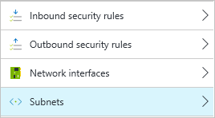
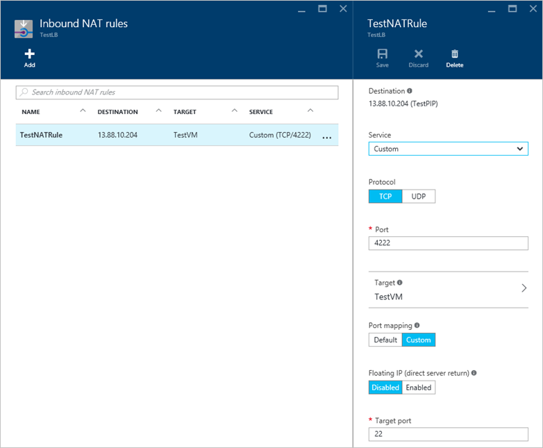

Azure 终结点的工作方法在经典部署模型和 Resource Manager 部署模型之间略有不同。现在你可以灵活地创建可控制出入 VM 的通信流的网络筛选器，从而可以像在经典部署模型中一样创建超出简单终结点的非常复杂的网络环境。本文提供了网络安全组的概述以及它们与使用经典终结点、创建筛选规则有什么不同，并提供了示例部署方案。

## Resource Manager 部署概述
将经典部署模型中的终结点替换为网络安全组和访问控制列表 (ACL) 规则。快速实现网络安全组 ACL 规则的步骤如下：

- 创建网络安全组
- 定义网络安全组 ACL 规则，以允许或拒绝流量
- 将网络安全组分配给网络接口或虚拟网络子网

如果你还想执行端口转发，则需要在 VM 前面放置负载平衡器并使用 NAT 规则。快速实现负载平衡器和 NAT 规则的步骤如下所示：

- 创建负载平衡器
- 创建后端池，并将 VM 添加到该池中
- 为所需的端口转发定义 NAT 规则
- 为 VM 分配 NAT 规则

## 网络安全组概述
网络安全组是一项新功能，它提供一个安全层，以允许特定端口和子网访问你的 VM。你通常始终设有网络安全组，在 VM 和外界之间提供此安全层。可以将网络安全组应用于虚拟网络子网或 VM 的特定网络接口。你现在可以不用创建终结点 ACL 规则，而是创建网络安全组 ACL 规则。与只是创建用于转发给定端口的终结点相比，这些 ACL 规则提供更多的控制。你可以[阅读有关网络安全组的更多内容](/documentation/articles/virtual-networks-nsg/)。

> [AZURE.TIP] 可以将网络安全组分配给多个子网或网络接口。没有 1:1 映射，意味着你可以使用一组常见的 ACL 规则创建网络安全组，并该网络安全组将应用于多个子网或网络接口。而且，可以将网络安全组应用于订阅中的资源（基于[基于角色的访问控制](/documentation/articles/role-based-access-control-what-is/)）。

## 负载平衡器概述
在经典部署模型中，Azure 会在云服务中执行所有网络地址转换 (NAT) 和端口转发。在创建终结点时，你会指定要公开的外部端口以及要将流量定向到的内部端口。网络安全组本身不执行此相同的 NAT 和端口转发。

需要在资源组中创建 Azure 负载平衡器，以便为此类端口转发创建 NAT 规则。同样，这足够精细以仅适用于特定 VM（如果需要）。Azure 负载平衡器 NAT 规则与网络安全组 ACL 规则结合使用，可提供更多灵活性和控制（与使用云服务终结点实现相比）。

## 网络安全组 ACL 规则
使用 ACL 规则可以基于特定端口、端口范围或协议定义哪些通信可以流入和流出 VM，并可以将这些规则分配给单个 VM 或子网。下面的屏幕截图是用于常见 Web 服务器的 ACL 规则的一个示例：

ACL 规则将基于你指定的优先级指标（值越大，优先级越低）应用。每个网络安全组具有三个用于处理 Azure 网络通信流量的默认规则，并使用显式 `DenyAllInbound` 作为最后一个规则。为默认 ACL 规则分配了非常低的优先级，以便不影响你创建的规则。

## 分配网络安全组
可以将网络安全组分配给一个子网或网络接口。此方法允许你在只想将 ACL 规则应用于特定 VM 时使用所需的粒度，或者可确保将一组通用的 ACL 规则应用于子网中的所有 VM：

网络安全组的行为不会根据是分配给子网还是分配给网络接口而发生更改。常见部署方案将网络安全组分配给子网，以确保附加到该子网的所有 VM 合规。你可以阅读更多有关[将网络安全组应用于资源](/documentation/articles/virtual-networks-nsg/#associating-nsgs)的内容。

## 网络安全组的默认行为
根据你创建网络安全组的方式和时间，可能会创建默认规则以允许对 TCP 端口 3389 进行 RDP 访问（Linux VM 将允许 TCP 端口 22）。在以下情况下，将创建这些自动 ACL 规则：

- 如果你通过门户预览创建 Windows VM，并接受用于创建新的网络安全组的默认操作，则将创建允许 TCP 端口 3389 (RDP) 的 ACL 规则。
- 如果你通过门户预览创建 Linux VM，并接受用于创建新的网络安全组的默认操作，则将创建允许 TCP 端口 22 (SSH) 的 ACL 规则。

在所有其他情况下，将不会创建这些默认 ACL 规则。你将无法通过创建相应的 ACL 规则连接到你的 VM。这包括以下常见操作：

- 以与创建 VM 独立的方式通过门户预览创建网络安全组。
- 通过 PowerShell、Azure CLI、Rest API 等以编程方式创建网络安全组。
- 创建 VM 并将其分配给尚未定义相应 ACL 规则的现有网络安全组。

在上述所有情况下，你都需要为 VM 创建 ACL 规则以允许相应的远程管理连接。

## 没有网络安全组的 VM 的默认行为
你可以在未创建网络安全组的情况下创建 VM。在这些情况下，你可以使用 RDP 或 SSH 连接到 VM，而无需创建任何 ACL 规则。同样，如果已在端口 80 上安装 Web 服务，则将自动可以远程访问该服务。VM 将打开所有端口。

> [AZURE.NOTE] 若要进行任何远程连接，你仍需要将公共 IP 地址分配给 VM。如果未为子网或网络接口分配网络安全组，则不会向任何外部通信公开 VM。通过门户预览创建 VM 时的默认操作是创建新的公共 IP。对于所有其他创建 VM 的形式（例如 PowerShell、Azure CLI 或 Resource Manager 模板），将不会自动创建公共 IP，除非显式请求。请注意，通过门户预览的默认操作还包括创建网络安全组，因此你最终应不会遇到公开的 VM 未配置网络筛选的情况。

## 了解负载平衡器和 NAT 规则
在经典部署模型中，可以创建还执行了端口转发的终结点。在经典部署模型中创建 VM 时，将会为 RDP 或 SSH 自动创建 ACL 规则，但这些规则不会分别向外界公开 TCP 端口 3389 或 TCP 端口 22。但是，会公开映射到相应内部端口的高值 TCP 端口。你还可以以类似方式创建自己的 ACL 规则，如在 TCP 端口 4280 上向外界公开 Web 服务器。你可以在经典管理门户的以下屏幕截图中看到这些 ACL 规则和端口映射：

使用网络安全组时，该端口转发函数由负载平衡器进行处理。门户预览的以下屏幕截图中显示了使用 NAT 规则执行从 TCP 端口 4222 到 VM 的内部 TCP 端口 22 的端口转发的负载平衡器示例：

> [AZURE.NOTE] 实现负载平衡器时，通常不会为 VM 本身分配公共 IP 地址，而是会向负载平衡器分配一个公共 IP 地址。你仍需要创建网络安全组和 ACL 规则，以定义出入 VM 的通信流。负载平衡器 NAT 规则只是定义允许哪些端口通过负载平衡器，以及这些端口如何在后端 VM 中分布。因此，你需要为流经负载平衡器的流量创建 NAT 规则，然后创建网络安全组 ACL 规则以允许这些流量实际到达 VM。
<!---HONumber=Mooncake_0627_2016-->