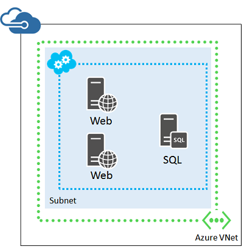
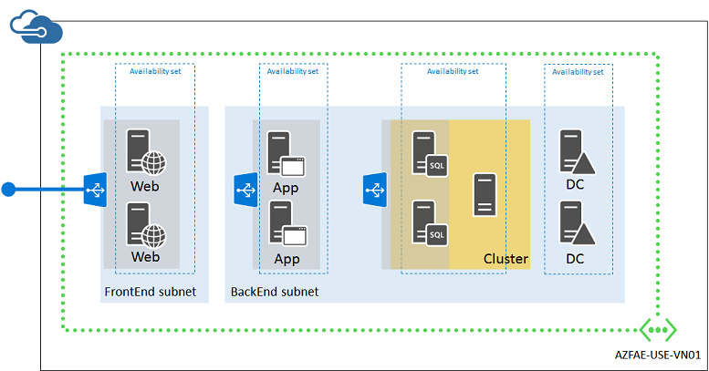

Azure 是一个实现开发/测试或概念证明配置的极好平台，因为它只需很少的投资即可测试实现你的解决方案的特定方法。但是，你必须能够将用于开发/测试环境的简便做法与用于全功能生产就绪的 IT 工作负荷实现的更难且更详细的做法区分开来。

本指南将列出规划对 Azure 中的 IT 工作负荷取得成功至关重要的许多方面。此外，使用规划可以更有序地创建必需的资源。虽然可以灵活运用，但我们建议你按本文中的顺序来进行规划和决策。

本文改编自 [Azure 实现指导原则](http://blogs.msdn.com/b/thecolorofazure/archive/2014/05/13/azure-implementation-guidelines.aspx)这篇博客文章中的内容。感谢 Santiago Cánepa（Microsoft 应用程序开发经理）和 Hugo Salcedo（Microsoft 应用程序开发经理）提供的原创内容。

> [AZURE.NOTE]地缘组已弃用。此处不介绍其用法。有关详细信息，请参阅[关于区域虚拟网络和地缘组](/documentation/articles/virtual-networks-migrate-to-regional-vnet/)。

## 1\.命名约定

在 Azure 中创建任何项目之前，你应该已确定合适的命名约定。命名约定可确保所有资源都具有可预测的名称，这有助于减轻与这些资源的管理相关联的管理负担。

你可以选择遵循一组为你的整个组织或特定 Azure 订阅或帐户定义的特定命名约定。虽然组织内的个人在使用 Azure 资源时，在团队需要在 Azure 上处理项目时很容易建立隐式规则，但该模型可伸缩性差。

你们应事先就命名约定集达成一致意见。对于超越构成这些约定的规则集的命名约定有一些注意事项。

### 词缀

创建特定资源时，Azure 使用某些默认设置来简化与这些资源关联的资源的管理。例如，在为新云服务创建第一个虚拟机时，Azure 经典管理门户会尝试将虚拟机的名称用于虚拟机的新云服务的名称。

因此，它对确定需要词缀来标识该类型的资源的类型是有利的。此外，还明确指定词缀是否在以下位置：

- 名称的开头（前缀）
- 名称的末尾（后缀）

例如，下面是托管计算引擎的资源组的两个可能名称：

- Rg-CalculationEngine（前缀）
- CalculationEngine-Rg（后缀）

词缀可以引用描述特定资源的不同方面。下表显示了通常使用的一些示例。

方面 | 示例 | 说明
--- | --- | ---
环境 | dev、stg、prod | 根据每个环境的用途和名称。
位置 | China North（中国北部）、China East（中国东部) | 根据数据中心的区域或组织的区域。
Azure 组件、服务或产品 | Rg 用于资源组，Svc 用于云服务，VNet 用于虚拟网络 | 根据资源提供支持的产品。
角色 | sql、ora、sp、iis | 根据虚拟机的角色。
实例 | 01、02、03 等。 | 适用于具有多个实例的资源。例如，云服务中经过负载平衡的 Web 服务器。

建立命名约定时，请确保这些命名约定明确说明要对每种类型的资源使用哪些词缀，以及在哪个位置使用（前缀还是后缀）。

### 日期

通常情况下，从资源名称确定创建日期很重要。我们建议使用 YYYYMMDD 日期格式。此格式可确保不仅会记录完整的日期，而且名称只是日期不同的两个资源也会同时按字母和按时间顺序进行排序。

### 命名资源

你应该在命名约定中定义每种类型的资源，其中应包含定义如何为创建的每个资源分配名称的规则。这些规则应适用于所有类型的资源，例如：

- 订阅
- 帐户
- 存储帐户
- 虚拟网络
- 子网
- 可用性集
- 资源组
- 云服务
- 虚拟机
- 终结点
- 网络安全组
- 角色

为了确保名称可以提供足够的信息来确定它所引用的资源，你应该使用描述性名称。

### 计算机名称

当管理员创建虚拟机时，Azure 将要求他们提供至多为 15 个字符的虚拟机名称。Azure 使用虚拟机名称作为 Azure 虚拟机资源名称。Azure 使用同一名称作为虚拟机上安装的操作系统的计算机名称。但是，这些名称可能并非始终相同。

如果使用已包含操作系统的 .vhd 映像文件创建虚拟机，Azure 中的虚拟机名称可能不同于虚拟机的操作系统计算机名称。这种情况可能会增加虚拟机管理难度，因此不建议使用这种方法。分配给 Azure 虚拟机资源的名称可以与分配给该虚拟机的操作系统的计算机名称相同。

我们建议 Azure 虚拟机名称应该与基础操作系统计算机名称相同。因此，请遵循 [Microsoft NetBIOS 计算机命名约定](https://support.microsoft.com/zh-CN/kb/188997)中所述的 NetBIOS 命名规则。

### 存储帐户名称

存储帐户具有适用于其名称的特殊规则。你只能使用小写字母和数字。有关详细信息，请参阅[创建存储帐户](/documentation/articles/storage-create-storage-account/#create-a-storage-account)。此外，存储帐户名称与 core.chinacloudapi.cn 组合在一起应该是一个全局有效的唯一 DNS 名称。例如，如果存储帐户名为 mystorageaccount，则下面生成的 DNS 名称应该是唯一的：

- mystorageaccount.blob.core.chinacloudapi.cn
- mystorageaccount.table.core.chinacloudapi.cn
- mystorageaccount.queue.core.chinacloudapi.cn

### Azure 构建基块名称

Azure 构建基块是 Azure 通常为利用 PaaS 功能的应用程序提供的应用程序级别服务，虽然 IaaS 资源可以利用一些诸如 SQL 数据库、流量管理器等工具。

这些服务依赖于已在 Azure 中创建并注册的一组项目。命名约定中还需要考虑这些项。

### 实现准则会扼要重述命名约定

决策：

- 你的 Azure 资源的命名约定是什么？

任务：

- 根据 Azure 资源的词缀、层次结构、字符串值和其他策略定义命名约定。

## 2\.订阅和帐户

要使用 Azure，需要一个或多个 Azure 订阅。云服务或虚拟机等资源存在于这些订阅的上下文中。

- 企业客户通常具有企业许可登记表，该表是层次结构中的最顶层资源并与一个或多个帐户相关联。
- 对于没有企业许可登记表的使用者和客户，最顶层资源是帐户。
- 订阅关联到帐户，并且每个帐户可以有一个或多个订阅。订阅级别的 Azure 记录计费信息。

由于两个层次结构级别在订阅/帐户关系上的限制，根据计费要求调整帐户和订阅的命名约定至关重要。例如，如果一家全球性公司使用 Azure，他们可以选择每个区域建立一个帐户，并在区域级别管理订阅。

例如，你可能会使用此结构。

按照同一示例，如果某一区域决定将多个订阅关联到一个特定组，则命名约定应引入相应方法来对帐户或订阅名称的额外项进行编码。此组织允许窜改计费数据以在计费报告期间生成新的层次结构级别。

该组织可以如下所示。

Microsoft 通过可下载的文件为企业协议中的单个帐户或所有帐户提供详细的计费信息。你可以通过合适的方式处理此文件，例如，使用 Microsoft Excel 来处理。此过程将引入数据、对将多个级别的层次结构编码为单独列的资源进行分区，并使用数据透视表或 PowerPivot 提供动态报告功能。

### 实现准则会扼要重述订阅和帐户

决策：

- 你需要使用哪一组订阅和帐户来托管你的 IT 工作负荷或基础结构？

任务：

- 使用命名约定创建订阅和帐户集。

## 3\.存储

Azure 存储空间是许多 Azure 解决方案不可或缺的组成部分。Azure 存储空间提供的服务可用于存储文件数据、非结构化数据和消息，该存储空间也是为虚拟机提供支持的基础结构的一部分。

Azure 提供两种类型的存储帐户。标准存储帐户可以访问 Blob 存储（用于存储 Azure 虚拟机磁盘）、表存储、队列存储和文件存储。高级存储专为高性能应用程序（例如 AlwaysOn 群集中的 SQL Server）设计，当前仅支持 Azure 虚拟机磁盘。

存储帐户将绑定到可伸缩性目标。要熟悉当前 Azure 存储空间限制，请参阅 [Azure 订阅和服务限制、配额和约束](/documentation/articles/azure-subscription-service-limits/#storage-limits)。另请参阅 [Azure 存储空间可伸缩性和性能目标](/documentation/articles/storage-scalability-targets/)。

Azure 使用一个操作系统磁盘、一个临时磁盘和零个或更多可选数据磁盘创建虚拟机。操作系统磁盘和数据磁盘是 Azure 页 blob，而临时磁盘则通过本地方式存储在计算机所在的节点上。这使得临时磁盘不适用于在系统回收过程中必须保留的数据，因为计算机可能会以无提示方式从一个节点迁移到另一个节点，从而丢失该磁盘中的任何数据。不要在临时驱动器上存储任何内容。

由于 blob 的最大大小为 1024 千兆字节 (GB)，并且必须包含 VHD 文件的元数据（页脚），因此操作系统磁盘和数据磁盘的最大大小为 1023 GB（1 GB 为 10243 字节）。你可以通过在 Windows 中实现磁盘条带化来超越此限制。

### 条带化的磁盘
除了提供相关功能来创建大于 1023 GB 的磁盘外，在许多情况下，对数据磁盘使用条带化还可增强性能，因为允许多个 blob 支持单个卷的存储。使用条带化时，将会并行处理针对单个逻辑磁盘写入和读取数据所需的 I/O。

Azure 将对可用的数据磁盘量和带宽加以限制，具体取决于虚拟机大小。有关详细信息，请参阅 [Windows](/documentation/articles/virtual-machines-windows-sizes/) 或者 [Linux](/documentation/articles/virtual-machines-linux-sizes/)虚拟机大小。

如果要对 Azure 数据磁盘使用磁盘条带化，请考虑以下准则：

- 数据磁盘应始终为最大大小 (1023 GB)
- 附加虚拟机大小所允许的最大数据磁盘
- 使用存储空间配置
- 使用存储条带化配置
- 避免使用 Azure 数据磁盘缓存选项（缓存策略 =“无”）

有关详细信息，请参阅[存储空间 - 专为提高性能设计](http://social.technet.microsoft.com/wiki/contents/articles/15200.storage-spaces-designing-for-performance.aspx)。

### 多个存储帐户

使用多个存储帐户支持与多个虚拟机关联的磁盘，可确保这些磁盘的聚合 I/O 远低于这些存储帐户每个的可伸缩性目标。

我们建议你从为每个存储帐户部署一个虚拟机开始。

### 存储布局设计

为了实现这些策略，以便为虚拟机的磁盘子系统实现良好性能，IT 工作负荷或基础结构通常会利用多个存储帐户。这些帐户托管多个 VHD blob。在某些情况下，多个 blob 将关联到虚拟机中的单个卷。

这种情况可能会增加管理任务的复杂性。为存储设计有效的策略（包括基础磁盘和关联的 VHD blob 的相应命名）是关键。

### 实现准则会扼要重述存储

决策：

- 你需要进行磁盘条带化以创建大于 500 千吉字节 (TB) 的磁盘吗？
- 你需要进行磁盘条带化以获得工作负荷的最佳性能吗？
- 你需要使用哪一组存储帐户来托管你的 IT 工作负荷或基础结构？

任务：

- 使用命名约定创建存储帐户集。可以使用 Azure 经典管理门户或 **New-AzureStorageAccount** PowerShell cmdlet。

## 4\.云服务

云服务是 Azure 服务管理中的基本构建基块，同时用于 PaaS 和 IaaS 服务。对于 PaaS，云服务表示其实例可以相互通信的角色关联。云服务将关联到一个公共虚拟 IP (VIP) 地址和一个负载平衡器，后者将接受来自 Internet 的传入流量，并将该流量负载平衡到配置为接收该流量的角色。

对于 IaaS，云服务提供类似的功能，虽然在大多数情况下，负载平衡器功能用于将流量转发到 Internet 上的特定 TCP 或 UDP 端口，再转发到该云服务中的多个虚拟机。

> [AZURE.NOTE]云服务不存在于 Azure 资源管理器中。

云服务名称在 IaaS 中尤其重要，因为 Azure 将使用它们作为磁盘的默认命名约定的一部分。云服务名称只能包含字母、数字和连字符。该字段中的第一个和最后一个字符必须是字母或数字。

Azure 将公开云服务名称，因为这些名称会关联到域“chinacloudapp.cn”中 VIP。为了改善应用程序的用户体验，应根据需要配置虚名称来替换完全限定的云服务名称。这通常使用公共 DNS 中将资源的公共 DNS 名称（例如，www.contoso.com）映射到托管资源的云服务（例如，托管 www.contoso.com 的 Web 服务器的云服务）的 DNS 名称的 CNAME 记录完成。

此外，用于云服务的命名约定可能需要允许例外，因为云服务名称必须在所有其他 Azure 云服务中唯一，而不考虑 Azure 租户。

对于云服务中的所有虚拟机来说，一项需要考虑的云服务限制是：一次只能执行一项虚拟机管理操作。当你在云服务中的一台虚拟机上执行虚拟机管理操作时，你必须等待该操作完成，然后才能在另一台虚拟机上执行新的管理操作。因此，云服务中虚拟机的数量应保持在较低的水平。

Azure 订阅最多可以支持 200 个云服务。

### 实现准则会扼要重述云服务

决策：

- 你需要使用哪一组云服务来托管你的 IT 工作负荷或基础结构？

任务：

- 使用命名约定创建云服务集。可以使用 Azure 经典管理门户或 **New-AzureService** PowerShell cmdlet。

## 5\.虚拟网络

下一个逻辑步骤是创建支持解决方案中的虚拟机之间的通信所需的虚拟网络。虽然可以只在一个云服务中托管 IT 工作负荷的多个虚拟机，但是建议使用虚拟网络。

虚拟网络是虚拟机的容器，你还可以为其指定子网、自定义寻址和 DNS 配置选项。同一虚拟网络中的虚拟机可以直接与同一虚拟网络中的其他计算机通信，而不考虑它们属于哪个云服务。在虚拟网络中，此通信将保持私有，而无需让通信通过公共终结点。如果虚拟机已连接到公司网络，这种通信可通过 IP 地址进行，或按名称进行，使用虚拟网络中安装的 DNS 服务器进行，或在本地进行。

### 站点连接
如果本地用户和计算机无需持续连接到 Azure 虚拟网络中的虚拟机，则可创建仅限云的虚拟网络。

这通常用于面向 Internet 的工作负荷，如基于 Internet 的 Web 服务器。你可以使用远程桌面连接、远程 PowerShell 会话、安全外壳 (SSH) 连接和点到站点 VPN 连接来管理这些虚拟机。

由于仅限云的虚拟网络未连接到你的本地网络，因此它们可以使用专用 IP 地址空间的任何部分。

如果本地用户和计算机需要持续连接到 Azure 虚拟网络中的虚拟机，则可创建跨界虚拟网络，然后使用 ExpressRoute 或站点到站点 VPN 连接将其连接到你的本地网络。

在此配置中，Azure 虚拟网络实质上是你的本地网络基于云的扩展。

由于跨界虚拟网络连接到你的本地网络，因此它们必须使用你的组织使用的唯一地址空间的一部分，并且路由基础结构必须通过将流量转发到你的本地 VPN 设备来支持将流量路由到该部分。

若要允许将数据包从跨界虚拟网络传输到你的本地网络，必须配置相关的本地地址前缀集作为虚拟网络的本地网络定义的一部分。根据虚拟网络的地址空间和相关的本地位置集，本地网络中可以有多个地址前缀。

可以将仅限云的虚拟网络转换为跨界虚拟网络，但这很可能需要你为你的虚拟网络地址空间、子网和使用 Azure 分配的静态 IP 地址（称为动态 IP (DIP)）的虚拟机重新编号。因此，在创建虚拟网络前，请仔细考虑所需的虚拟网络类型（仅限云还是跨界）。

### 子网
子网允许你组织相关资源，以逻辑方式（例如，一个子网用于关联到同一个应用程序的虚拟机）或以物理方式（例如，每个云服务一个子网）或使用子网隔离技术以提高安全性。

对于跨界虚拟网络，应使用用于本地资源的相同约定来设计子网，请记住：**Azure 始终使用每个子网的地址空间的前三个 IP 地址**。若要确定子网所需的地址数，请计算你现在需要的虚拟机数，估计未来的增长，然后使用下表确定子网大小。

所需的虚拟机数 | 所需的主机位数 | 子网的大小
--- | --- | ---
1–3 | 3 | /29
4–11 | 4 | /28
12–27 | 5 | /27
28–59 | 6 | /26
60–123 | 7 | /25

> [AZURE.NOTE]对于普通的本地子网，具有 n 个主机位的子网的最大主机地址数为 2n – 2 个。对于 Azure 子网，具有 n 个主机位的子网的最大主机地址数是 2n – 5（2 + 3 作为 Azure 在每个子网上使用的地址）。

如果你选择的子网大小太小，将需要对子网中的虚拟机进行重新编号和重新部署。

### 实现准则会扼要重述虚拟网络

决策：

- 你需要使用哪种类型的虚拟网络来托管 IT 工作负荷或基础结构（仅限云还是跨界）？
- 对于跨界虚拟网络，你现在需要多少地址空间来托管子网和虚拟机和用于将来合理扩展？

任务：

- 定义用于虚拟网络的地址空间。
- 定义子网集和每个子网的地址空间。
- 对于跨界虚拟网络，定义虚拟网络中的虚拟机需要访问的本地位置的本地网络地址空间集。
- 使用命名约定创建虚拟网络。可以使用Azure 经典管理门户。

## 6\.可用性集

在 Azure PaaS 中，云服务包含执行应用程序代码的一个或多个角色。角色可以拥有结构自动设置的一个或多个虚拟机实例。在任何给定时间，Azure 都可以更新这些角色中的实例，但因为这些实例属于同一角色，所以 Azure 知道不能同时更新所有实例，以防止角色的服务中断。

在 Azure IaaS 中，角色的概念并不重要，因为每个 IaaS 虚拟机表示包含单个实例的角色。为了提示 Azure 不要同时关闭两个或更多关联的计算机（例如，为了对它们所在的节点进行操作系统更新），引入了可用性集的概念。可用性集告知 Azure 不要同时关闭同一可用性集中的所有计算机，以防止服务中断。可用性集的虚拟机成员具有 99.95% 的正常运行时间服务级别协议。

可用性集必须是该解决方案的高可用性规划的一部分。可用性集定义为单个云服务中具有相同可用性集名称的虚拟机集。在创建云服务后，可以创建可用性集。

### 实现准则会扼要重述可用性集

决策：

- 你的 IT 工作负荷或基础结构中的各种角色和层需要多少可用性集？

任务：

- 使用命名约定定义一组可用性集。创建虚拟机时，你可以将该虚拟机关联到某个可用性集，也可以在创建虚拟机后将该虚拟机关联到某个可用性集。

## 7\.虚拟机

在 Azure PaaS 中，Azure 管理虚拟机及其关联的磁盘。你必须创建并命名云服务和角色，然后 Azure 将创建关联到这些角色的实例。对于 Azure IaaS，由你负责为云服务、虚拟机和关联的磁盘提供名称。

为了减少管理负担，Azure 经典管理门户将使用计算机名称作为关联的云服务的默认名称建议（如果客户在虚拟机创建向导中选择创建新的云服务）。

此外，Azure 还将使用云服务名称、计算机名称和创建日期的组合来命名磁盘及其支持的 VHD blob。

通常，磁盘数将大大多于虚拟机数。你在操作虚拟机时应小心以防止出现孤立的磁盘。此外，还可以删除磁盘，而不会删除支持的 blob。如果出现这种情况，该 blob 将一直保留在存储帐户中，直到被手动删除为止。

### 实现准则会扼要重述虚拟机

决策：

- 你需要为 IT 工作负荷或基础结构提供多少个虚拟机？

任务：

- 使用命名约定定义每个虚拟机名称。
- 使用 Azure 经典管理门户、**New-AzureVM** PowerShell cmdlet 或使 Azure CLI。

## IT 工作负荷的示例：Contoso 财务分析引擎

Contoso Corporation 已使用最先进的专有算法开发了下一代财务分析引擎，以帮助实现将来的市场贸易。他们想要将此引擎提供给其客户作为 Azure 中的一组服务器，其中包括：

- 两个（最终更多）在 Web 层中运行自定义 Web 服务的基于 IIS 的 Web 服务器
- 两个（最终更多）在应用程序层中执行计算的基于 IIS 的应用程序服务器
- 使用 AlwaysOn 可用性组，将历史数据和正在执行的计算数据存储在数据库层中的 SQL Server 2014 群集（两个 SQL Server 和多数节点见证）
- 身份验证层中自包含林和域的两个 Active Directory 域控制器，它们是 SQL Server 群集所必需的
- 所有服务器都位于两个子网中；前端子网用于 Web 服务器，后端子网用于应用程序服务器、SQL Server 2014 群集和域控制器

从 Internet 上的 Contoso 客户端传入的安全 Web 流量需要在 Web 服务器之间进行负载平衡。来自 Web 服务器的 HTTP 请求形式的计算请求流量需要在应用程序服务器之间进行平衡。此外，还必须设计引擎以实现高可用性。

生成的设计必须引入：

- Contoso Azure 订阅和帐户
- 存储帐户
- 包含两个子网的虚拟网络
- 具有类似角色的服务器组的可用性集
- 虚拟机
- 单个资源组

以上所有项将遵循这些 Contoso 命名约定：

- Contoso 使用 [IT 工作负荷]-[位置]-[Azure 资源] 作为前缀。在此示例中，"azfae"（Azure 财务分析引擎）为 IT 工作负荷的名称，"use"（美国东部 2）是位置，因为 Contoso 的大多数初始客户都位于美国东海岸。
- 存储帐户使用 contosoazfaeusesa[说明] 请注意 contoso 已添加到前缀以提供唯一性，并且存储帐户名称不支持使用连字符。
- 虚拟网络使用 AZFAE-USE-VN[数字]。
- 可用性集使用 azfae-use-as-[角色]。
- 虚拟机名称使用 azfae-use-vm-[vmname]。

### Azure 订阅和帐户

Contoso 使用名为“Contoso 企业订阅”的企业订阅来提供此 IT 工作负荷的计费。

### 存储帐户

Contoso 确定他们需要以下两个存储帐户：

- **contosoazfaeusesawebapp** 用于 Web 服务器、应用程序服务器和域控制器及其额外的数据磁盘的标准存储
- **contosoazfaeusesasqlclust** 用于 SQL Server 群集服务器及其额外的数据磁盘的高级存储

### 包含子网的虚拟网络

由于该虚拟网络不需要持续连接到 Contoso 本地网络，Contoso 决定选择仅限云的虚拟网络。

他们通过 Azure 经典管理门户使用以下设置创建了仅限云的虚拟网络：

- 名称：AZFAE-USE-VN01
- 位置：中国东部
- 虚拟网络地址空间：10.0.0.0/8
- 第一个子网：
	- 名称：FrontEnd
	- 地址空间：10.0.1.0/24
- 第二个子网：
	- 名称：BackEnd
	- 地址空间：10.0.2.0/24

### 可用性集

为了维护其财务分析引擎的所有四个层的高可用性，Contoso 决定使用四个可用性集：

- **azfae-use-as-dc** 用于域控制器
- **azfae-use-as-web** 用于 Web 服务器
- **azfae-use-as-app** 用于应用程序服务器
- **azfae-use-as-sql** 用于 SQL Server 群集中的服务器

这些可用性集将随虚拟机一起创建。

### 虚拟机

Contoso 决定将以下名称用于其 Azure 虚拟机：

- **azfae-use-vm-dc01** 用于第一个域控制器
- **azfae-use-vm-dc02** 用于第二个域控制器
- **azfae-use-vm-web01** 用于第一个 Web 服务器
- **azfae-use-vm-web02** 用于第二个 Web 服务器
- **azfae-use-vm-app01** 用于第一个应用程序服务器
- **azfae-use-vm-app02** 用于第二个应用程序服务器
- **azfae-use-vm-sql01** 用于 SQL 服务器群集中的第一个 SQL 服务器
- **azfae-use-vm-sql02** 用于 SQL 服务器群集中的第二个 SQL 服务器
- **azfae-use-vm-sqlmn01** 用于 SQL Server 群集中的多数节点见证

这是生成的配置。

此配置引入以下项：

- 包含两个子网（FrontEnd 和 BackEnd）的仅限云虚拟网络
- 两个存储帐户
- 四个可用性集，每个财务分析引擎层一个
- 四个层中的虚拟机
- 用于从 Internet 到 Web 服务器的基于 HTTPS 的 Web 流量的外部负载平衡集
- 用于从 Web 服务器到应用程序服务器的未加密 Web 流量的内部负载平衡集
- 单个资源组

## 其他资源

[Azure 订阅和服务限制、配额和约束](/documentation/articles/azure-subscription-service-limits/#storage-limits)

[Windows](/documentation/articles/virtual-machines-windows-sizes/) 或者 [linux](/documentation/articles/virtual-machines-linux-sizes/) 虚拟机的大小

[Azure 存储空间可伸缩性和性能目标](/documentation/articles/storage-scalability-targets/)

[云平台集成框架（Azure 体系结构模式）](/documentation/articles/azure-architectures-cpif-overview/)

[数据中心扩展参考体系结构关系图](https://gallery.technet.microsoft.com/Datacenter-extension-687b1d84)

<!---HONumber=Mooncake_1207_2015-->