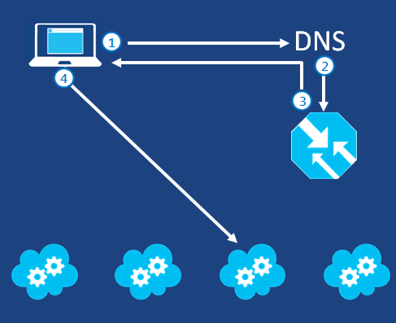

为 Azure 基础结构服务提供两个级别的负载平衡：

- **DNS 级别**：使到以下位置的流量实现负载平衡：位于不同数据中心的不同云服务、位于不同数据中心的不同 Azure Web 应用，或者外部终结点。这是通过 Azure 流量管理器和轮循机制负载平衡方法完成的。
- **网络级别**：使传入一个云服务的不同虚拟机中的 Internet 流量实现负载平衡，或使一个云服务或虚拟网络中的虚拟机之间的流量实现负载平衡。这是通过 Azure 负载平衡器完成的。

## 使用流量管理器针对云服务和 Web 应用实现负载平衡##

使用流量管理器可以控制用户流量到终结点（可能包括云服务、 Web 应用、外部站点和其他流量管理器配置文件）的分发过程。流量管理器的工作方式是将智能策略引擎应用到对 Internet 资源域名的域名系统 (DNS) 查询。云服务或 Web 应用可以在世界上不同的数据中心中运行。

必须使用 REST 或 Windows PowerShell 将外部终结点或流量管理器配置文件配置为终结点。

流量管理器使用三种负载平衡方法来分发流量：

- **故障转移**：请在以下情况下使用此方法：你希望对所有流量使用一个主终结点，但希望在主终结点不可用时提供备份。
- **性能**：请在以下情况下使用此方法：你在不同地理位置中具有多个终结点，并且希望请求客户端使用“最靠近的”终结点（因为延迟最低）。
- **轮循机制：**请在以下情况下使用此方法：要将负载分发到位于同一数据中心的一组云服务中，或位于不同数据中心的多个云服务或 Web 应用中。

有关详细信息，请参阅[关于流量管理器负载平衡方法](/documentation/articles/traffic-manager-routing-methods/)。

下图显示了一个用于将流量分发到不同云服务的轮循机制负载平衡方法的示例。

以下是基本过程：

1.	Internet 客户端查询与 Web 服务相对应的域名。
2.	DNS 将该名称查询请求转发到流量管理器。
3.	流量管理器在轮循机制列表中选择下一个云服务并将 DNS 名称发送回来。Internet 客户端的 DNS 服务器将该名称解析为 IP 地址，然后将其发送到 Internet 客户端。
4.	Internet 客户端通过流量管理器与所选的云服务相连接。

有关详细信息，请参阅[流量管理器](/documentation/articles/traffic-manager-overview/)。

## 针对虚拟机的 Azure 负载平衡 ##

位于同一云服务或虚拟网络中的虚拟机可以使用其专用 IP 地址直接相互通信。该云服务或虚拟网络以外的计算机和服务仅可通过已配置好的终结点与某个云服务或虚拟网络中的虚拟机通信。终结点是公用 IP 地址和端口到 Azure 云服务中的虚拟机或 Web 角色的该专用 IP 地址和端口的映射。

在名为“负载平衡集”的配置中，Azure 负载平衡器将特定类型的传入流量随机分发到多个虚拟机或服务中。例如，你可将 Web 请求流量负载分配到多个 Web 服务器或 Web 角色。

下图显示了公用和专用 TCP 端口 80 的标准（未加密）Web 流量的负载平衡终结点，由三个虚拟机共享。这三个虚拟机位于一个负载平衡集中。

Azure 还可以在云服务或虚拟网络内部实现负载平衡。这称为“内部负载平衡”并可以通过以下方式使用：

- 在多层应用程序的不同层（例如，在 Web 层和数据库层之间）的服务器之间实现负载平衡。
- 使托管在 Azure 中的业务线 (LOB) 应用程序实现负载平衡，而无需额外的负载平衡器硬件或软件。
- 将本地服务器包含在一组流量已实现负载平衡的计算机中。

与 Azure 负载平衡类似，可以通过配置内部负载平衡集来实现内部负载平衡。

下图的示例显示了在外部/本地虚拟网络的三个虚拟机之中共享的业务线 (LOB) 应用程序的内部负载平衡终结点。

<!-- LINKS -->
