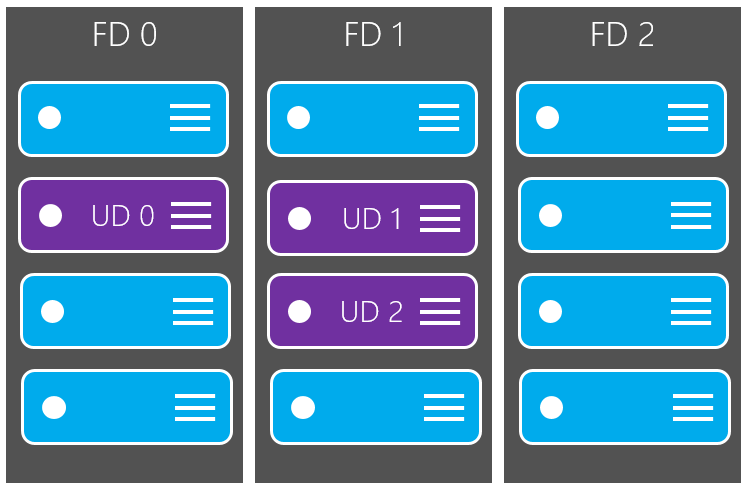

## 了解计划内与计划外维护
有两种类型的 Azure 平台事件可能影响到虚拟机的可用性：计划内维护和计划外维护。

- **计划内维护事件**是指由 21vnet 对底层 Azure平台进行定期更新，以改进虚拟机运行时所在的平台基础结构的总体可靠性、性能和安全性。大多数此类更新在执行时不会影响虚拟机或云服务。但有时候，这些更新要求重启你的虚拟机，否则无法将这些必需更新应用到平台基础结构。

- **计划外维护事件**见于虚拟机所在硬件或物理基础结构出现某类故障的情况。此类故障可能包括：本地网络故障、本地磁盘故障，或者其他机架级别的故障。检测到此类故障时，Azure 平台会自动将虚拟机从所在的不健康物理机迁移到健康的物理机。此类事件很少见，但也会导致虚拟机重启。

## 当你设计可用性高的应用程序时，请遵循最佳做法
若要减轻一个或多个此类事件引发的停机所造成的影响，我们建议你遵循以下最佳做法以提高虚拟机的可用性：

* [在可用性集中配置多个虚拟机以确保冗余]
* [将每个应用程序层配置到不同的可用性集中]
* [将负载平衡器与可用性集组合在一起]

### 在可用性集中配置多个虚拟机以确保冗余
若要为应用程序提供冗余，建议你将两个或更多虚拟机组合到一个可用性集中。这种配置可以确保在发生计划内或计划外维护事件时，至少有一个虚拟机可用，因此满足 99.95% Azure SLA 的要求。有关详细信息，请参阅[虚拟机的 SLA](/support/sla/virtual-machines)。

> [AZURE.IMPORTANT] 避免将单实例虚拟机单独地置于可用性集中。此配置中的虚拟机并不符合 SLA 保证，在出现 Azure 计划内维护事件时就会停机。

基础 Azure 平台为可用性集中的每个虚拟机分配一个**更新域**和一个**容错域**。对于给定的可用性集，默认情况下会分配五个非用户可配置的更新域（然后可以增加资源管理器部署以最多提供 20 个更新域），以指示可同时重新启动的虚拟机和底层物理硬件组。在单个可用性集中配置了 5 个以上的虚拟机时，第 6 个虚拟机将放置在第 1 个虚拟机所在的更新域中，第 7 个虚拟机将放置在第 2 个虚拟机所在的更新域中，依此类推。在计划内维护期间，更新域的重新启动顺序可能不会按序进行，但一次只重新启动一个更新域。

容错域定义一组共用一个通用电源和网络交换机的虚拟机。默认情况下，在可用性集中配置的虚拟机隔离在资源管理器部署的最多三个容错域（经典部署的两个容错域）中。虽然将虚拟机置于可用性集中并不能让你的应用程序免受特定于操作系统或应用程序的故障的影响，但可以限制潜在物理硬件故障、网络中断或电源中断的影响。

<!--Image reference-->
   

### 将每个应用程序层配置到不同的可用性集中

如果你的虚拟机几乎都是相同的，并且对你的应用程序的用途是一样的，我们建议你针对每个应用程序层配置可用性集。如果将两个不同的层置于同一可用性集中，则同一应用程序层中的所有虚拟机可以同时重启。通过在可用性集中为每个层配置至少两个虚拟机，可以确保每个层中至少有一个虚拟机可用。

例如，你可以将运行 IIS、Apache、Nginx 等服务器的应用程序前端的所有虚拟机置于单个可用性集中。请确保仅将前端虚拟机置于同一可用性集中。同样，请确保仅将数据层虚拟机置于其自身的可用性集中，例如已复制的 SQL Server 虚拟机或 MySQL 虚拟机。

<!--Image reference-->
   

### 将负载平衡器与可用性集组合在一起
将 Azure Load Balancer 与可用性集组合在一起，以获取最大的应用程序复原能力。Azure 负载平衡器将流量分布到多个虚拟机中。对于标准层虚拟机来说，Azure 负载平衡器已包括在内。请注意，并非所有虚拟机层都包括 Azure 负载平衡器。有关对虚拟机进行负载平衡的更多信息，请参阅“对 [Windows](/documentation/articles/virtual-machines-windows-load-balance/) 或 [Linux](/documentation/articles/virtual-machines-linux-load-balance/) 虚拟机进行负载平衡”。

如果没有将负载平衡器配置为对多个虚拟机上的流量进行平衡，则任何计划内维护事件都会影响唯一的那个处理流量的虚拟机，导致应用程序层中断。将同一层的多个虚拟机置于相同的负载平衡器和可用性集下可以确保至少有一个虚拟机实例能够持续处理流量。

 

<!-- Link references -->
[在可用性集中配置多个虚拟机以确保冗余]: #configure-multiple-virtual-machines-in-an-availability-set-for-redundancy
[将每个应用程序层配置到不同的可用性集中]: #configure-each-application-tier-into-separate-availability-sets
[将负载平衡器与可用性集组合在一起]: #combine-the-load-balancer-with-availability-sets
[Avoid single instance virtual machines in availability sets]: #avoid-single-instance-virtual-machines-in-availability-sets

<!---HONumber=Mooncake_0627_2016-->