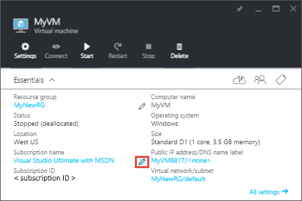

## 使用门户将 VM 移到其他订阅

可以使用门户将 VM 及其关联的资源移到其他订阅。

1. 打开 [Azure 门户预览](https://portal.azure.cn)。
2. 单击“浏览”>“虚拟机”，然后从列表中选择要移动的 VM。
	
	
	
3. 在“基本功能”部分中，单击订阅名称旁边的“更改订阅”铅笔图标。此时将打开“移动资源”边栏选项卡。
	
	
	
4. 选择要移动的每个资源。大多数情况下，应移动列出的所有可选资源。
5. 选择要将 VM 移到的**订阅**。
6. 选择一个现有**资源组**，或者键入名称以创建新的资源组。
7. 完成后，选择你了解将创建新的资源 ID 并且移动后需要将这些资源 ID 用于 VM，然后单击“确定”。

## 使用门户将 VM 移到其他资源组

可以使用门户将 VM 及其关联的资源移到其他资源组。

1. 打开 [Azure 门户预览](https://portal.azure.cn)。
2. 单击“浏览”>“资源组”，然后选择包含 VM 的资源组。
3. 从“资源组”边栏选项卡上的菜单中选择“移动”。
	
	  

	
3. 在“移动资源”边栏选项卡中，选择要移动的资源，然后键入现有资源组名称，或选择创建新资源组。完成后，选择你了解将创建新的资源 ID 并且移动后需要将这些资源 ID 用于 VM，然后单击“确定”。
	
	

<!---HONumber=Mooncake_0829_2016-->