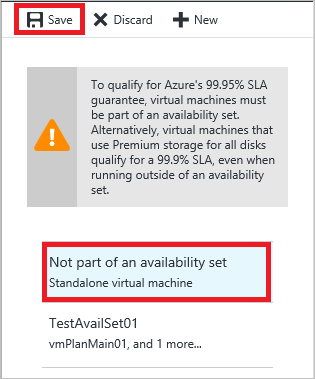

## 多实例和单实例 VM
对于在 Azure 上运行的许多客户而言，在 VM 进行计划内维护时可以计划是非常重要的，因为在维护期间会停机约 15 分钟。 可以在预配的 VM 接收计划内维护时，使用可用性集帮助控制。

有两个可能的 VM 配置在 Azure 上运行。 VM 可配置为多实例或单实例。 如果 VM 在可用性集中，它们将配置为多实例。 请注意，即使单个 VM 也可以部署在可用性集中，并被视为多实例。 如果 VM 不在可用性集中，它们将配置为单实例。  有关可用性集的详细信息，请参阅[管理 Windows 虚拟机的可用性](/documentation/articles/virtual-machines-windows-manage-availability/)或[管理 Linux 虚拟机的可用性](/documentation/articles/virtual-machines-linux-manage-availability/)。

单实例和多实例的 VM 计划内维护更新单独发生。 通过将 VM 重新配置为单实例（如果它们是多实例），或配置为多实例（如果它们是单实例），可以控制其 VM 收到计划内维护的时间。 有关 Azure VM 计划内维护的详细信息，请参阅 [Azure Linux 虚拟机的计划内维护](/documentation/articles/virtual-machines-linux-planned-maintenance/)或 [Azure Windows 虚拟机的计划内维护](/documentation/articles/virtual-machines-windows-planned-maintenance/)。

## 对于多实例配置
可以通过将 VM 从可用性集删除，以选择计划内维护影响部署在可用性集设置中的 VM 的时间。

1. 在计划内维护七天前，向多实例配置中的 VM 发送电子邮件。 受影响的多实例 VM 的订阅 ID 和名称将包括在电子邮件正文中。
2. 在这七天内，可以通过从可用性集删除该区域中的多实例 VM，以选择实例的更新时间。 配置中的此更改导致重新启动，因为虚拟机正在从一台需要进行维护的物理主机，移到另一台不需进行维护的物理主机。
3. 可以在 Azure 门户预览中从可用性集删除 VM。

   1. 在门户中，选择要从可用性集中删除的 VM。  

   2. 在“设置”下面，单击“可用性集”。

      

   3. 在可用性集下拉菜单中，选择“不属于可用性集”。

      

   4. 在顶部单击“保存”。 单击“是”确认知道此操作会重新启动 VM。

   >[AZURE.TIP]
   >以后，可以通过选择一个列出的可用性集将 VM 重新配置为多实例。

4. 从可用性集中删除的 VM 将移到单实例主机，并且不在可用性集设置的计划内维护期间更新。
5. 可用性集 VM 更新完成（根据原始电子邮件中所述的计划）之后，应该将 VM 添加回到其可用性集。 加入可用性集会将 VM 重新配置为多实例，导致重新启动。 通常，跨整个 Azure 环境的所有多实例更新完成之后，将轮到单实例维护。

也可以使用 Azure PowerShell 从可用性集中删除 VM：

    Get-AzureVM -ServiceName "<VmCloudServiceName>" -Name "<VmName>" | Remove-AzureAvailabilitySet | Update-AzureVM

## 对于单实例配置
可以通过将这些 VM 添加到可用性集，以选择计划内维护影响单实例设置中的 VM 的时间。

分步指南

1. 在计划内维护七天前，向单实例配置中的 VM 发送电子邮件。 受影响的单实例 VM 的订阅 ID 和名称将包括在电子邮件正文中。
2. 在这七天内，可以通过将单实例 VM 添加到相同区域中的可用性集来选择实例重新启动的时间。 配置中的此更改导致重新启动，因为虚拟机正在从一台需要进行维护的物理主机，移到另一台不需进行维护的物理主机。
3. 遵循此处的说明，使用 Azure 门户预览和 Azure PowerShell 将现有 VM 添加到可用性集。 （请参阅这些步骤后面的 Azure PowerShell 示例。）
4. 将这些 VM 重新配置为多实例后，它们将从单实例 VM 的计划内维护中排除。
5. 单实例 VM 更新完成（根据原始电子邮件中的计划）之后，可以通过从可用性集中删除 VM，将它们恢复为单实例。

也可以使用 Azure PowerShell 将 VM 添加到可用性集：

    Get-AzureVM -ServiceName "<VmCloudServiceName>" -Name "<VmName>" | Set-AzureAvailabilitySet -AvailabilitySetName "<AvSetName>" | Update-AzureVM

<!--Anchors-->

<!--Link references-->
[Virtual Machines Manage Availability]: /documentation/articles/virtual-machines-windows-classic-tutorial/
[Understand planned versus unplanned maintenance]: /documentation/articles/virtual-machines-linux-manage-availability/#Understand-planned-versus-unplanned-maintenance