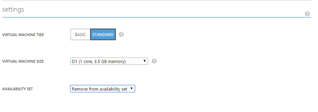

## 多实例和单实例 VM
对于在 Azure 上运行的许多客户而言，在 VM 进行计划内维护时可以计划是非常重要的，因为这会导致停机约 15 分钟。可以在预配的 VM 接收计划内维护时，利用可用性集帮助控制。

有两个可能的 VM 配置在 Azure 上运行。VM 可配置为多实例或单实例。如果 VM 在可用性集中，它们将配置为多实例。请注意，即使单个 VM 也可以部署在可用性集中，并被视为多实例。如果 VM 不在可用性集中，它们将配置为单实例。有关可用性集的详细信息，请参阅 [Manage the Availability of your Windows Virtual Machines（管理 Windows 虚拟机的可用性）](/documentation/articles/virtual-machines-windows-manage-availability)或 [Manage the Availability of your Linux Virtual Machines（管理 Linux 虚拟机的可用性）](/documentation/articles/virtual-machines-linux-manage-availability)。

单实例和多实例的 VM 计划内维护更新单独发生。通过将 VM 重新配置为单实例（如果它们是多实例），或配置为多实例（如果它们是单实例），可以控制其 VM 收到计划内维护的时间。有关 Azure VM 计划内维护的详细信息，请参阅 [Planned maintenance for Azure Linux virtual machines（Azure Linux 虚拟机的计划内维护）](/documentation/articles/virtual-machines-linux-planned-maintenance)或 [Planned maintenance for Azure Windows virtual machines（Azure Windows 虚拟机的计划内维护）](/documentation/articles/virtual-machines-windows-planned-maintenance)。

## 对于多实例配置
可以通过将 VM 从可用性集删除，以选择计划内维护影响部署在可用性集设置中的 VM 的时间。
1.	在计划内维护 7 天前，向多实例配置中的 VM 发送电子邮件。受影响多实例 VM 的订阅 ID 和名称将包含在电子邮件的正文中。
2.	在这 7 天中，可以通过从可用性集删除该区域中的多实例 VM，以选择实例的更新时间。此设置中的更改导致重新启动，因为虚拟机正在从一部以维护为目标的实体主机，移到另一部不是以维护为目标的实体主机。 
3.	可以在经典门户中从可用性集删除 VM。 
   
        a.	In the Classic portal, click on the VM and then select "configure." 
        
        b.	Under "settings", you can see which Availability Set the VM is in.
        
    

        c.	In the availability set dropdown menu, select "remove from availability set."
        
    

        d.	At the bottom, select "save." Select "yes" to acknowledge that this action will restart the VM.
4.	这些 VM 将移到单实例主机，并且不在可用性集设置的计划内维护期间更新。
5.	可用性集 VM 更新完成（根据原始电子邮件中所述的计划）之后，应该将 VM 添加回到其可用性集，它们将重新配置为多实例 VM。将 VM 从单实例移回多实例将导致重新启动。通常，跨整个 Azure 环境的所有多实例更新完成之后，将轮到单实例维护。

请注意，也可以使用 Azure PowerShell：
Get-AzureVM -ServiceName "<VmCloudServiceName>" -Name "<VmName>" | Remove-AzureAvailabilitySet | Update-AzureVM 来实现此目的。

## 对于单实例配置
可以通过将这些 VM 添加到可用性集，以选择计划内维护影响单实例设置中的 VM 的时间。
分步指南
1.	在计划内维护 7 天前，向单实例配置中的 VM 发送电子邮件。受影响单实例 VM 的订阅 ID 和名称将包含在电子邮件的正文中。 
2.	在这 7 天中，可以通过移动单实例 VM（方法是将它们移到相同区域中的可用性集），来选择实例重新启动的时间。此设置中的更改导致重新启动，因为虚拟机正在从一部以维护为目标的实体主机，移到另一部不是以维护为目标的实体主机。
3.	遵循此处的说明使用经典门户和 Azure PowerShell 将现有 VM 添加到可用性集（请参阅以下注释中的 Azure PowerShell 示例）。
4.	将这些 VM 重新配置为多实例后，它们将从单实例 VM 的计划内维护中排除。
5.	单实例 VM 更新完成（根据原始电子邮件中所述的计划）之后，可以从可用性集删除 VM，它们将重新配置为单实例 VM。

请注意，也可以使用 Azure PowerShell 实现此目的：

    Get-AzureVM -ServiceName "<VmCloudServiceName>" -Name "<VmName>" | Set-AzureAvailabilitySet -AvailabilitySetName "<AvSetName>" | Update-AzureVM

<!--Anchors-->

<!--Link references-->
[Virtual Machines Manage Availability]: /documentation/articles/virtual-machines-windows-tutorial-classic-portal
[Understand planned versus unplanned maintenance]: /documentation/articles/virtual-machines-manage-availability#Understand-planned-versus-unplanned-maintenance

<!---HONumber=Mooncake_0425_2016-->