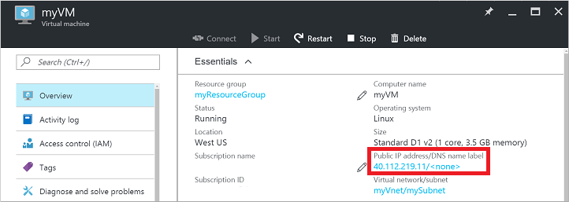
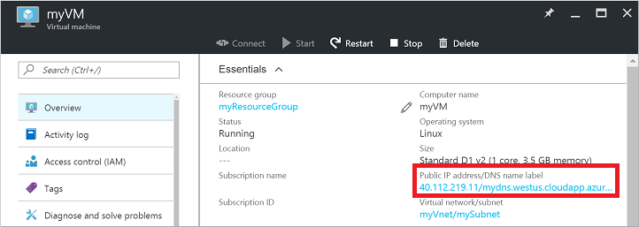

<!-- Ibiza portal: tested -->

## 快速步骤

本文假设你已在门户预览中登录到你的订阅，并使用 Resource Manager 部署模型创建了一个具有可用映像的虚拟机。虚拟机开始运行后可按照以下步骤操作。

1.  在门户预览中查看虚拟机设置，然后单击公共 IP 地址。

    

2.  请注意，公共 IP 的 DNS 名称为空。单击“公共 IP”边栏选项卡的“所有设置”。

    

3.  打开“公共 IP 设置”中的“配置”选项卡。输入所需的 DNS 名称标签，然后“保存”此配置。

    

    公共 IP 资源现在会在其边栏选项卡上显示此新的 DNS 标签。

4.  关闭“公共 IP”边栏选项卡，然后返回到门户预览中的“虚拟机”边栏选项卡。确保 DNS 名称/FQDN 显示在公共 IP 资源的 IP 地址旁边。

    

