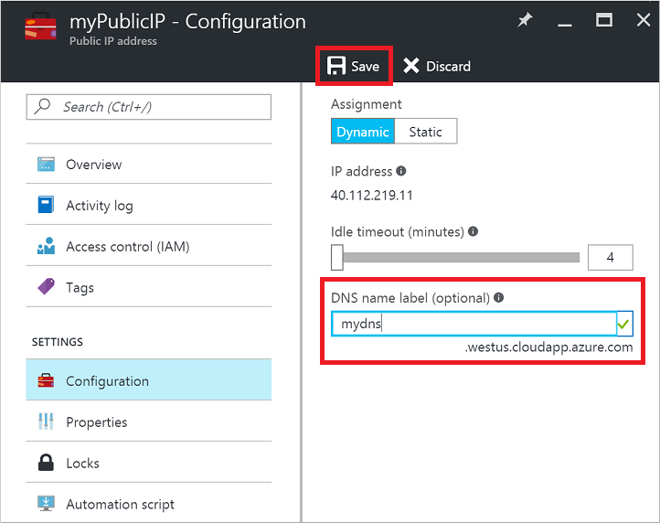

<!-- need to be verified -->

## 快速步骤
本文假设你已在门户中登录到你的订阅，并使用 Resource Manager 部署模型创建了一个具有可用映像的虚拟机。虚拟机开始运行后可按照以下步骤操作。

1. 在门户中选择你的虚拟机。DNS 名称为空白。单击“公共 IP 地址”：
   
      

2. 输入所需的 DNS 名称标签，然后单击“保存”。
   
      

   
    公共 IP 资源现在会在其边栏选项卡上显示此新的 DNS 标签。

3. 关闭“公共 IP”边栏选项卡，然后返回到门户中的“VM 概述”边栏选项卡。几秒钟后，门户应更新设置。验证 DNS 名称/FQDN 是否显示在“公共 IP 地址”资源的 IP 地址旁边。
   
      

<!---HONumber=Mooncake_1212_2016-->