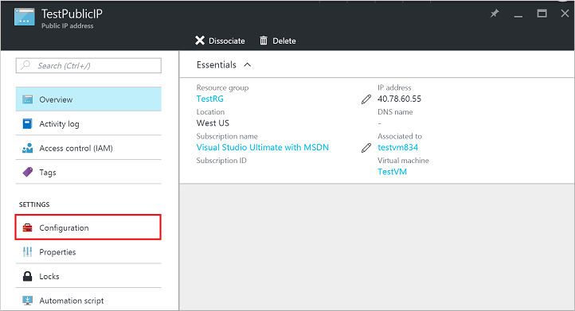

在 [Azure 门户](https://portal.azure.cn)中使用“Resource Manager”部署模型创建虚拟机时，该门户会自动为虚拟机创建一个公共 IP 资源。可以使用此 IP 地址远程访问虚拟机。虽然默认情况下门户不创建[完全限定域名](https://en.wikipedia.org/wiki/Fully_qualified_domain_name)（简称 FQDN），但在创建虚拟机以后，创建完全限定域名相当容易。本文演示了创建 DNS 名称或 FQDN 的步骤。

本文假设你已在门户中登录到你的订阅，并使用“Resource Manager”创建了一个具有可用映像的虚拟机。虚拟机开始运行后可按照以下步骤操作。

1.  在门户中查看虚拟机设置，然后单击公共 IP 地址。

    

2.  请注意，公共 IP 的 DNS 名称为空。单击“公共 IP”边栏选项卡的“所有设置”。

    

3.  打开“公共 IP 设置”中的“配置”选项卡。输入所需的 DNS 名称标签，然后“保存”此配置。

    

    公共 IP 资源现在会在其边栏选项卡上显示此新的 DNS 标签。

4.  关闭“公共 IP”边栏选项卡，然后返回到门户中的“虚拟机”边栏选项卡。确保 DNS 名称/FQDN 显示在公共 IP 资源的 IP 地址旁边。

    

    你现在可以使用此 DNS 名称远程连接至虚拟机。例如，连接到完全限定域名为 `testdnslabel.centralus.chinacloudapp.cn` 且用户名为 `adminuser` 的 Linux 虚拟机时，使用 `SSH adminuser@testdnslabel.centralus.chinacloudapp.cn`。
