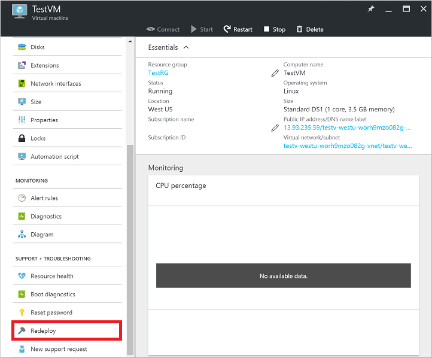
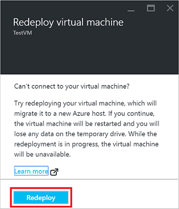
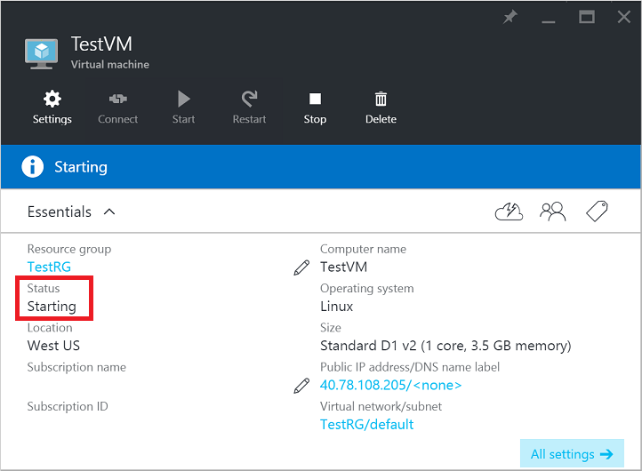
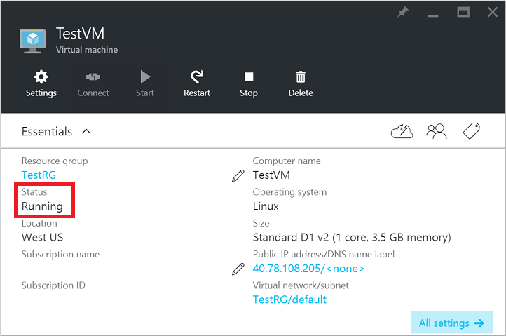

## 使用 Azure 门户预览

1. 选择你想要重新部署的 VM，然后单击“设置”边栏选项卡中的“重新部署”按钮：

	

2. 单击“重新部署”按钮以确认该操作：

	

3. 当 VM 准备好重新部署时，你将看到该 VM 的“状态”更改为“正在更新”：

	

4. 当 VM 在新的 Azure 主机上启动时，“状态”将更改为“正在启动”：

	

5. VM 完成启动过程后，“状态”将返回到“正在运行”，这表示已成功重新部署 VM：

	

<!---HONumber=Mooncake_0808_2016-->