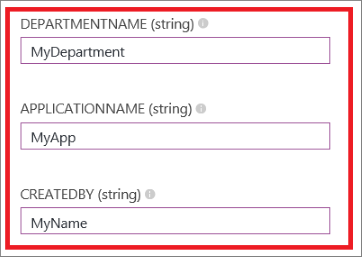
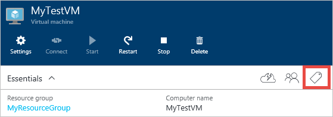
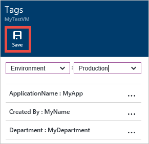

## 通过模板标记虚拟机

首先，让我们看一下通过模板进行标记。[此模板](https://github.com/Azure/azure-quickstart-templates/tree/master/101-vm-tags)将标记放置在以下资源中：计算（虚拟机）、存储（存储帐户）和网络（公共 IP 地址、虚拟网络和网络接口）。（这个模板是 Windows VM 的，但是可以修改成 Linux VM。）

下载[模板](https://github.com/Azure/azure-quickstart-templates/tree/master/101-vm-tags)，并且做必要的修改，然后用 PowerShell 或者 CLI 发布。

>[AZURE.NOTE] 你从 GitHub 仓库 "azure-quickstart-templates" 中下载的模板，需要做一些修改才能适用于 Azure 中国云环境。例如，替换一些终结点 -- "blob.core.windows.net" 替换成 "blob.core.chinacloudapi.cn"，"cloudapp.azure.com" 替换成 "chinacloudapp.cn"；改掉一些不支持的 VM 映像，还有，改掉一些不支持的 VM 大小。

此模板包括以下标记：*Department*、*Application* 和 *Created By*。如果想要不同的标记名称，则可以直接在模板中添加/编辑这些标记。

如你所见，标记定义为键/值对，用冒号 (:) 分隔。必须按以下格式定义标记：

        “tags”: {
            “Key1” : ”Value1”,
            “Key2” : “Value2”
        }

完成编辑后，使用选择的标记保存模板文件。

接下来，在“编辑参数”部分中，可以填写标记的值。

单击“创建”使用标记值部署此模板。

## 通过门户预览进行标记

使用标记创建资源后，可以在门户预览中查看、添加和删除该标记。

选择标记图标，以查看标记：

通过定义你自己的键/值对，使用门户预览添加新标记并将其保存。

新标记现在应在资源的标记列表中显示。

<!---HONumber=Mooncake_1221_2015-->