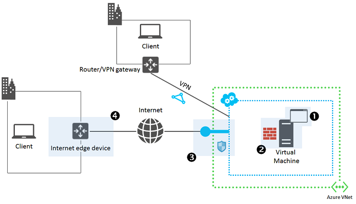
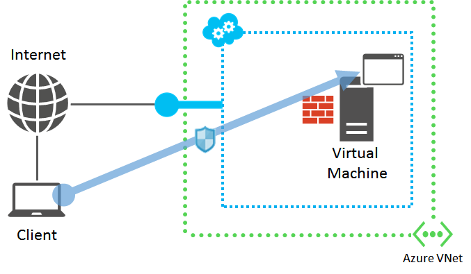

连接到 Azure 虚拟机 (VM) 上运行的应用程序时，可能因各种原因而出现问题，例如，应用程序未运行和未侦听所需的端口，或网络规则未将流量正确地传递到应用程序。本文说明有条理地找到问题并更正问题。

如果你在使用 RDP 或 SSH 连接到 VM 时发生问题，请先参阅以下文章之一：

 - [对与基于 Windows 的 Azure 虚拟机的远程桌面连接进行故障排除](/documentation/articles/virtual-machines-windows-troubleshoot-rdp-connection/)
 - [对于基于 Linux 的 Azure 虚拟机的安全外壳 (SSH) 连接进行故障排除](/documentation/articles/virtual-machines-linux-troubleshoot-ssh-connection/)。

> [AZURE.NOTE] Azure 具有用于创建和处理资源的两个不同的部署模型：[资源管理器和经典](/documentation/articles/resource-manager-deployment-model/)。这篇文章介绍如何使用这两种模型，但 Azure 建议大多数最新部署使用资源管理器模型。

如果你对本文中的任何点需要更多帮助，可以联系 [MSDN Azure 和 CSDN Azure](/support/forums/)上的 Azure 专家。或者，你也可以提出 Azure 支持事件。请转到 [Azure 支持站点](/support/contact/)并单击“获取支持”。

## 快速排查终结点连接问题

如果在连接到应用程序时发生问题，请尝试以下一般故障排除步骤。执行每个步骤之后，尝试重新连接到应用程序：

- 重启虚拟机
- 重新创建终结点/防火墙规则/网络安全组 (NSG) 规则
	- [经典模型 - 管理云服务终结点](/documentation/articles/cloud-services-enable-communication-role-instances/)
	- [Resource Manager 模型 - 管理网络安全组](/documentation/articles/virtual-networks-create-nsg-arm-pportal/)
- 从不同的位置（例如不同的 Azure 虚拟网络）进行连接
- 重新部署虚拟机
	- [重新部署 Windows VM](/documentation/articles/virtual-machines-windows-redeploy-to-new-node/)
	- [重新部署 Linux VM](/documentation/articles/virtual-machines-linux-redeploy-to-new-node/)
- 重新创建虚拟机

有关详细信息，请参阅[终结点连接（RDP/SSH/HTTP 等故障）疑难解答](https://social.msdn.microsoft.com/Forums/azure/538a8f18-7c1f-4d6e-b81c-70c00e25c93d/troubleshooting-endpoint-connectivity-rdpsshhttp-etc-failures?forum=WAVirtualMachinesforWindows)。

## 详细故障排除概述

有四个主要区域需要对 Azure 虚拟机上运行的应用程序的访问进行故障排除。

1.	在 Azure 虚拟机上运行的应用程序。
	- 应用程序本身是否正常运行？
2.	Azure 虚拟机。
	- VM 本身是否正常运行并响应请求？
3.	云服务的 Azure 终结点包含虚拟机（针对经典部署模型中的虚拟机）、入站 NAT 规则（针对 Resource Manager 部署模型中的虚拟机）和网络安全组。
	- 流量是否可以通过预期的端口从用户流向 VM/应用程序？
4.	Internet 边缘设备。
	- 是否有防火墙规则阻止流量正常流动？

对于通过站点到站点 VPN 或 ExpressRoute 连接访问应用程序的客户端计算机，可能会导致问题的主要区域是应用程序和 Azure 虚拟机。若要确定问题并进行更正，请遵循下列步骤。

## 步骤 1：是否可以访问目标 VM 中的应用程序？

尝试使用适当的客户端程序，从运行该程序的 VM 访问应用程序。使用本地主机名、本地 IP 地址或环回地址 (127.0.0.1)。

例如，如果应用程序是 Web 服务器，则在 VM 上打开浏览器，并尝试访问 VM 上托管的网页。

如果可以访问应用程序，请转到[步骤 2](#step2)。

如果不能访问应用程序，请验证以下各项：

- 应用程序是否在目标虚拟机上运行。
- 应用程序是否在预期 TCP 和 UDP 端口侦听。

在基于 Windows 和基于 Linux 的虚拟机上，使用 **netstat -a** 命令显示活动的侦听端口。检查应用程序应侦听的预期端口的输出。重新启动应用程序，或根据需要将其配置为使用预期的端口，然后尝试在本地重新访问应用程序。

## 步骤 2：是否可以通过相同虚拟网络中的另一台虚拟机访问应用程序？

使用 VM 的主机名或其 Azure 分配的公共、专用或提供程序 IP 地址尝试访问位于不同 VM 但相同虚拟网络中的应用程序。对于使用经典部署模型创建的虚拟机，请不要使用云服务的公共 IP 地址。

例如，如果应用程序是 Web 服务器，则尝试在相同虚拟网络中的不同 VM 上使用浏览器访问网页。

如果可以访问应用程序，请转到[步骤 3](#step3)。

如果不能访问应用程序，请验证以下各项：

- 目标 VM 上的主机防火墙允许入站请求和出站响应流量。
- 目标 VM 上运行的入侵检测或网络监视软件允许流量。
- 云服务终结点或网络安全组允许流量
	- [经典模型 - 管理云服务终结点](/documentation/articles/cloud-services-enable-communication-role-instances/)
	- [Resource Manager 模型 - 管理网络安全组](/documentation/articles/virtual-networks-create-nsg-arm-pportal/)
- VM 中在测试 VM 和你的 VM 之间的路径运行的单独组件（例如负载平衡器或防火墙）允许流量。

在基于 Windows 的虚拟机上，使用具有高级安全性的 Windows 防火墙确定防火墙规则是否排除应用程序的入站和出站流量。

## 步骤 3：是否可以通过虚拟网络之外但未连接到你的计算机所在的相同网络的计算机访问应用程序？

尝试通过虚拟网络之外的计算机访问应用程序，作为应用程序运行但与原始客户端计算机不在相同的网络的 VM。

例如，如果应用程序是Web 服务器，则尝试通过不在虚拟网络中的虚拟机使用浏览器访问网页。

如果不能访问应用程序，请验证以下各项：

- 对于使用经典部署模型创建的 VM：
	- VM 的终结点配置允许传入流量，尤其是协议（TCP 或 UDP）及公用和专用端口号。
	- 终结点上的访问控制列表 (ACL) 不会阻止来自 Internet 的传入流量。
	- 有关详细信息，请参阅[如何对虚拟机设置终结点](/documentation/articles/virtual-machines-windows-classic-setup-endpoints/)。
	
- 对于使用 Resource Manager 部署模型创建的 VM：
	- VM 的入站 NAT 规则配置允许传入流量，尤其是协议（TCP 或 UDP）及公用和专用端口号。
	- 网络安全组允许入站请求和出站响应流量。
	- 有关详细信息，请参阅[什么是网络安全组 (NSG)？](/documentation/articles/virtual-networks-nsg/)。

如果虚拟机或终结点是负载平衡集的成员，则：

- 验证探测协议（TCP 或 UDP）和端口号是否正确。
- 如果探测协议和端口与负载平衡集协议和端口不同，则：
	- 验证应用程序是否在探测协议（TCP 或 UDP）和端口号（在目标 VM 上使用 **netstat -a**）上侦听。
	- 目标 VM 上的主机防火墙允许入站探测请求和出站探测响应流量。

如果可以访问应用程序，请确保 Internet 边缘设备允许：

- 从客户端计算机到 Azure 虚拟机的出站应用程序请求流量。
- 来自 Azure 虚拟机的入站应用程序响应流量。

## 其他资源

[对与基于 Windows 的 Azure 虚拟机的远程桌面连接进行故障排除](/documentation/articles/virtual-machines-windows-troubleshoot-rdp-connection/)

[对基于 Linux 的 Azure 虚拟机的安全外壳 (SSH) 连接进行故障排除](/documentation/articles/virtual-machines-linux-troubleshoot-ssh-connection/)

<!---HONumber=Mooncake_0627_2016-->