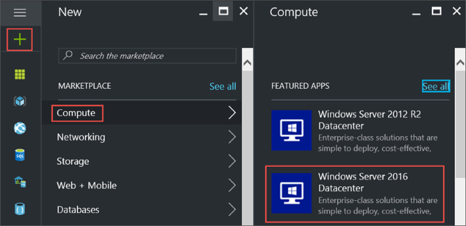
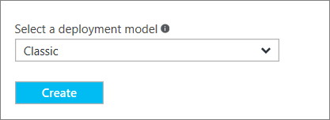
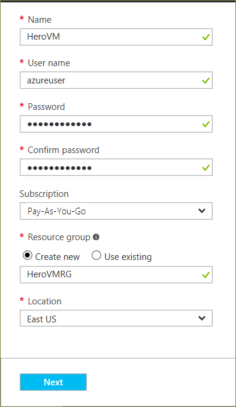
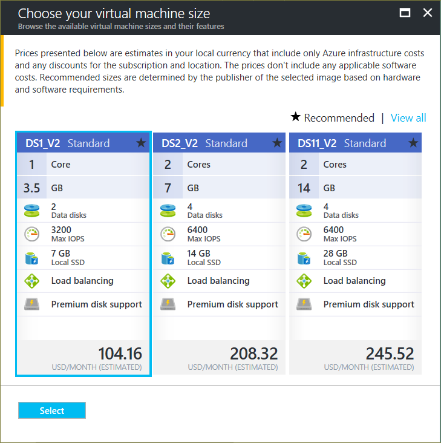
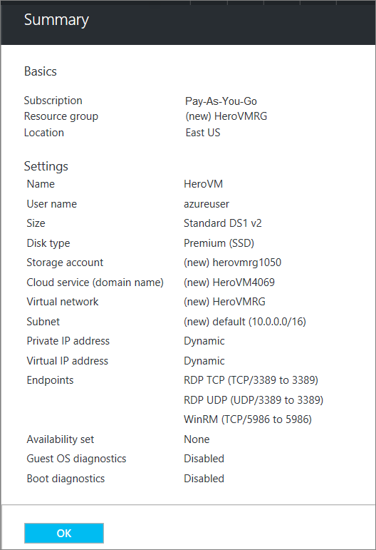
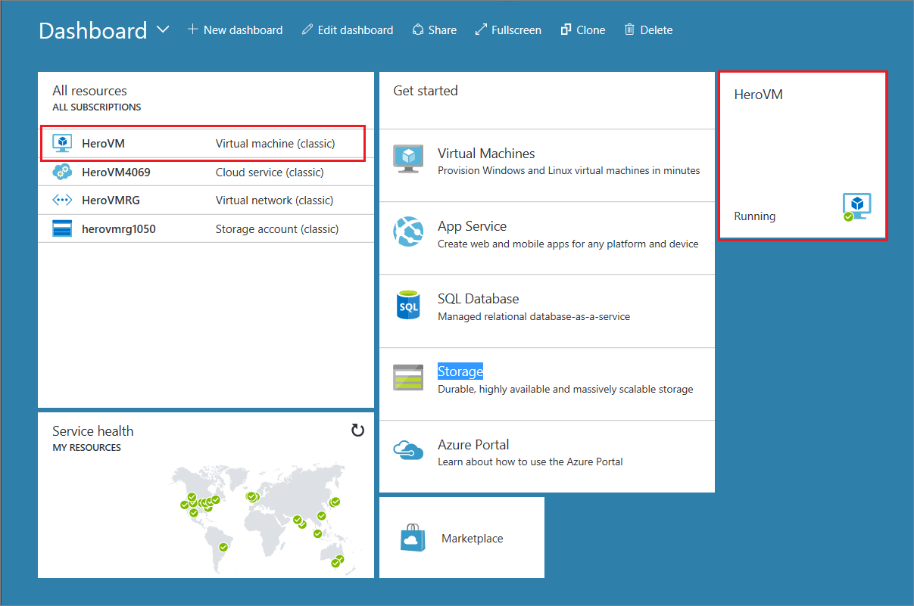

1. 登录 [Azure 门户](https://portal.azure.cn)。

2. 首先在左上角单击“新建”>“计算”>“Windows Server 2016 Datacenter”。

      

3. 在 Windows Server 2016 Datacenter 中，选择“经典”部署模型。单击“创建”。

      

## 1\.“基本信息”边栏选项卡

“基本信息”边栏选项卡会请求虚拟机的管理信息。

1. 输入虚拟机的**名称**。在示例中，_HeroVM_ 是虚拟机的名称。名称必须为 1-15 个字符，不能包含特殊字符。

2. 输入用于在 VM 上创建本地帐户的**用户名**和强**密码**。该本地帐户用于登录和管理 VM。在示例中，_azureuser_ 是用户名。

    密码的长度必须为 8 到 123 个字符，并且必须符合以下四个复杂性要求中的三个要求：1 个小写字符、1 个大写字符、1 个数字和 1 个特殊字符。查看有关[用户名和密码要求](/documentation/articles/virtual-machines-windows-faq/)的更多信息。

3. “订阅”是可选的。一个常用设置是“即用即付”。

4. 选择现有的**资源组**，或键入新资源组的名称。在示例中，_HeroVMRG_ 是资源组的名称。

5. 选择要在其中运行 VM 的 Azure 数据中心**位置**。在示例中，位置为**中国东部**。

6. 完成后，单击“下一步”转到下一边栏选项卡。

      

## 2\.“大小”边栏选项卡

“大小”边栏选项卡标识了 VM 的配置详细信息，列出了各种选项，其中包括：OS、处理器数、磁盘存储类型、估计的每月使用费用。

选择 VM 大小，然后单击“选择”继续。在此示例中，_DS1_\__V2 Standard_ 是 VM 大小。

  

## 3\.“设置”边栏选项卡

“设置”边栏选项卡可请求存储和网络选项。可以接受默认设置。Azure 可根据需要创建适当的条目。

如果选择了支持它的虚拟机大小，则可以通过选择“磁盘类型”中的“高级(SSD)”来试用 Azure 高级存储。

完成更改后，单击“确定”。

## 4\.“摘要”边栏选项卡

“摘要”边栏选项卡列出了在以前的边栏选项卡中指定的设置。准备好制作映像时，请单击“确定”。

  

<!--  deleted 2/16/2017 - RABixby
  * A virtual machine's size affects the cost of using it, as well as configuration options such as how many data disks you can attach. For more information, see [Sizes for virtual machines](/documentation/articles/virtual-machines-windows-sizes/).
  -->

创建虚拟机之后，门户将在“所有资源”下列出新虚拟机，并在仪表板上显示虚拟机的磁贴。此外，还会创建并列出相应的云服务和存储帐户。虚拟机和云服务都会自动启动，其状态将显示为“正在运行”。

  

<!---HONumber=Mooncake_0313_2017-->