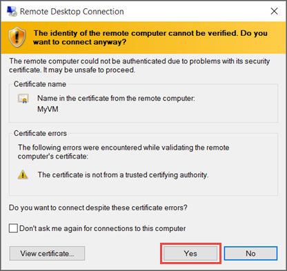

<properties services="virtual-machines" title="How to Log on to a Virtual Machine Running Windows Server" authors="cynthn" solutions="" manager="timlt" editor="tysonn" />

4. 单击“连接”创建和下载远程桌面协议文件（.rdp 文件）。单击“打开”以使用此文件。

5. 你将收到 .rdp 来自未知发布者的警告。这是一般警报。在“远程桌面”窗口中，单击“连接”以继续。

	

6. 在“Windows 安全性”窗口中，键入虚拟机上帐户的凭据，然后单击“确定”。

 	**本地帐户** - 通常，这是创建虚拟机时指定的本地帐户用户名和密码。在本示例中，域是虚拟机的名称，输入格式为 *vmname*&#92;*username*。
	
	**已加入域的 VM** - 如果 VM 属于某个域，请以域&#92;用户名格式输入用户名。该帐户还需要属于管理员组或已被授予 VM 的远程访问权限。
	
	**域控制器** - 如果 VM 是域控制器，请键入该域的域管理员帐户的用户名和密码。

7.	单击“是”以验证虚拟机的 ID 并完成登录。

	

<!---HONumber=Mooncake_0606_2016-->