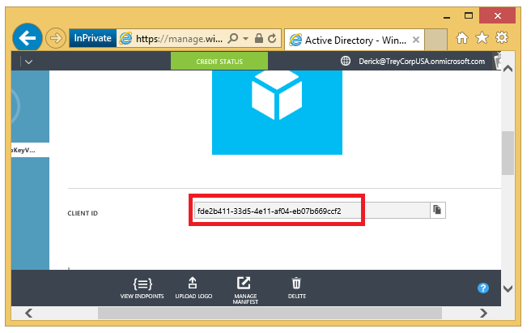

## 准备 AKV 集成
若要使用 Azure 密钥保管库集成来配置 SQL Server VM，有以下几个先决条件：

1.	[安装 Azure Powershell](#install-azure-powershell)
2.	[创建 Azure Active Directory](#create-an-azure-active-directory)
3.	[创建密钥保管库](#create-a-key-vault)

以下各节描述了这些先决条件，以及稍后运行 PowerShell cmdlet 需要收集的信息。

### 安装 Azure PowerShell
请确保已安装最新的 Azure PowerShell SDK。有关详细信息，请参阅[如何安装和配置 Azure PowerShell](/documentation/articles/powershell-install-configure/)。

### 创建 Azure Active Directory
首先，你的订阅中需要具有 [Azure Active Directory](/pricing/1rmb-trial/) (AAD)。其优点之一是允许你为特定用户和应用程序授予对密钥保管库的权限。

然后，将应用程序注册到 Azure AAD。这将为你提供一个服务主体帐户，使你有权访问 VM 所需的密钥保管库。在 Azure 密钥保管库文章中，你可以在[将应用程序注册到 Azure Active Directory](/documentation/articles/key-vault-get-started/#register) 部分中找到这些步骤，或者可以在[此博客文章](http://blogs.technet.com/b/kv/archive/2015/01/09/azure-key-vault-step-by-step.aspx)的**获取应用程序的标识**部分中看到这些步骤以及屏幕截图。请注意，在完成这些步骤之前，你需要在注册期间收集以下信息，之后在 SQL VM 上启用 Azure 密钥保管库集成时需要这些信息。

- 添加应用程序后，在“配置”选项卡上找到**客户端 ID**。 
	
	
	稍后会将该客户端 ID 分配给 PowerShell 脚本中的 **$spName**（服务主体名称）参数，以启用 Azure 密钥保管库集成。 
- 此外，在执行这些步骤期间，请在创建密钥时复制密钥的密码，如下面的屏幕截图中所示。稍后会将此密钥密码分配给 PowerShell 脚本中的 **$spSecret**（服务主体密码）参数。  
	
- 必须为此新的客户端 ID 授予以下访问权限：**加密**、**解密**、**密钥换行**、**取消密钥换行**、**签名**和**验证**。可通过 [Set-AzureRmKeyVaultAccessPolicy](https://msdn.microsoft.com/zh-cn/library/azure/mt603625.aspx) cmdlet 实现此操作。有关详细信息，请参阅[授权应用程序使用密钥或密码](/documentation/articles/key-vault-get-started/#authorize)。

### 创建密钥保管库
若要使用 Azure 密钥保管库来存储将用于在 VM 中加密的密钥，你将需要对密钥保管库的访问权限。如果你尚未设置密钥保管库，请按照[开始使用 Azure 密钥保管库](/documentation/articles/key-vault-get-started/)主题中的步骤创建一个。请注意，在完成这些步骤之前，你需要在设置期间收集一些信息，之后在 SQL VM 上启用 Azure 密钥保管库集成时需要这些信息。

进行创建密钥保管库的步骤时，请注意返回的 **vaultUri** 属性，它是密钥保管库 URL。下面显示了该步骤中提供的示例，其中的密钥保管库名称是 ContosoKeyVault，因此密钥保管库 URL 将为 https://contosokeyvault.vault.chinacloudapi.cn/。

	New-AzureRmKeyVault -VaultName 'ContosoKeyVault' -ResourceGroupName 'ContosoResourceGroup' -Location 'China East'

稍后会将该密钥保管库 URL 分配给 PowerShell 脚本中的 **$akvURL** 参数，以启用 Azure 密钥保管库集成。

<!---HONumber=Mooncake_0215_2016-->