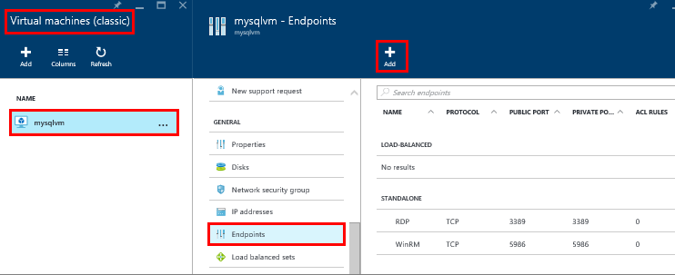

###  为虚拟机创建 TCP 终结点

要从 Internet 访问 SQL Server，虚拟机必须具有终结点以侦听传入的 TCP 通信。此 Azure 配置步骤将传入 TCP 端口通信定向到虚拟机可以访问的 TCP 端口。

>[AZURE.NOTE] 如果你在同一云服务或虚拟网络中连接，则不需要创建一个公开访问的终结点。在这种情况下，你可以继续执行下一步。有关详细信息，请参阅[连接方案](/documentation/articles/virtual-machines-windows-classic-sql-connect/#connection-scenarios)。

1. 在 Azure 门户预览版中，选择“虚拟机（经典）”。

2. 然后选择 SQL Server 虚拟机。

3. 选择“终结点”，然后单击终结点边栏选项卡顶部的“添加”按钮。

	

4. 在“添加终结点”边栏选项卡上，提供“名称”，例如 SQLEndpoint。

5. 选择“TCP”作为“协议”。

6. 为“公用端口”指定端口号，如“57500”。

7. 为“专用端口”，指定 SQL Server 侦听端口，默认为“1433”。

6. 单击“确定”以创建终结点。

<!---HONumber=Mooncake_0808_2016-->