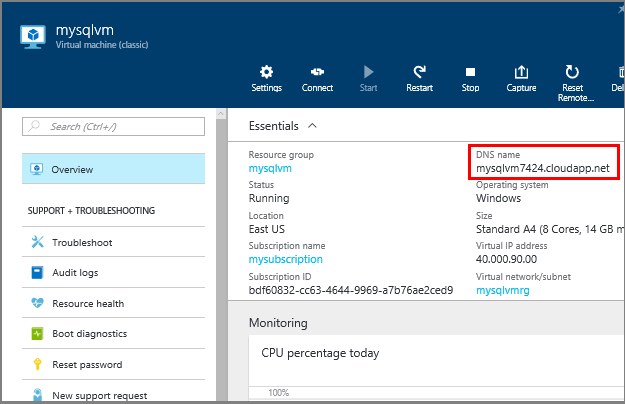
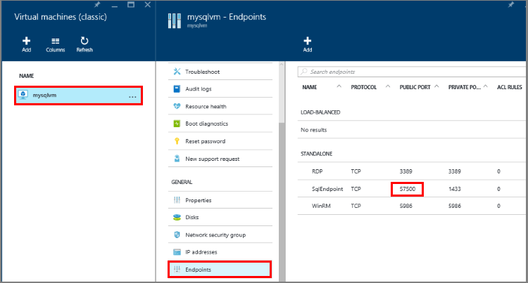
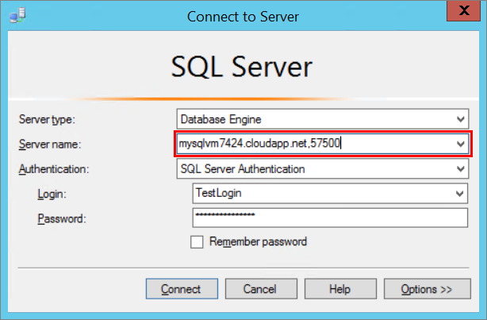

### 确定虚拟机的 DNS 名称

若要从另一台计算机连接到 SQL Server 数据库引擎，必须知道虚拟机的域名系统 (DNS) 名称。（这是 Internet 用于识别虚拟机的名称）。可以使用 IP 地址，但 IP 地址在 Azure 为冗余或维护而移动资源时可能会变更。DNS 名称将保持不变，因为可将该名称重定向到新的 IP 地址。）

1. 在 Azure 经典管理门户（或在完成前一步后），选择“虚拟机”。 

2. 在“虚拟机实例”页面上的“速览”列中，找到并复制虚拟机的 DNS 名称。

	
	

### 从其他计算机连接到数据库引擎
 
1. 在连接到 Internet 的计算机上，打开 SQL Server Management Studio。
2. 在“连接到服务器”或“连接到数据库引擎”对话框的**“服务器名称”**框中，按 *DNSName,portnumber* 的格式输入虚拟机的 DNS 名称（在前一任务中确定）和公共终结点端口号，例如 **tutorialtestVM.chinacloudapp.cn,57500**。若要获取端口号，请登录到 Azure 经典管理门户并找到虚拟机。在仪表板中，单击“终结点”并使用分配给“MSSQL”的“公用端口”。
3. 在“身份验证”框中，选择“SQL Server 身份验证”。
5. 在“登录名”框中，键入你在前面的任务中创建的登录名。
6. 在“密码”框中，键入你在前面的任务中创建的登录名的密码。
7. 单击“连接”。

	

<!---HONumber=Mooncake_0215_2016-->