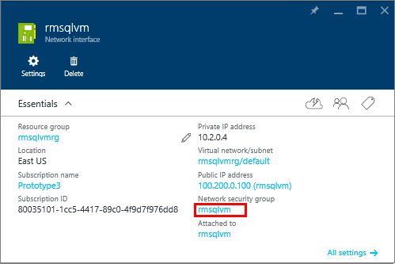

<!-- Ibiza portal: tested -->

### 为 VM 配置网络安全组入站规则

如果你希望能够通过 Internet 连接到 SQL Server，则需为 SQL Server 实例所侦听的端口配置网络安全组入站规则。默认情况下，该端口为 TCP 端口 1433。

1. 在门户预览中选择“虚拟机”，然后选择你的 SQL Server VM。

2. 单击“所有设置”链接。

3. 展开“网络接口”。

	

4. 然后选择 VM 的网络接口。

4. 单击“网络安全组”链接。

	

6. 在网络安全组的属性中，展开“入站安全规则”。

5. 单击“添加”按钮。

6. 提供“SQLServerPublicTraffic”作为“名称”。

7. 将协议更改为“TCP”。

8. 将“目标端口范围”指定为 1433（或 SQL Server 实例正在侦听的端口）。

9. 确保将“操作”设置为“允许”。安全规则对话框应类似于以下屏幕快照。

	

9. 单击“确定”保存 VM 的规则。

<!---HONumber=Mooncake_0411_2016-->