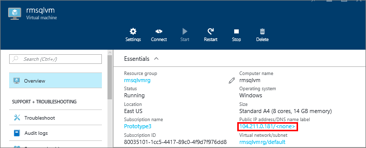
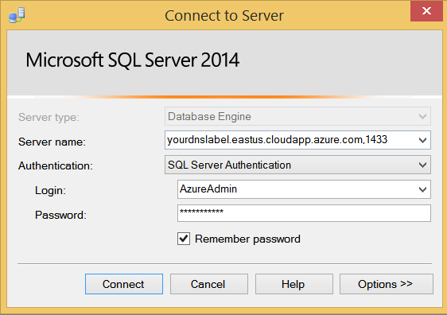

<!-- Ibiza portal: tested -->

### 配置用于公共 IP 地址的 DNS 标签

若要从 Internet 连接到 SQL Server 数据库引擎，请首先配置用于公共 IP 地址的 DNS 标签。

> [AZURE.NOTE] 如果你打算只连接到同一虚拟网络中的 SQL Server 实例，或者只进行本地连接，则此步骤不是必需的。

若要创建 DNS 标签，请首先在门户预览中选择“虚拟机”。选择要显示其属性的 SQL Server VM。

1. 在虚拟机边栏选项卡中，选择“公共 IP 地址”。

	

2. 在公共 IP 地址的属性中，展开“配置”。

3. 输入 DNS 标签名称。这是一种可通过名称而非 IP 地址直接连接到 SQL Server VM 的 A 记录。

	

### 从其他计算机连接到数据库引擎
 
1. 在连接到 Internet 的计算机上，打开 SQL Server Management Studio (SSMS)。

2. 在“连接到服务器”或“连接到数据库引擎”对话框的“服务器名称”框中，输入虚拟机的完整 DNS 名称（已在以前的任务中确定）。****

3. 在“身份验证”框中，选择“SQL Server 身份验证”。

5. 在“登录”框中，键入有效 SQL 登录的名称。

6. 在“密码”框中，键入登录的密码。

7. 单击“连接”。

	

<!---HONumber=Mooncake_0411_2016-->