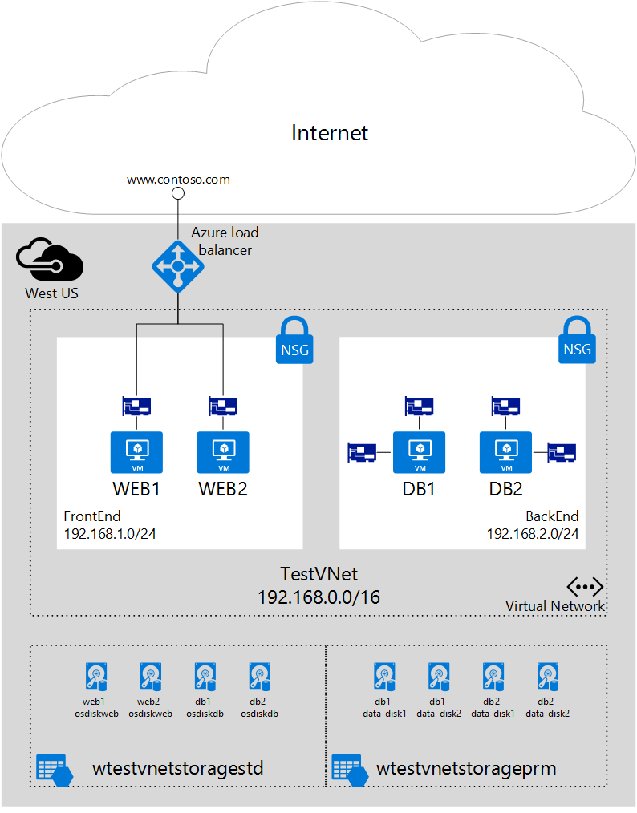

## 方案

本文档将指导你完成在特定方案中使用 VM 中的多个 NIC 的部署。在此方案中，你在 Azure 中托管两层 IaaS 工作负荷。每个层部署在虚拟网络 (VNet) 中其自己的子网中。前端层由几个 Web 服务器组成，这些服务器在负载平衡器集中组合在一起以实现高可用性。后端层由几个数据库服务器组成。这些数据库服务器将部署为每个具有两个 NIC，一个用于数据库访问，另一个用于管理。此方案还包括网络安全组 (NSG) 以控制哪些流量允许到达部署中的每个子网和 NIC。下图显示了此方案的基本体系结构。

<!---HONumber=Mooncake_0104_2016-->