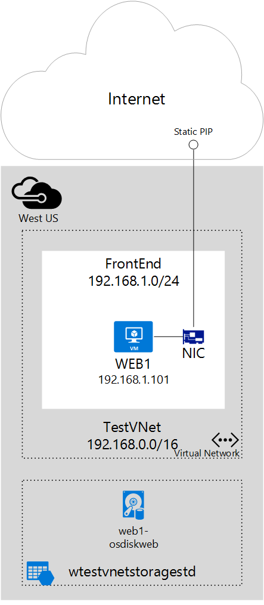

## 方案

本文档将指导完成使用分配给虚拟机 (VM) 的静态公共 IP 地址的部署。在此方案中，你有一个具有自己的静态公共 IP 地址的 VM。VM 属于名为 **FrontEnd** 的子网，并且在该子网中还具有一个静态专用 IP 地址 (**192.168.1.101**)。

需要 SSL 连接并且其中的 SSL 证书链接到 IP 地址的 Web 服务器可能需要静态 IP 地址。

你可以按照以下步骤来部署上图中所示的环境。

<!---HONumber=Mooncake_0215_2016-->