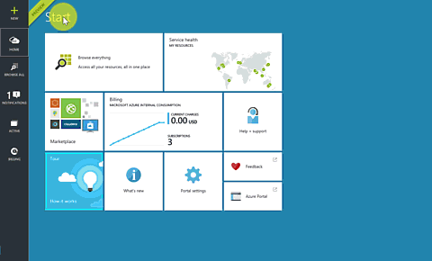
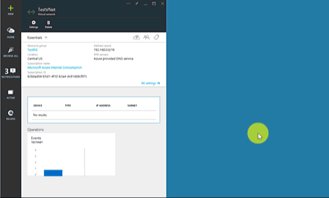
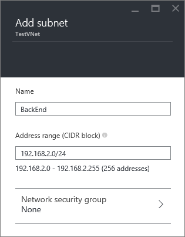
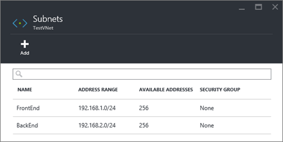

<!-- Ibiza portal: tested -->

## 如何在 Azure 门户预览中创建 VNet

若要通过 Azure 门户预览基于上述方案创建 VNet，请执行下面的步骤。

1. 从浏览器导航到 http://portal.azure.cn ，如有必要，请使用 Azure 帐户登录。
2. 单击“新建”>“网络”>“虚拟网络”，然后单击“选择部署模型”列表中的“Resource Manager”，再单击“创建”（如下图所示）。

	

3. 在“创建虚拟网络”边栏选项卡上，配置 VNet 设置（如下图所示）。

	

4. 单击**“资源组”**并选择要将 VNet 添加到的资源组，或者单击**“新建”**将 VNet 添加到新资源组。下图显示了名为 **TestRG** 的新资源组的资源组设置。有关资源组的详细信息，请访问 [Azure Resource Manager 概述](/documentation/articles/resource-group-overview/#resource-groups)。

	

5. 如有必要，更改你的 VNet 的**“订阅”**和**“位置”**设置。

6. 如果你不想看到该 VNet 作为**启动板**中的磁贴，请禁用**“固定到启动板”**。

7. 单击**“创建”**，注意名为**“创建虚拟网络”**的磁贴，如下图中所示。

	

8. 等待创建 VNet，然后在“虚拟网络”边栏选项卡中，单击“所有设置”>“子网”>“添加”（如下所示）。

	

9. 指定“后端”子网的子网设置，然后单击“确定”（如下所示）。

	

10. 注意子网列表（如下图所示）。

	
<!---HONumber=Mooncake_0418_2016-->